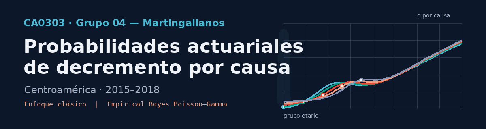
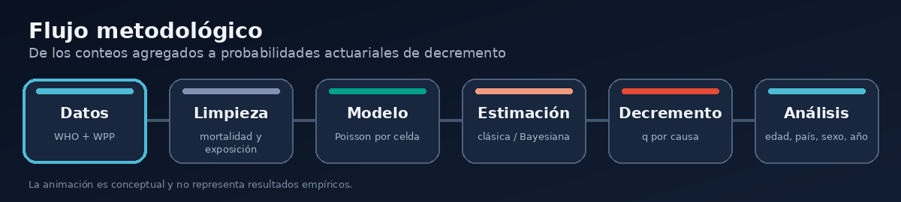

<div align="center">
  

  <br>

  
  
  
  
  

  <p><strong>Universidad de Costa Rica · Escuela de Matemática · Departamento de Matemática y Ciencias Actuariales</strong></p>
</div>

---

## Descripción

Este repositorio contiene el desarrollo del proyecto de investigación del **Grupo 04 — Martingalianos** para el curso **CA0303 Estadística Actuarial**.

El proyecto estudia la variación de la probabilidad actuarial de decremento por causa en países centroamericanos durante el periodo 2015–2018. La unidad de análisis se define por país, sexo, año calendario, grupo etario y categoría de causa de muerte según la ICD-10.

La pregunta de investigación es:

> **¿Qué patrones de variabilidad se pueden estimar en la probabilidad de decremento por categoría de causas de la ICD-10 en países centroamericanos durante 2015–2018?**

El objeto actuarial central es

```math
q_{x,t}^{(c)} = P\left(T_{x,t}\leq 1,\ J=c\right)
```

donde $T_{x,t}$ representa el tiempo futuro de vida asociado a la celda definida por el grupo etario $x$ y el año calendario $t$, mientras que $J$ identifica la causa del decremento. El horizonte principal se fija en un año para mantener coherencia con la periodicidad anual de los datos.

---

## Alcance

El análisis comprende seis países:

- Belice
- Costa Rica
- El Salvador
- Guatemala
- Nicaragua
- Panamá

Se consideran dieciséis categorías amplias de causas de muerte de la ICD-10, desde enfermedades infecciosas y tumores hasta enfermedades circulatorias, respiratorias y causas externas.

---

## Metodología

<div align="center">
  
</div>

### Modelo de conteo

Para cada celda y causa se modela el número de defunciones mediante

```math
D_{x,t}^{(c)}\mid\mu_{x,t}^{(c)} \sim \mathrm{Poisson}\left(E_{x,t}\mu_{x,t}^{(c)}\right)
```

donde $D_{x,t}^{(c)}$ es el conteo de defunciones, $E_{x,t}$ es la exposición y $\mu_{x,t}^{(c)}$ es la intensidad de mortalidad por causa.

### Enfoque clásico

La intensidad se estima por máxima verosimilitud:

```math
\widehat{\mu}_{x,t}^{(c)} = \frac{D_{x,t}^{(c)}}{E_{x,t}}
```

La intensidad total es

```math
\widehat{\mu}_{x,t}^{(\tau)} = \sum_{j=1}^{r}\widehat{\mu}_{x,t}^{(j)}
```

y la probabilidad anual de decremento por la causa $c$ se estima como

```math
\widehat{q}_{x,t}^{(c)} = \frac{\widehat{\mu}_{x,t}^{(c)}}{\widehat{\mu}_{x,t}^{(\tau)}} \left(1-e^{-\widehat{\mu}_{x,t}^{(\tau)}}\right)
```

### Enfoque Empirical Bayes

La intensidad se modela con una distribución Gamma:

```math
\mu_{x,t}^{(c)}
\sim
\operatorname{Gamma}
\left(
\alpha_p^{(c)},\beta_p^{(c)}
\right), \quad \mathbb{E}\left[\mu_{x,t}^{(c)}\right]
=
\frac{\alpha_p^{(c)}}{\beta_p^{(c)}}
```

Para cada país y causa, los hiperparámetros se estiman mediante el método Empirical Bayes, aplicando el estimador de máxima verosimilitud marginal después de integrar. La distribución marginal de los conteos es binomial negativa.

Una vez estimados $\widehat{\alpha}_p^{(c)}$ y $\widehat{\beta}_p^{(c)}$, la distribución posterior es

```math
\mu_{x,t}^{(c)}\mid D_{x,t}^{(c)},E_{x,t} \sim \mathrm{Gamma} \left( \widehat{\alpha}_p^{(c)}+D_{x,t}^{(c)}, \widehat{\beta}_p^{(c)}+E_{x,t} \right)
```

La probabilidad bayesiana de decremento se obtendrá simulando conjuntamente las intensidades posteriores de todas las causas y transformando cada simulación. Esto evita sustituir directamente las medias posteriores dentro de una función no lineal.

### Tratamiento de celdas especiales

Los conteos iguales a cero se conservan cuando corresponden a celdas donde la causa es posible. Se distingue entre ceros observacionales y celdas fuera del dominio definido para una causa.

- La causa XV, embarazo, parto y puerperio, se ajusta con las celdas femeninas de los grupos etarios 10–14 a 50–54.
- La causa XVI, afecciones originadas en el periodo perinatal, se ajusta con las celdas del grupo 0–4.

Estas restricciones evitan que los hiperparámetros sean dominados por combinaciones que no describen adecuadamente la experiencia de riesgo de la causa.

---

## Análisis derivados

Además de la probabilidad absoluta de decremento, el proyecto estudia complementarias como:

La composición causal condicionada al fallecimiento es

```math
\pi_{x,t}^{(c)} = P\left(J=c\mid T_{x,t}\leq 1\right) = \frac{q_{x,t}^{(c)}}{\sum_{j=1}^{r}q_{x,t}^{(j)}}
```


## Fuentes de datos

| Componente | Fuente | Uso en el proyecto |
|---|---|---|
| Defunciones | [WHO Mortality Database](https://www.who.int/data/data-collection-tools/who-mortality-database) | Conteos por país, sexo, año, edad y causa de muerte |
| Exposición | [World Population Prospects 2024](https://population.un.org/wpp/) | Población a mitad de año utilizada como aproximación de la exposición |

La base analítica final utiliza las variables:

```text
anio, sexo, pais, grupo_edad, causa, causa_grupo, muertes, exposicion
```

---

## Estructura del repositorio


```text
ca303-i-2026-grupo-4-martingalianos/
├── README.md
├── readme_assets/
│   ├── hero_martingalianos.gif
│   └── flujo_metodologico.gif
├── bitacoras/
│   ├── bitacora_1/
│   │   └── figuras/
│   ├── bitacora_2/
│   ├── bitacora_3/
│   │   └── bitacora_3.qmd
│   └── bitacora_4/
├── codigo/
│   ├── 01_limpieza.R
│   ├── 02_limpieza_exposicion.R
│   ├── 03_graficos.R
│   ├── 04_enfoque_clasico.R
│   ├── 05_analisis_clasico.R
│   ├── 06_enfoque_bayesiano_alpha_beta.R
│   └── funciones/
├── datos/
│   ├── originales/
│   └── procesados/
│       └── parametros_bayesianos_alpha_beta.csv
├── fichas/
│   ├── literatura/
│   └── resultados/
├── proyecto_final/
│   ├── proyecto.tex
│   └── figuras/
└── referencias/
    ├── country_codes
    └── referencias.bib
```

---

## Scripts

| Archivo | Función |
|---|---|
| `01_limpieza.R` | Limpieza y armonización de la mortalidad por causa |
| `02_limpieza_exposicion.R` | Preparación de la exposición por país, sexo, año y grupo etario |
| `03_graficos.R` | Análisis exploratorio y visualizaciones iniciales |
| `04_enfoque_clasico.R` | Estimación clásica de intensidades y probabilidades de decremento |
| `05_analisis_clasico.R` | Composición causal, concentración y análisis del enfoque clásico |
| `06_enfoque_bayesiano_alpha_beta.R` | Estimación de $\alpha_p^{(c)}$ y $\beta_p^{(c)}$ por máxima verosimilitud marginal |

El archivo

```text
datos/procesados/parametros_bayesianos_alpha_beta.csv
```

contiene los hiperparámetros estimados por país y causa.

---

## Reproducibilidad

### Requisitos

- R 4.x
- Quarto para renderizar las bitácoras
- LaTeX para generar documentos PDF

Paquetes utilizados o previstos en los scripts:

```r
readr
dplyr
tidyr
stringr
purrr
here
ggplot2
ggsci
cowplot
scales
knitr
```
## Avance de las bitácoras

| Bitácora | Contenido principal | Estado |
|---|---|---|
| Bitácora 1 | Definición y conceptualización de la pregunta; tensiones actuariales y estadísticas; delimitación temporal y geográfica; primeras decisiones sobre datos, ICD-10 y riesgos competitivos | Finalizada |
| Bitácora 2 | Revisión y jerarquización bibliográfica; antecedentes actuariales y latinoamericanos; rastro de decisiones; restricciones de las fuentes; análisis exploratorio e identidad visual del proyecto | Finalizada |
| Bitácora 3 | Formulación metodológica detallada; modelo Poisson; enfoque clásico; composición y concentración causal; Empirical Bayes Poisson–Gamma; estimación de hiperparámetros y preparación de la simulación posterior | En desarrollo |
| Bitácora 4 | Resultados finales, comparación de enfoques, discusión y cierre del proyecto | No iniciada |

---


## Referencias principales

| Referencia | Aporte al proyecto |
|---|---|
| Bowers et al. (1997) | Fundamentos de contingencias de vida y modelos de decrementos múltiples |
| Pitacco et al. (2009) | Intensidades de mortalidad, exposición y transición de tasas a probabilidades actuariales |
| Deshmukh (2012) | Formulación de decrementos múltiples, fuerzas por causa y cálculo computacional en R |
| Manton et al. (1989) | Modelación de conteos de defunciones mediante estructuras Poisson y heterogeneidad de mortalidad |
| Olivieri y Pitacco (2011) | Transición desde tablas determinísticas hacia modelos bayesianos de mortalidad |
| Lynch y Brown (2005) | Simulación posterior de probabilidades de transición y construcción de cantidades de tabla de vida |
| Zhang et al. (2019) | Estimación Empirical Bayes de hiperparámetros Poisson–Gamma mediante máxima verosimilitud marginal |
| Schmitt et al. (2019) | Justificación del modelo jerárquico Poisson–Gamma y de la marginal binomial negativa |
| Goerlich (2012) | Antecedente aplicado para estudiar composición de causas de muerte por edad |

---

## Integrantes

| Nombre | Carné | Correo institucional |
|---|---|---|
| Sebastián Miranda Ramírez | C4H274 | - |
| Benjamín Gutiérrez Padua | C4F813 | benjamin.gutierrezpadua@ucr.ac.cr |
| Kevin David Calderón Martínez | C4D511 | kevindavid.calderon@ucr.ac.cr |
| Gabriel de Jesús Chaves Esquivel | C4E273 | gabriel.chavesesquivel@ucr.ac.cr |

**Profesor:** Maikol Solís Chacón  
**Curso:** CA0303 Estadística Actuarial  
**Periodo:** I ciclo de 2026

---

<div align="center">
  <sub>Grupo 04 — Martingalianos · Universidad de Costa Rica</sub>
</div>
