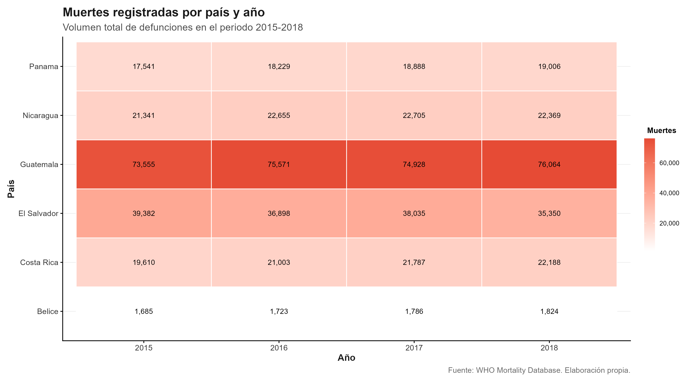
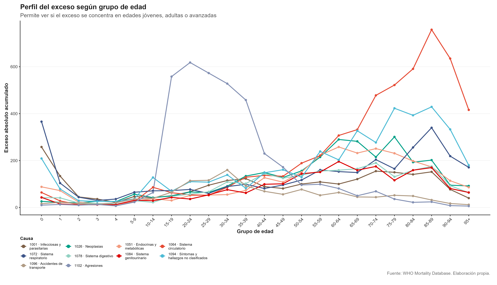
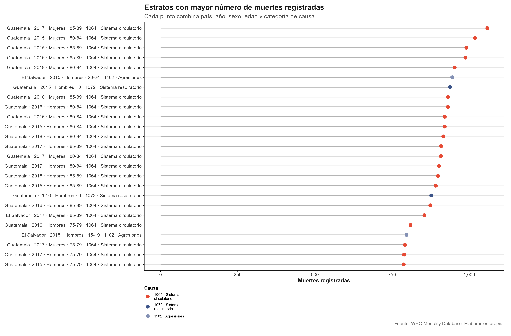
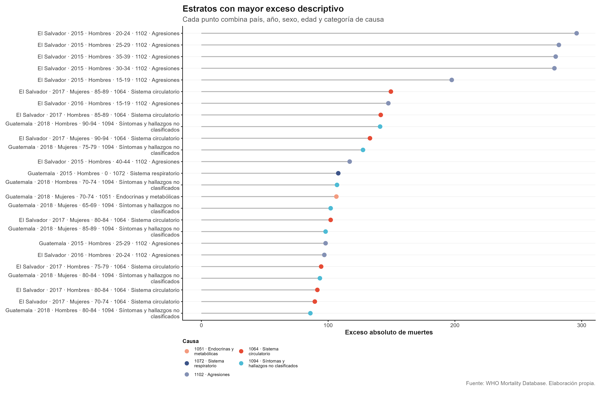
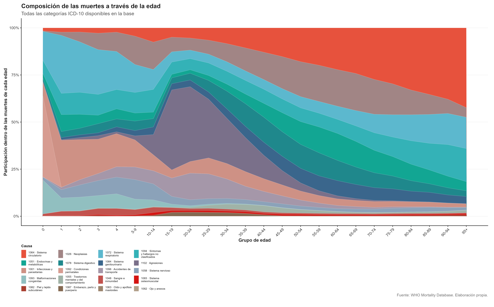

## {.title-slide background-image="imagenes/fondo_portada.png" background-size="cover" background-position="center"}

<div class="titulo-portada">
Análisis del cambio de la probabilidad de decremento

<div class="formula-titulo">
${}_n q_x^{(c)}$
</div>

para grupos etarios por causas de muerte de acuerdo con la clasificación ICD-10 en países de Centroamérica, 2015–2018
</div>

<div class="autores-portada">
Kevin David Calderón Martínez 

Gabriel de Jesús Chaves Esquivel

Benjamín Gutiérrez Padua

Sebastián Miranda Ramírez  
</div>

<div class="curso-portada">
CA0303 Estadística Actuarial

Profesor Maikol Solís

Universidad de Costa Rica

I - 2026
</div>

---

## {.title-slide background-image="imagenes/foto_pregunta.png" background-size="cover" background-position="center"}

<div class="titulo-portada">
PREGUNTA DE INVESTIGACIÓN
</div>

<div class="pregunta-investigacion">

¿Qué patrones de variabilidad se pueden estimar en la probabilidad de decremento  
${}_n q_x^{(c)}$  
por categoría de causas de la ICD-10 en países centroamericanos durante 2015–2018?

</div>


---

## {.slide-datos background-image="imagenes/foto_who.png" background-size="cover" background-position="center"}

<div class="titulo-datos">DATOS</div>

<div class="datos-layout">

<div class="datos-fila">

<div class="datos-texto">
<h3>WHO</h3>
<p>Base internacional de mortalidad por causa, edad, sexo, país y año.</p>
</div>

<div class="datos-contenido">

```{r}
#| label: resumen-base-mortalidad
#| echo: false
#| message: false
#| warning: false

library(tidyverse)
library(knitr)


tabla_resumen <- tibble(
  `Categoría principal` = c(
    "País", "Año", "Sexo", "Grupo de edad",
    "Causa de muerte", "Número de defunciones"
  ),
  `Nombre en la base` = c(
    "Pais", "Year", "Sex", "Deaths1–Deaths26",
    "Cause", "Deaths1–Deaths26"
  )
)

kable(
  tabla_resumen,
  format = "html",
  align = c("l", "l"),
  table.attr = 'class="tabla-datos"'
)
```

<div class="caption-tabla">
  <strong>Tabla 1:</strong> Significado de las columnas de la base de datos.
  <em>Obtenido de: World Health Organization (2026).</em>
</div>

</div>
</div>

<div class="datos-fila fila-icd">

<div class="datos-texto">
<h3>ICD-10</h3>
<p>
Clasificación internacional de enfermedades y causas de muerte utilizada
para codificar y organizar las defunciones.
</p>
</div>

<div class="datos-contenido">

```{r}
#| label: tabla-ejemplo-icd10
#| echo: false
#| message: false
#| warning: false

library(tibble)
library(knitr)

tabla_icd_ejemplo <- tribble(
  ~`Primer carácter<br>(Letra)`, ~`Demás caracteres<br>(Números)`, ~`Enfermedad`,
  "A-B", "",      "Ciertas enfermedades infecciosas y parasitarias",
  "A",   "00-09", "Enfermedades infecciosas intestinales",
  "A",   "00",    "Cólera",
  "B",   "00-09", "Infecciones virales por lesiones de piel y membrana mucosa",
  "B",   "00",    "Herpes simple",
  "B",   "001",   "Dermatitis vesicular herpética",
  "B",   "04",    "Viruela del mono"
)

kable(
  tabla_icd_ejemplo,
  format = "html",
  escape = FALSE,
  align = c("l", "l", "l"),
  table.attr = 'class="tabla-icd-ejemplo"'
)
```

<div class="caption-tabla">
  <strong>Tabla 2:</strong> Ejemplo breve de la clasificación de enfermedades de acuerdo al ICD-10.
  <em>Elaboración propia.</em>
</div>

</div>
</div>
</div>


## {.slide-poisson background-image="imagenes/foto_d.png" background-size="cover" background-position="center"}

<div class="titulo-poisson">MODELACIÓN DE DEFUNCIONES</div>

<div class="poisson-layout">

<div class="poisson-texto">

<div class="poisson-bloque">
<h3>Observaciones agrupadas</h3>
<p>
Los registros no corresponden a edades individuales, sino a grupos etarios:
<strong>0–4, 5–9, ..., 50–54</strong>.
</p>
</div>

<div class="poisson-bloque">
<h3>Variable de conteo</h3>
<p>
Definimos <strong>D<sub>x,t</sub><sup>(c)</sup></strong> como el número de defunciones
observadas en el grupo etario <strong>x</strong>, año <strong>t</strong> y causa <strong>c</strong>. Este valor es una v.a
</p>
</div>

</div>

<div class="poisson-modelo">

<div class="formula-titulo">Modelo condicional</div>

::: {.formula-poisson}
$$
D_{x,t}^{(c)} \mid \mu_{x,t}^{(c)}, E_{x,t}
\sim
\operatorname{Poisson}\!\left(E_{x,t}\mu_{x,t}^{(c)}\right)
$$
:::

::: {.interpretacion-poisson}
$$
\mathbb{E}\!\left[D_{x,t}^{(c)}\right]
=
E_{x,t}\mu_{x,t}^{(c)}
$$
:::

<div class="frase-clave">
El número esperado de muertes depende de la exposición poblacional y de la fuerza de mortalidad por causa.
</div>

</div>

</div>


<!-- ACA EMPIEZA MI PARTE -->

## {.slide-eda background-image="imagenes/foto_pregunta.png" background-size="cover" background-position="center"}

<div class="titulo-eda">ANÁLISIS EXPLORATORIO DE DATOS</div>

<div class="eda-layout">

<div class="eda-ecuacion">

<div class="eda-subtitulo">
Medida de exceso
</div>

<div class="formula-eda">

$$
\begin{gathered}
\max\left(D^{(c)}-\tilde{D}^{(c)},\,0\right) \\[0.55em]
D^{(c)} \ge 1.2\,\bar{D}^{(c)}
\end{gathered}
$$

</div>

<div class="eda-definicion">
$$\tilde{D}^{(c)}$$ representa la mediana de las defunciones agrupadas correspondientes a la misma causa \(c\).
</div>

<div class="eda-frase">
<ul>
  <li>Belice registró: 4484 excesos.</li>
  <li>Guatemala registró: 22807 excesos.</li>
</ul>
</div>

</div>

<div class="eda-imagen">
  
</div>

</div>


## {.slide-perfil-excesos background-image="imagenes/foto_pregunta.png" background-size="cover" background-position="center"}

<div class="titulo-perfil-excesos">
PERFIL DE EXCESOS
</div>

<div class="perfil-excesos-layout">

<div class="perfil-excesos-imagen">
  
</div>

<div class="perfil-excesos-notas">
  <ul>
    <li>
      Para edades entre 15–55 años, las agresiones resultan la causa de decremento con mayor exceso.
    </li>
    <li>
      Para los 70 años en adelante, las enfermedades degenerativas, como las asociadas al sistema circulatorio, toman mayor intensidad.
    </li>
  </ul>
</div>

</div>


## {.slide-estratos background-image="imagenes/foto_pregunta.png" background-size="cover" background-position="center"}

<div class="titulo-estratos">
ESTRATOS DE MAYOR NÚMERO DE MUERTES Y EXCESOS
</div>

<div class="estratos-layout">

<div class="estratos-imagen">
  
</div>

<div class="estratos-imagen">
  
</div>

</div>

<div class="mensaje-estratos">
El exceso más fuerte no necesariamente coincide con el mayor número de muertes registradas.
</div>

## {.slide-historia background-image="imagenes/foto_pregunta.png" background-size="cover" background-position="center"}

<div class="titulo-historia">
IMAGEN QUE CUENTA LA HISTORIA
</div>

<div class="historia-layout">

<div class="historia-imagen">
  
</div>

<div class="mensaje-historia">
  - Masa de acumulación de decrementos asociados a causas segregadas
</div>

</div>


## {.slide-decremento background-image="imagenes/foto_pregunta.png" background-size="cover" background-position="center"}

<div class="titulo-decremento">
CONSTRUCCIÓN DE LA PROBABILIDAD DE DECREMENTO MÚLTIPLE
</div>

<div class="decremento-layout">

<div class="cuadro-tasa">

<div class="subtitulo-cuadro">
Tasa central de mortalidad por causa
</div>

<div class="formula-tasa">

$$
{}_n m_{x,t}^{(c)}
=
\frac{
D_{x,t}^{(c)}
}{
{}_n L_{x,t}
}
$$

</div>

<div class="explicacion-tasa">
  <p>
    \\(D_{x,t}^{(c)}\\): defunciones observadas por la causa \\(c\\).
  </p>
  <p>
    \\({}_{n}L_{x,t}\\): exposición al riesgo, aproximada mediante años-persona.
  </p>
</div>

</div>

<div class="cuadro-probabilidad">

<div class="subtitulo-cuadro">
Probabilidad de decremento múltiple
</div>

<div class="formula-q">

$$
{}_n q_{x,t}^{(c)}
=
\underbrace{
\frac{
{}_n m_{x,t}^{(c)}
}{
{}_n m_{x,t}^{(\cdot)}
}
}_{\text{participación relativa de la causa }c}
\;
\underbrace{
\left(
1-e^{-n\,{}_n m_{x,t}^{(\cdot)}}
\right)
}_{\text{probabilidad de morir por cualquier causa}}
$$

</div>

<div class="explicacion-q">
Bajo fuerza de mortalidad constante dentro del intervalo, la probabilidad de decremento por causa se obtiene ponderando la intensidad relativa de la causa por la probabilidad total de muerte.
</div>

</div>

</div>

<div class="nota-decremento">
  <ul>
    <li>
      El dataset de población aporta la exposición entre causas en competencia a mitad de año, lo cual facilita su uso al no requerir interpolaciones.
    </li>
  </ul>
</div>


