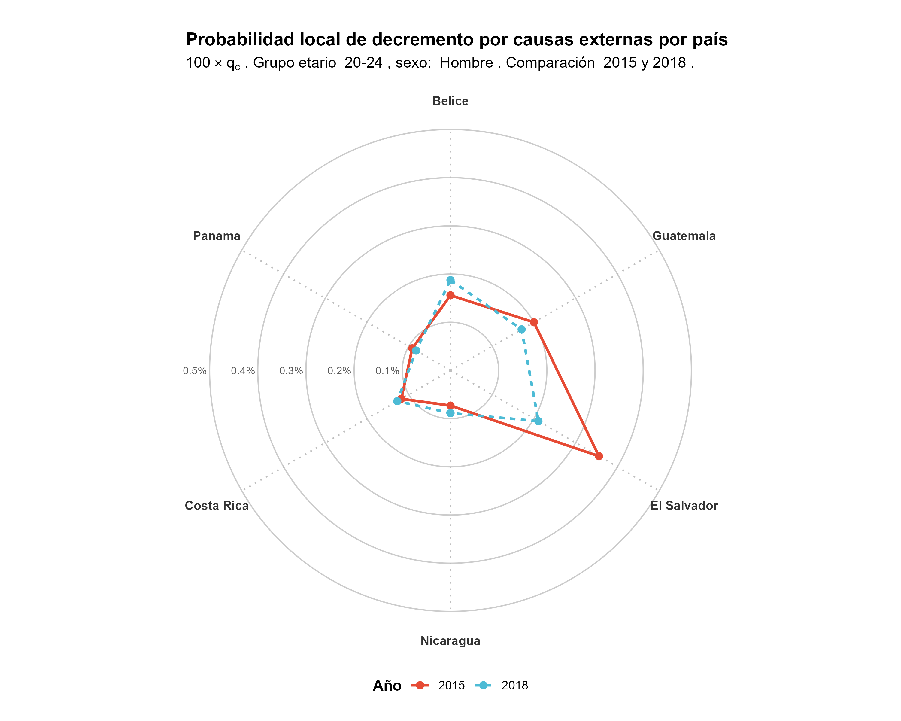
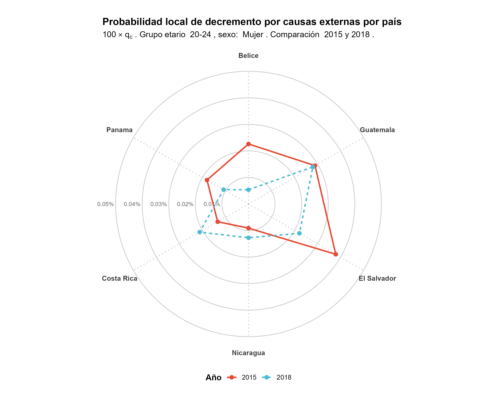
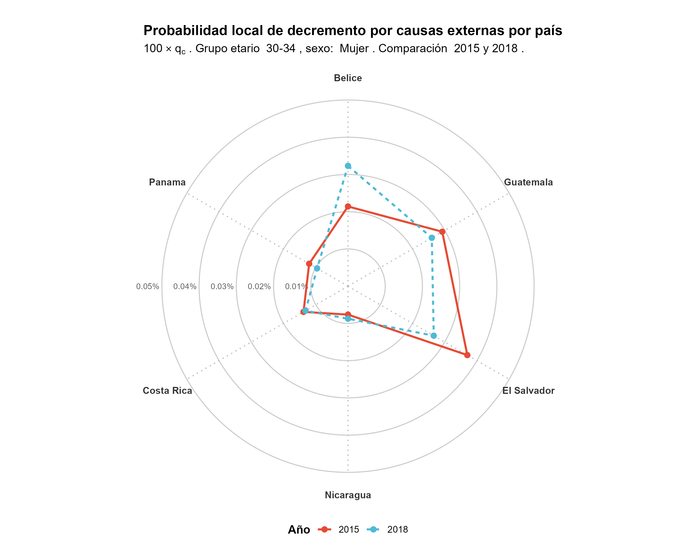
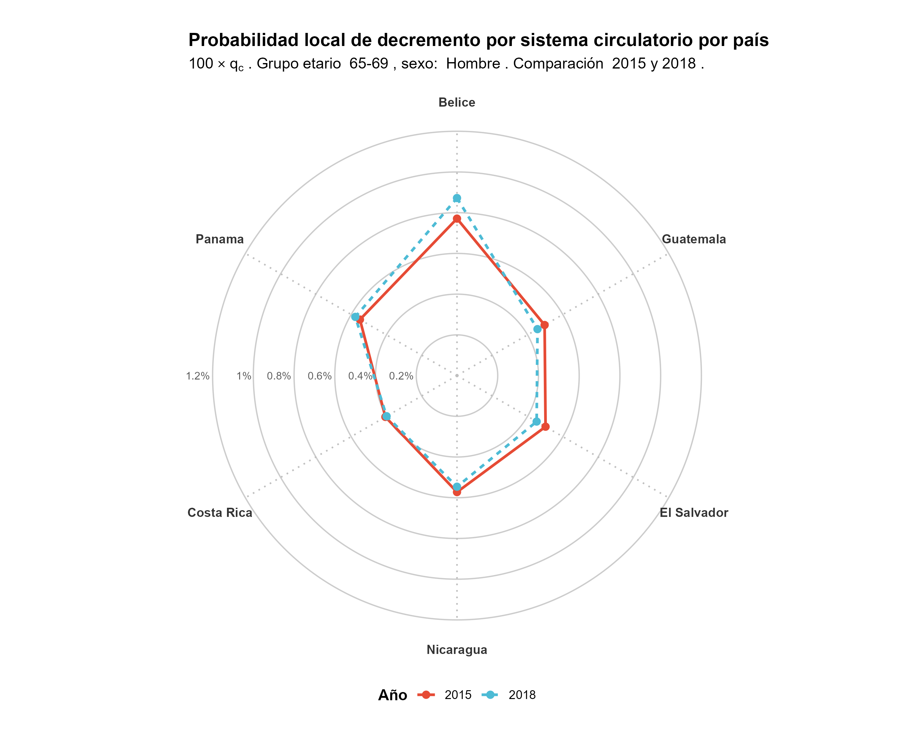
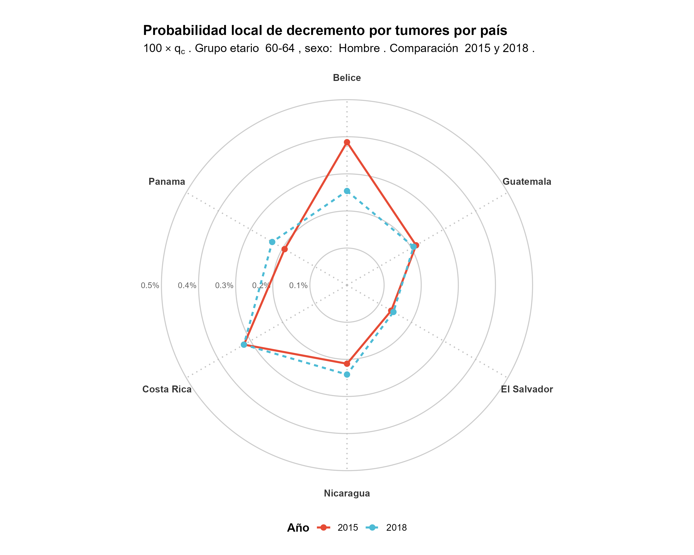
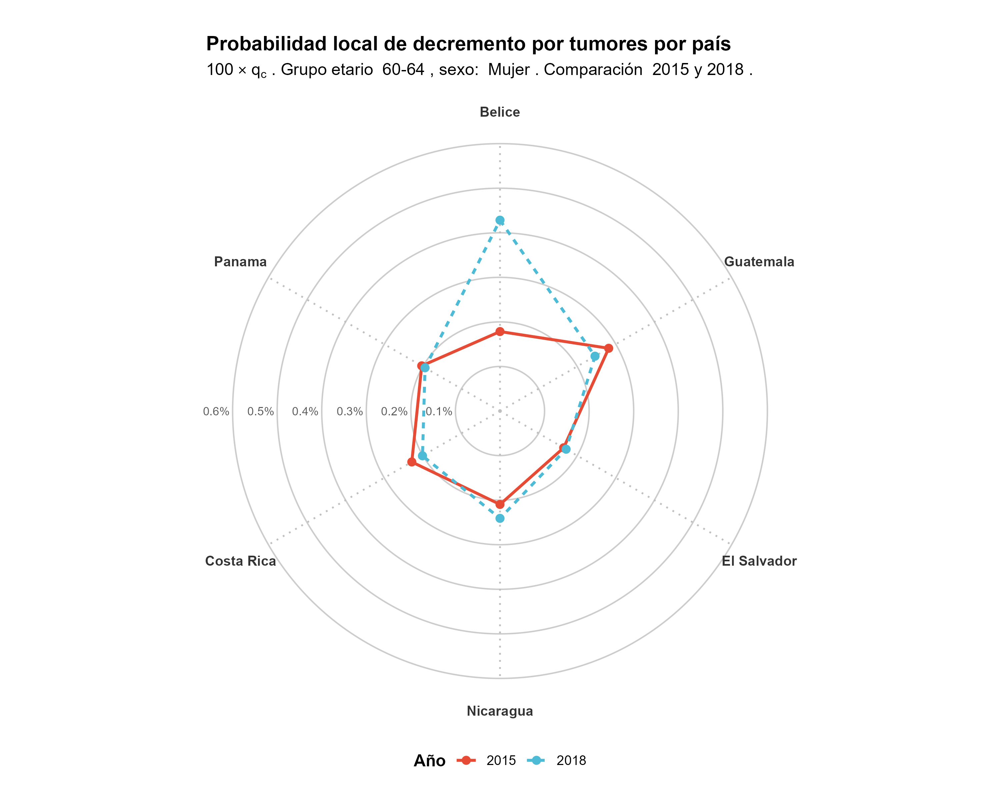
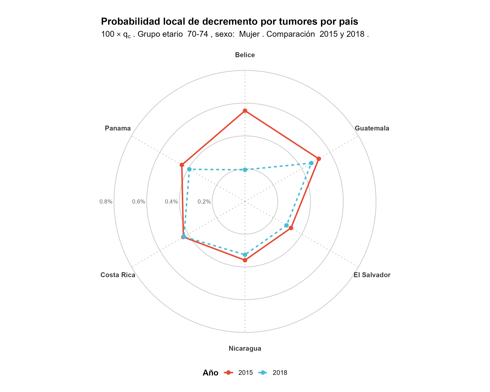
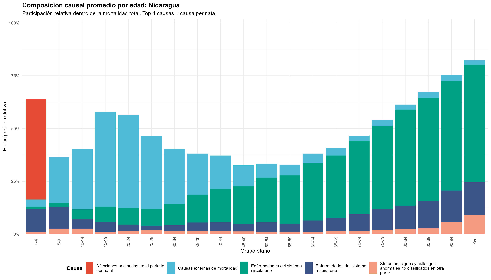
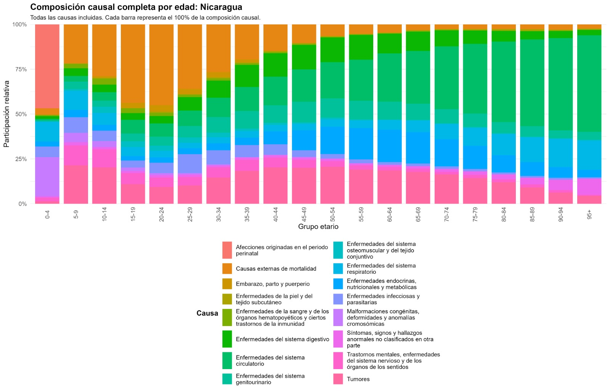
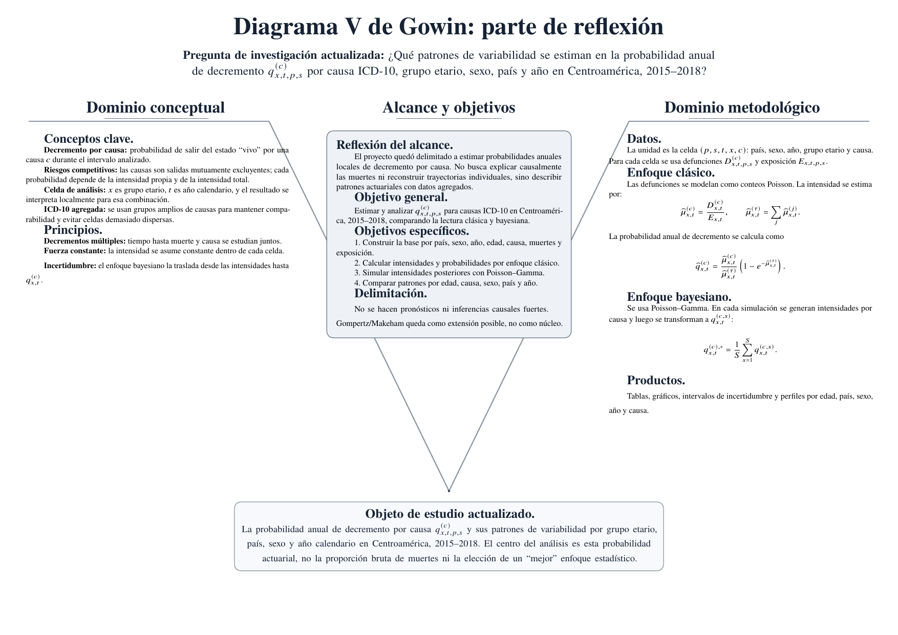

::: {.content-visible when-format="pdf"}
```{=latex}
\begin{titlepage}
\thispagestyle{empty}

\AddToShipoutPictureBG*{%
  \AtPageLowerLeft{%
    \includegraphics[width=\paperwidth,height=\paperheight]{portada.png}%
  }%
}

\begin{center}

{\Huge\bfseries Bitácora 3\par}

\vspace{1.1cm}

\textbf{Universidad de Costa Rica}

\vspace{0.5cm}

\textbf{Escuela de Matemática}

\textbf{Departamento de Matemática y Ciencias Actuariales}

\vspace{0.8cm}

\textbf{Proyecto de Investigación}

\vspace{2.2cm}

\begin{minipage}{0.88\textwidth}
\centering
{\Large\bfseries
Análisis del cambio de la probabilidad de decremento ${}_{n}q_{x}^{(c)}$ para grupos etarios por causas de muerte de acuerdo a la clasificación ICD-10 en países de Centroamérica [2015, 2018].
\par}
\end{minipage}

\vspace{1.8cm}

\textbf{Integrantes}

\vspace{0.2cm}

\textbf{Sebastián Miranda Ramírez C4H274}

\textbf{Benjamín Gutiérrez Padua C4F813}

\textbf{Kevin David Calderón Martínez C4D511}

\textbf{Gabriel de Jesús Chaves Esquivel C4E273}

\vspace{0.5cm}

\textbf{Profesor}

\vspace{0.3cm}

\textbf{Maikol Solís Chacón}

\vfill

\textbf{2026}

\end{center}

\end{titlepage}
```
:::

:::: {.content-visible when-format="html"}
::: {style="text-align: center; margin-top: 120px;"}
<b>Universidad de Costa Rica</b><br><br>

<b>Escuela de Matemática</b><br> <b>Departamento de Matemática y Ciencias Actuariales</b><br><br>

<b>Proyecto de Investigación</b><br><br>

<b> Análisis del cambio de la probabilidad de decremento ${}_{n}q_{x}^{(c)}$ para grupos etarios por causas de muerte de acuerdo a la clasificación ICD-10 en países de Centroamérica \[2015, 2018\]. </b><br><br>

<b>Integrantes</b><br><br>

Sebastián Miranda Ramírez — C4H274<br> Benjamín Gutiérrez Padua — C4F813<br> Kevin David Calderón Martínez — C4D511<br> Gabriel de Jesús Chaves Esquivel — C4E273<br><br>

<b>Profesor</b><br> Maikol Solís Chacón<br><br>

<b>2026</b>
:::
::::

# Bitácora 3

# 1. Parte de Planificación

## 1.1.1 Carga de datos

En el repositorio de GitHub, dentro de la carpeta `codigo`, se encuentran los scripts que construyen y limpian la base de datos utilizada en el proyecto. La base de datos limpia se llama `data_centroamerica_FINAL.csv` y se encuentra en la ruta `datos/procesados` del repositorio. Para construirla, se partió de los registros de mortalidad por causa y de la base de exposición poblacional *World Population Prospects*. Primero se filtraron los países de Centroamérica considerados en el proyecto y los años 2015--2018. Luego se estandarizaron las variables necesarias para unir ambas fuentes: año, país, sexo y grupo etario. En el caso de las defunciones, las causas de muerte se agruparon según los grandes capítulos de la ICD-10 identificados con números romanos, en lugar de trabajar con códigos demasiado específicos. Esta decisión permitió reducir la dispersión de los conteos y mantener categorías comparables, como tumores, enfermedades del sistema circulatorio, enfermedades respiratorias, afecciones perinatales y causas externas de mortalidad.

Finalmente, la base de mortalidad y la base de exposición de la WPP se unieron mediante las llaves comunes de año, país, sexo y grupo etario, obteniendo una base en formato largo donde cada fila representa una celda actuarial específica. Esta estructura permite estimar intensidades de mortalidad por causa y transformarlas en probabilidades anuales de decremento $q_x^{(c)}$.

## 1.1.2 Analisis descriptivo de la base de datos

La base de datos utilizada en esta etapa del proyecto tiene como unidad de análisis una celda definida por año calendario, sexo, país, grupo etario y causa de muerte. En particular, las variables `anio`, `sexo`, `pais` y `grupo_edad` permiten ubicar demográfica y temporalmente a la población expuesta, mientras que `causa` y `causa_grupo` identifican la categoría de muerte según la agrupación general de la ICD-10. La variable `muertes` registra el número de defunciones observadas en cada celda y la variable `exposicion` aproxima la población expuesta al riesgo durante ese año, usualmente interpretada como población a mitad de año.

```{r}
#| label: tbl-ejemplo-base-final
#| echo: false
#| message: false
#| warning: false
#| tbl-cap: "Primeras filas de la base final utilizada en el análisis."

library(readr)
library(dplyr)
library(knitr)
library(here)

data_centroamerica_final <- read_csv(
  here("datos", "procesados", "data_centroamerica_FINAL.csv"),
  show_col_types = FALSE
)

data_centroamerica_final %>%
  select(
    anio,
    pais,
    sexo,
    grupo_edad,
    causa,
    muertes,
    exposicion
  ) %>%
  slice_head(n = 6) %>%
  kable(
    digits = 2,
    format.args = list(big.mark = " ", scientific = FALSE)
  )
```

## 1.2.1. Formulación metodológica del proyecto

La metodología del proyecto se construye alrededor de estimar la probabilidad actuarial de decremento por causa,

$${}_n q_{x,t}^{(c)}
=
P(T_{x,t}\leq n,\ J=c),$$

donde $x$ representa el del grupo etario de cada persona y t el año calendario en el cual se encuentran,

$$x\in\{0,1,2,3,4,5\text{-}9,10\text{-}14,\ldots,90\text{-}94,95+\}, \quad t\in\{2015,2016,2017,2018\}$$

y $c$ una categoría de causa de muerte según la ICD-10, de acuerdo con la clasificación definida en bitácoras anteriores. En particular, cuando el grupo etario se denote por su edad inicial, $x$ también puede leerse como el extremo inferior del intervalo. Por ejemplo, para el grupo $30\text{-}34$ se puede escribir $x=30$ y asociar el intervalo $I_x=[30,35)$, esta convención se usará al escribir las diversas fórmulas a estimar.

La variable aleatoria $T_{x,t}$ representa el tiempo futuro de vida de una persona perteneciente al grupo etario $x$ durante el año calendario $t$ y $J$ es una variable aleatoria que indica la causa del decremento. Con esta convención, $q_{x,t}^{(c)}$ debe leerse como la probabilidad de morir por la causa $c$ para una vida perteneciente al grupo etario $x$ durante el año calendario $t$, bajo las intensidades estimadas para esa celda. Por ejemplo, si $x=30\text{-}34$, entonces $q_{30\text{-}34,t}^{(c)}$ no se interpreta como la probabilidad exacta de una persona de edad puntual $30$, $33.9$ o $34.7$, sino como el riesgo anual asociado al grupo etario completo $30\text{-}34$ durante el año $t$. Asimismo se considera que para que alguien muera por la causa $c$ primero debe no haber muerto por las otras $c-1$ causas, de manera que estas se consideran "causas competidoras" e influyen en el cálculo de las diferentes probabilidades. Bowers et al. (1997) y Deshmukh (2012) presentan este tratamiento para las probabilidades de decremento.

Aunque el objeto de estudio también depende del país y del sexo, estas dimensiones se mantienen en el cálculo, pero se omiten de la expresión para no sobrecargar la notación, en el momento de presentación de resultados se hará explícito el sexo y el país al que se esté referiendo cada aseveración. De forma más general, la probabilidad podría escribirse como ${}_n q_{x,t,p,s}^{(c)}$, donde $p$ representa el país y $s$ el sexo.

Con respecto al sistema de clasificación de las causas de defunción: Existe una estandarización aún más general para la clasificación de enfermedades utilizando números romanos, la cual fue propuesta por la misma WHO, para agrupar de manera más amplia la causa de muerte en el cálculo de las tablas de vida de decrementos múltiples. Para efectos de este trabajo, se utilizará este estándar para un mejor manejo de datos. A continuación una tabla que explica el estándar:

```{r, echo = FALSE}
library(knitr)
estandar <- data.frame(
  "      **Grupo**     " = c("I","II","III","IV","V-VIII","IX","X","XI","XII","XIII", "XIV", "XV", "XVI", "XVII", "XVIII", "XX"),
  "     **ICD-10** " = c("A00-B99, R75", "C00-D48","D50-D89","E00-E90","F00-H95","I00-I99","J00-J99","K00-K93","L00-L99","M00-M99", "N00-N99", "O00-O99 ", "P00-P96", "Q00-Q99", "R00-R74, R76-R99, U00-U99", "V01-Y89"),
  "     **Causa**   " = c(
    "Enfermedades infecciosas y parasitarias",
    "Tumores",
    "Enfermedades de la sangre y de los órganos hematopoyéticos, y ciertos trastornos que afectan al mecanismo de la inmunidad",
    "Enfermedades endocrinas, nutricionales y metabólicas",
    "Trastornos mentales y del comportamiento (V) y Enfermedades del sistema nervioso y de los órganos de los sentidos (VI-VIII)",
    "Enfermedades del sistema circulatorio",
    "Enfermedades del sistema respiratorio",
    "Enfermedades del sistema digestivo",
    "Enfermedades de la piel y del tejido subcutáneo",
    "Enfermedades del sistema osteomuscular y del tejido conjuntivo",
    "Enfermedades del sistema genitourinario",
    "Embarazo, parto y puerperio",
    "Afecciones originadas en el periodo perinatal",
    "Malformaciones congénitas, deformidades y anomalías cromosómicas",
    "Síntomas, signos y hallazgos anormales clínicos y de laboratorio, no clasificados en otra parte.",
    "Causas externas de mortalidad"
  ), check.names = FALSE
)

kable(estandar, caption = "*Explicación de la lista de tabulación de mortalidad de la ICD-10. Obtenido de: World Health Organization (WHO)*")
```

Para la estimación de estas causas se deberá de recurrir a los datos disponibles en la WHO Mortality Database, los cuales se presentan de manera agregada, por tanto la unidad de análisis será una celda definida por país y sexo dados, así como año calendario $t$, grupo etario $x$ y causa de muerte $c$. Para cada celda se tendrá un conteo de defunciones,

$$D_{x,t}^{(c)},$$

obtenido de la WHO Mortality Database, y una exposición en años-persona,

$$E_{x,t},$$

aproximada mediante la población a mitad de año correspondiente al mismo país, sexo, año calendario y grupo etario, obtenida de World Population Prospects 2024. Esta aproximación es metodológicamente razonable en este contexto, pues la población a mitad de año suele utilizarse como aproximación de la exposición al riesgo cuando se trabaja con datos agregados anuales; Pitacco et al. (2009) discuten esta interpretación de la exposición en modelos de mortalidad.

Antes de pasar a los enfoques de estimación, es necesario aclarar con mayor precisión los supuestos bajo los cuales se interpretará el objeto actuarial del proyecto. En este sentido, la notación actuarial general $\,{}_n q_{x,t}^{(c)}\,$ es útil para introducir la idea de probabilidad de decremento por causa, y además es cercana a la notación estándar utilizada en trabajos sobre probabilidades de decrementos múltiples. En una formulación actuarial más general, para trabajar con $\,{}_n q_{x',t'}^{(c)}\,$ se puede interpretar $x'$ como una edad exacta y $t'$ como un momento exacto del calendario. Sin embargo, en dichos trabajos se suele contar con maneras precisas de estimar las probabilidades $,{}q_{x',t'}^{(c)},$ para al menos todos los $x',t'$ enteros, de manera que mediante supuestos como fuerza de mortalidad constante en cada celda $[x', x'+1)$ y $[t',t'+1)$ se pueden estimar toda la familia de probabilidades $,{}_n q_{x',t'}^{(c)},$ para $x',t',n$ reales.

Sin embargo, en este trabajo no se cuenta con datos para todas las edades exactas $x'$ ni para todos los momentos calendario $t'$, debido a la naturaleza agregada de la WHO Mortality Database. Los datos disponibles están agrupados por grupo etario y año calendario, a excepción de los primeros años de vida, donde sí aparecen de manera más desagregada. Por esta razón, en nuestro trabajo $x$ no representa una edad exacta individual, sino que indexa el grupo etario al que pertenece la persona.

Por tanto, el supuesto de fuerza constante no se hará solamente sobre una celda del estilo $[x',x'+1)$ y $[t',t'+1)$ para edades exactas, sino sobre todo el intervalo de edad asociado al grupo etario durante un año calendario. Así, para un país y sexo fijados, si $I_x$ representa el grupo etario asociado a $x$, y si $t$ representa el año calendario, se asumirá que la fuerza de mortalidad por causa es constante dentro de la celda formada por grupo etario y año calendario. Es decir, si

$$
I_x=[a_x,b_x),
$$

entonces se supondrá que

$$
\mu_{y,z}^{(c)}=\mu_{x,t}^{(c)}
$$

para edades exactas $y\in I_x$ y momentos calendario $z\in[t,t+1)$, donde $\mu_{x,t}^{(c)}$ representa la intensidad o tasa central de mortalidad por la causa $c$ para la celda definida por grupo etario $x$ y año calendario $t$.

En el caso particular de grupos quinquenales, si el grupo se denota por su edad inicial y se escribe $I_x=[x,x+5)$, el supuesto anterior equivale a asumir que

$$
\mu_{x+\xi_1,t+\xi_2}^{(c)}
=
\mu_{x,t}^{(c)},
\qquad
0\le \xi_1<5,\quad 0\le \xi_2<1.
$$

En otras palabras, $\mu_{x,t}^{(c)}$ no representa una intensidad propia de una edad exacta como $33.9$, sino la intensidad estimada para todo el grupo etario $x$ durante el año $t$. Por ejemplo, si $x=30$ representa el grupo $30\text{-}34$, entonces $\mu_{30,t}^{(c)}$ representa una única intensidad asociada al intervalo $I_{30}=[30,35)$ durante el año calendario $t$.

Esta aclaración es importante porque $\,{}_n q_{x,t}^{(c)}\,$, para un horizonte general $n$, solo puede usarse directamente con una única intensidad de muerte cuando el intervalo considerado permanece dentro de la celda donde esa intensidad fue asumida constante. Si una persona tuviera una edad exacta $y\in I_x$ y se quisiera seguir durante $n$ años usando solamente $\mu_{x,t}^{(c)}$, tendría que cumplirse al menos que

$$
y+n\leq b_x.
$$

Si esta condición no se cumple, la persona saldría del grupo etario $I_x$ y entraría en otro grupo, por lo que ya no sería correcto usar únicamente la intensidad $\mu_{x,t}^{(c)}$. Además, aun si se cumpliera la condición anterior respecto al grupo etario, también habría que considerar el año calendario si el seguimiento se interpretara estrictamente como una trayectoria real en edad y calendario, pues el año $t$ cambiaría al avanzar el tiempo. En ese caso, la fórmula directa con una sola intensidad tendría que sustituirse por un encadenamiento por tramos, usando las intensidades correspondientes a los grupos etarios y años calendario que se vayan cruzando.

Por esta razón, en la aplicación empírica del proyecto se fijará el horizonte en $n=1$, pues esta elección es la más coherente con la estructura anual de los datos, y hace que el proyecto sea computacionalmente estable y fácilmente interpretable. Una vez hecha esta salvedad, se escribirá simplemente

$$
q_{x,t}^{(c)}
$$

para referirse a la probabilidad anual de decremento por causa. Es decir,

$$
q_{x,t}^{(c)}:={}_1 q_{x,t}^{(c)}.
$$

Con esta convención, $q_{x,t}^{(c)}$ debe leerse como una probabilidad anual asociada a la celda agregada definida por grupo etario, año calendario, país, sexo y causa. Es decir, representa el riesgo anual estimado de morir por la causa $c$ para el conjunto de vidas expuestas dentro del grupo etario $x$ durante el año $t$, bajo las intensidades estimadas para esa celda. Por ejemplo, si $x=30$ representa el grupo $30\text{-}34$, entonces $q_{30,t}^{(c)}$ representa el riesgo anual estimado del grupo etario $30\text{-}34$ durante el año $t$.

Esta cantidad debe entenderse principalmente como una medida del grupo etario, no como una probabilidad exacta para cada edad individual dentro del grupo. Si una persona tuviera una edad exacta dentro de ese intervalo, por ejemplo $31.2$ o $32.5$, el modelo simplemente la ubicaría dentro del grupo $30\text{-}34$ y le asociaría la misma intensidad estimada para todo el grupo. Esto ocurre porque los datos no permiten distinguir el riesgo de cada edad exacta por separado. Así, bajo el supuesto de fuerza constante dentro de la celda, edades internas como $30$, $31.2$, $32.5$ o incluso $33.9$ quedan representadas por la misma probabilidad grupal $q_{30,t}^{(c)}$, pero no se está haciendo una estimación exacta para cada edad individual.

Con estas salvedades aclaradas, es esencial definir de qué manera se estimará $q_{x,t}^{(c)}$. Para seguir la línea del curso y los métodos allí vistos, se usará tanto un enfoque clásico como uno bayesiano. En este sentido, la comparación no será el fin del proyecto por sí misma, sino un medio para interpretar patrones de variabilidad. Si una celda tiene alta exposición y suficientes defunciones, ambos enfoques deberían producir resultados similares. Si una celda tiene baja exposición, conteos nulos o una causa poco frecuente, el enfoque bayesiano debería producir estimaciones más estabilizadas e intervalos más amplios. El por qué de estos resultados esperados se hará claro conforme se definan los métodos de estimación que se tomará en cada uno de los enfoques.

### Enfoque clásico

El primer bloque metodológico será clásico. Para cada celda se modelarán las defunciones por causa como una variable aleatoria de conteo:

$$D_{x,t}^{(c)}\mid \mu_{x,t}^{(c)}
\sim
\text{Poisson}\left(E_{x,t}\mu_{x,t}^{(c)}\right),$$

Esta formulación se apoya en Manton et al. (1989), argumentan que las defunciones pueden modelarse aproximadamente como una variable Poisson con dichos parámetros. Esto es además coherente con la naturaleza de la distribución Poisson, la cual representa el número de sucesos aleatorios que ocurren en un intervalo de tiempo dado, en este caso dichos sucesos serían las defunciones. Asimismo, $\mu_{x,t}^{(c)}$ se interpreta como la fuerza de mortalidad, es decir, una tasa instantánea de salida del estado vivo por la causa $c$, asumida constante dentro de la celda anual considerada. Por tanto, al multiplicarla por la exposición $E_{x,t}$, el producto $E_{x,t}\mu_{x,t}^{(c)}$ representa el número esperado de defunciones por la causa $c$ en dicha celda, lo que justifica que sea el parametro de la Poisson.

Pitacco et al (2009) muestran que, bajo este modelo, la estimación clásica por máxima verosimilitud de la intensidad es

$$\widehat{\mu}_{x,t}^{(c)}
=
\frac{D_{x,t}^{(c)}}{E_{x,t}}.$$

Esta representa cuántas defunciones por la causa $c$ se observan en relación con la población expuesta en esa celda. Luego se construye la fuerza total de salida del estado vivo sumando las intensidades por causa a lo largo de las $r$ causas:

$${\mu}_{x,t}^{(\tau)}
=
\sum_{j=1}^{r}
{\mu}_{x,t}^{(j)}.$$

La notación $(\tau)$ se usa para indicar la mortalidad total por todas las causas consideradas. Esta suma es la parte que hace que el enfoque sea realmente de decrementos múltiples en presencia de causas competitivas, como se mencionó antes, la causa $c$ no se analiza como si fuera la única causa posible, sino en presencia de las demás causas que también pueden producir la muerte dentro del intervalo.

Bajo el supuesto de fuerza constante dentro de la celda anual considerada, la transformación de intensidades a probabilidades de decremento se aplica directamente para el horizonte anual del proyecto. Siguiendo la fórmula de decrementos múltiples bajo fuerza constante presentada por Deshmukh (2012, p. 46), la probabilidad anual de morir por la causa $c$ se expresa como

$$q_{x,t}^{(c)}
=
\frac{\mu_{x,t}^{(c)}}{\mu_{x,t}^{(\tau)}}
\left(
1-e^{-\mu_{x,t}^{(\tau)}}
\right).$$

En consecuencia, la estimación clásica será

$$\widehat{q}_{x,t}^{(c)}
=
\frac{\widehat{\mu}_{x,t}^{(c)}}{\widehat{\mu}_{x,t}^{(\tau)}}
\left(
1-e^{-\widehat{\mu}_{x,t}^{(\tau)}}
\right).$$

### Enfoque bayesiano

El enfoque bayesiano mantiene el mismo modelo de conteo usado en el enfoque clásico, de forma que:

$$
D_{x,t}^{(c)}
\mid
\mu_{x,t}^{(c)}
\sim
\operatorname{Poisson}
\left(
E_{x,t}\mu_{x,t}^{(c)}
\right).
$$

Sin embargo ahora la intensidad de mortalidad por causa se considera una variable aleatoria. La diferencia respecto al enfoque clásico es que ahora $\mu_{x,t}^{(c)}$ no se trata como un parámetro fijo desconocido, sino como una variable aleatoria positiva. Para ello se asigna una distribución Gamma:

$$
\mu_{x,t}^{(c)}
\sim
\operatorname{Gamma}
\left(
\alpha_p^{(c)},\beta_p^{(c)}
\right), \quad \mathbb{E}\left[\mu_{x,t}^{(c)}\right]
=
\frac{\alpha_p^{(c)}}{\beta_p^{(c)}}.
$$

Se debe recordar que, aunque en buena parte de la metodología se omiten el país y el sexo de la notación para evitar sobrecargarla, la estimación se realiza utilizando celdas definidas por país, sexo, grupo etario, año calendario y causa. En el caso de los hiperparámetros sí se mantendrá explícito el país $p$, ya que se estimará un par distinto para cada combinación de país y causa:

$$
\alpha_p^{(c)},\beta_p^{(c)}.
$$

Estos hiperparámetros serán comunes para los distintos sexos, grupos etarios y años calendario incluidos en la experiencia colectiva del país $p$ y la causa $c$. Es decir, para cada país y causa se utilizará la información observada en ambos sexos, los distintos grupos etarios y los años 2015 a 2018, pero el resultado será un único par de hiperparámetros.

Para formalizar esta idea, se define

$$
\mathcal I_p^{(c)}
=
\left\{
(s,x,t):
\text{país }p\text{ y causa }c\text{ fijos}
\right\},
$$

donde $s$ representa el sexo, $x$ el grupo etario y $t$ el año calendario. Por tanto, $\mathcal I_p^{(c)}$ contiene las celdas cuya experiencia se utilizará para estimar los hiperparámetros correspondientes al país $p$ y la causa $c$.

Para la mayoría de las causas, el conjunto $\mathcal I_p^{(c)}$ incluirá todas las combinaciones disponibles de sexo, grupo etario y año calendario. Sin embargo, antes de realizar la estimación es necesario distinguir entre ceros observacionales y ceros estructurales.

Un cero observacional corresponde a una celda en la cual la muerte por la causa $c$ es posible, pero no se registraron defunciones durante el año analizado. Estas celdas deben mantenerse en la estimación, ya que aportan información sobre la intensidad de mortalidad.

En cambio, un cero estructural corresponde a una combinación de sexo o grupo etario para la cual la causa no resulta aplicable. Estas celdas no deben interpretarse como observaciones de una intensidad pequeña, sino como casos que se encuentran fuera del conjunto de riesgo correspondiente a la causa.

En particular, para la causa XV, correspondiente a embarazo, parto y puerperio, se define

$$
\mathcal I_p^{(\mathrm{XV})}
=
\left\{
(\mathrm{Mujer},x,t):
\begin{aligned}
x &\in
\left\{
10\text{-}14,
15\text{-}19,
\ldots,
50\text{-}54
\right\},\\[2mm]
t &\in
\left\{
2015,2016,2017,2018
\right\}
\end{aligned}
\right\}.
$$

Por tanto, para esta causa no se utilizarán en la estimación de los hiperparámetros las celdas correspondientes a hombres ni los grupos etarios situados fuera de dicho intervalo. No obstante, los conteos iguales a cero que aparezcan dentro de las celdas femeninas incluidas sí permanecerán en la estimación.

Para la causa XVI, afecciones originadas en el periodo perinatal, se define

$$
\mathcal I_p^{(\mathrm{XVI})}
:=
\left\{
(s,0\text{-}4,t):
s\in\{\text{Hombre},\text{Mujer}\},
\quad
t\in\{2015,2016,2017,2018\}
\right\}.
$$

En este caso, la estimación utilizará solamente las celdas correspondientes al grupo etario $0\text{-}4$, para ambos sexos y todos los años disponibles. Los conteos nulos observados dentro de estas celdas también se conservarán.

Así, las restricciones anteriores no implican eliminar de manera general las observaciones para las cuales

$$
D_{x,t,s}^{(c)}=0.
$$

Únicamente se excluyen las celdas que se encuentran fuera del dominio de aplicación de la causa.

Esto permite mantener la idea de experiencia colectiva propia del enfoque Empirical Bayes. Cada celda conserva su información observada, pero la estimación de su intensidad se beneficia de la experiencia conjunta del país y la causa. Esta característica resulta especialmente útil cuando existen celdas con poca exposición, conteos pequeños o conteos nulos.

#### Estimación de $\alpha_p^{(c)}$ y $\beta_p^{(c)}$

Los hiperparámetros $\alpha_p^{(c)}$ y $\beta_p^{(c)}$ se estimarán mediante un enfoque Empirical Bayes, inspirado en el procedimiento presentado por Zhang et al. (2019). Esto significa que no se fijarán subjetivamente, sino que se estimarán a partir de los conteos observados pertenecientes al conjunto $\mathcal I_p^{(c)}$.

El modelo bayesiano puede representarse mediante la jerarquía

$$
\alpha_p^{(c)},\beta_p^{(c)}
\longrightarrow
\mu_{x,t,s}^{(c)}
\longrightarrow
D_{x,t,s}^{(c)}.
$$

En el primer nivel, los hiperparámetros $\alpha_p^{(c)}$ y $\beta_p^{(c)}$ describen la experiencia colectiva asociada al país $p$ y a la causa $c$. En el segundo nivel, cada intensidad $\mu_{x,t,s}^{(c)}$ representa el riesgo latente propio de una celda definida por sexo, grupo etario y año calendario. Finalmente, en el tercer nivel se encuentran los conteos observados $D_{x,t,s}^{(c)}$.

Para cada celda aplicable se mantiene el modelo

$$
D_{x,t,s}^{(c)}
\mid
\mu_{x,t,s}^{(c)}
\sim
\operatorname{Poisson}
\left(
E_{x,t,s}\mu_{x,t,s}^{(c)}
\right),
$$

junto con la distribución previa

$$
\mu_{x,t,s}^{(c)}
\sim
\operatorname{Gamma}
\left(
\alpha_p^{(c)},
\beta_p^{(c)}
\right),
$$

donde $\beta_p^{(c)}$ se parametriza como tasa. Por tanto,

$$
\mathbb{E}\left[
\mu_{x,t,s}^{(c)}
\right]
=
\frac{\alpha_p^{(c)}}{\beta_p^{(c)}}.
$$

La dificultad es que las intensidades $\mu_{x,t,s}^{(c)}$ no se observan directamente. Los datos disponibles son las defunciones $D_{x,t,s}^{(c)}$ y las exposiciones $E_{x,t,s}$. Por ello, los hiperparámetros no se estimarán utilizando una muestra observada de intensidades, sino mediante la distribución marginal de los conteos.

Esta distribución se obtiene integrando la intensidad latente:

$$
P\left(
D_{x,t,s}^{(c)}=d
\right)
=
\int_0^\infty
P\left(
D_{x,t,s}^{(c)}=d
\mid
\mu
\right)
f\left(
\mu
\mid
\alpha_p^{(c)},\beta_p^{(c)}
\right)
d\mu.
$$

Este procedimiento elimina el nivel intermedio no observado y produce una relación directa entre los hiperparámetros y los conteos:

$$
\alpha_p^{(c)},\beta_p^{(c)}
\longrightarrow
D_{x,t,s}^{(c)}.
$$

Como señalan Schmitt et al. (2019), al integrar la intensidad en el modelo conjugado Poisson--Gamma se obtiene una distribución marginal binomial negativa:

$$
P\left(
D_{x,t,s}^{(c)}=d
\right)
=
\frac{
\Gamma\left(\alpha_p^{(c)}+d\right)
}{
\Gamma\left(\alpha_p^{(c)}\right)d!
}
\left(
\frac{
\beta_p^{(c)}
}{
\beta_p^{(c)}+E_{x,t,s}
}
\right)^{\alpha_p^{(c)}}
\left(
\frac{
E_{x,t,s}
}{
\beta_p^{(c)}+E_{x,t,s}
}
\right)^d.
$$

Siguiendo la lógica Empirical Bayes descrita por Zhang et al. (2019), los hiperparámetros se estimarán mediante máxima verosimilitud marginal. Para cada país $p$ y causa $c$, se construye la log-verosimilitud

$$
\begin{aligned}
\ell_p^{(c)}(\alpha,\beta)
=
\sum_{(s,x,t)\in\mathcal I_p^{(c)}}\Bigg[
&
\log\Gamma\left(
\alpha+D_{x,t,s}^{(c)}
\right)
-
\log\Gamma(\alpha)
-
\log\left(
D_{x,t,s}^{(c)}!
\right)
\\[2mm]
&
+
\alpha
\log\left(
\frac{\beta}
{\beta+E_{x,t,s}}
\right)
+
D_{x,t,s}^{(c)}
\log\left(
\frac{E_{x,t,s}}
{\beta+E_{x,t,s}}
\right)
\Bigg].
\end{aligned}
$$

Por tanto, para cada país $p$ y causa $c$, los estimadores Empirical Bayes se definen como

$$
\left(
\widehat{\alpha}_p^{(c)},
\widehat{\beta}_p^{(c)}
\right)
=
\underset{\alpha>0,\ \beta>0}
{\operatorname{arg\,max}}
\;
\ell_p^{(c)}(\alpha,\beta).
$$

La maximización se realizará numéricamente mediante la función `optim()` de R. Para garantizar que los parámetros permanezcan positivos, la optimización se realizará sobre $\log(\alpha)$ y $\log(\beta)$, recuperando posteriormente los valores de $\alpha$ y $\beta$ mediante la función exponencial. Esta transformación no modifica el criterio de máxima verosimilitud, sino que facilita la búsqueda numérica respetando las restricciones

$$
\alpha>0,
\qquad
\beta>0.
$$

Una vez estimados los hiperparámetros, para cada celda perteneciente a $\mathcal I_p^{(c)}$ se obtiene por conjugación Poisson--Gamma

$$
\mu_{x,t,s}^{(c)}
\mid
D_{x,t,s}^{(c)},E_{x,t,s}
\sim
\operatorname{Gamma}
\left(
\widehat{\alpha}_p^{(c)}
+
D_{x,t,s}^{(c)},
\widehat{\beta}_p^{(c)}
+
E_{x,t,s}
\right).
$$

Para las celdas situadas fuera de $\mathcal I_p^{(c)}$ no se generará una intensidad mediante la distribución Gamma posterior. En la implementación, su contribución a la intensidad total de la celda se fijará en cero y se conservará un indicador que señale que la causa no fue considerada aplicable dentro del dominio definido para el proyecto.

Este valor nulo no debe interpretarse necesariamente como una afirmación general de imposibilidad biológica, sino como una restricción del dominio de modelación adoptado según el sexo, la agrupación etaria y el soporte observado en los datos. La excepción más clara corresponde a la causa XV en hombres, para la cual el cero sí se considera estructural.

En cambio, las celdas pertenecientes a $\mathcal I_p^{(c)}$ permanecerán en la estimación incluso cuando $D_{x,t,s}^{(c)}=0$. En esos casos, la intensidad posterior no se fija en cero, sino que se obtiene mediante

$$
\mu_{x,t,s}^{(c)}
\mid
D_{x,t,s}^{(c)} = 0
\sim
\operatorname{Gamma}
\left(
\widehat{\alpha}_p^{(c)}+0,
\widehat{\beta}_p^{(c)}+E_{x,t,s}
\right).
$$

#### Simulación posterior de $q_{x,t}^{(c)}$

De la explicación brindada en el enfoque clásico y en resonancia con Deshmukh (2012, p. 46) sabemos que:

$$
q_{x,t}^{(c)}
=
\frac{
\mu_{x,t}^{(c)}
}{
\mu_{x,t}^{(\tau)}
}
\left(
1-e^{-\mu_{x,t}^{(\tau)}}
\right),
$$

Sin embargo, como ahora en el enfoque bayesiano cada $\mu_{x,t}^{(j)}$ es una variable aleatoria posterior, entonces la probabilidad de decremento ${}Q_{x,t}^{(c)}$ también lo es (note que debido a esto ahora se escribirá con una Q mayúscula). Por tanto, al querer estimarla no basta con sustituir directamente las medias posteriores de las intensidades en la fórmula clásica. Esto se debe a que la transformación de intensidades a probabilidades de decremento no es lineal, pues depende de la suma $\mu_{x,t}^{(\tau)}=\sum_{j=1}^{r}\mu_{x,t}^{(j)}$ dentro de una función exponencial.

Así, bajo función de pérdida cuadrática, el estimador bayesiano de interés es la esperanza posterior de la variable aleatoria ${}Q_{x,t}^{(c)}$. Debido a que se están usando los $r$ conteos de defunciones (uno por causa) para calcular $\mu_{x,t}^{(\tau)}$, se tiene que dicha esperanza posterior se ve la siguiente manera:

$$
\begin{aligned}
\mathbb{E}\left({}Q_{x,t}^{(c)}
\mid D_{x,t}^{(1)},\ldots,D_{x,t}^{(r)},E_{x,t}\right)
= 
\mathbb{E}\left[
\frac{\mu_{x,t}^{(c)}}{\mu_{x,t}^{(\tau)}}
\left(
1-e^{-\mu_{x,t}^{(\tau)}}
\right)
\mid
D_{x,t}^{(1)},\ldots,D_{x,t}^{(r)},E_{x,t}
\right].
\end{aligned}
$$

Para simplificar la notación, de ahora en adelante se denotará por $\mathcal{D}_{x,t}$ a los conteos de defunciones por causa junto con la exposición correspondiente de la celda $x,t$. Por tanto, la esperanza anterior se escribirá simplemente como

$$
\mathbb{E}[{}Q_{x,t}^{(c)}\mid \mathcal{D}_{x,t}]
$$

Note que ${}Q_{x,t}^{(c)} = f(\mu_{x,t}^{(1)},\ldots,\mu_{x,t}^{(r)})$ y en general se tiene que

$$
\mathbb{E}\left[
f\left(\mu_{x,t}^{(1)},\ldots,\mu_{x,t}^{(r)}\right)
\mid \mathcal{D}_{x,t}
\right]
\neq
f\left(
\mathbb{E}\left[\mu_{x,t}^{(1)}\mid\mathcal{D}_{x,t}\right],
\ldots,
\mathbb{E}\left[\mu_{x,t}^{(r)}\mid\mathcal{D}_{x,t}\right]
\right).
$$

Por esta razón, no se estimará $Q_{x,t}^{(c)}$ sustituyendo directamente las medias posteriores de las intensidades en la fórmula presentada. En su lugar, se deberán hacer simulaciones y aproximar la media posterior de las probabilidades de decrementos mediante Ley de los Grandes Números, esto se hará de la siguiente manera:

Para cada celda $(x,t)$ y para cada simulación $s=1,\ldots,S$, se generan intensidades posteriores por causa:

$$
\mu_{x,t}^{(j,s)}
\sim
\operatorname{Gamma}
\left(
\widehat{\alpha}_p^{(j)}+D_{x,t}^{(j)},
\widehat{\beta}_p^{(j)}+E_{x,t}
\right),
\qquad
j=1,\ldots,r.
$$

Luego, para esa misma simulación, se calcula la intensidad total simulada:

$$
\mu_{x,t}^{(\tau,s)}
=
\sum_{j=1}^{r}
\mu_{x,t}^{(j,s)}.
$$

Con estas intensidades simuladas se obtiene una realización posterior de la probabilidad de decremento por causa $c$:

$$
q_{x,t}^{(c,s)}
=
\frac{
\mu_{x,t}^{(c,s)}
}{
\mu_{x,t}^{(\tau,s)}
}
\left(
1-e^{-\mu_{x,t}^{(\tau,s)}}
\right).
$$

Después de $S$ simulaciones, para cada causa $c$ se obtiene una muestra de la forma

$$
q_{x,t}^{(c,1)},\ldots,q_{x,t}^{(c,S)}.
$$

Para $S$ grande se tiene que el estimador bayesiano de $Q_{x,t}^{(c)}$ de dicha causa $c$ se aproxima entonces como la media muestral de dicho conjunto:

$$
q_{x,t}^{(c)*}
=
\frac{1}{S}
\sum_{s=1}^{S}
q_{x,t}^{(c,s)}
\approx
\mathbb{E}\left(
Q_{x,t}^{(c)}
\mid
\mathcal{D}_{x,t}
\right).
$$

Esta aproximación se justifica por la Ley de los Grandes Números.

### Análisis de las probabilidades de decremento

Una vez estimadas las probabilidades de decremento por causa desde ambos enfoques, se construyen dos análisis derivados: La probabilidad de decremento por causa y la composición causal condicionada al fallecimiento. Estos análisis constituyen un enfoque probabilísitco que compara entre sí las causas de decremento. Su propósito es responder la pregunta planteada inicialmente; cómo varía la probabilidad de decremento por causa según grupo etario, país, sexo y año calendario.

Inicialmente, el primer análisis gráfico corresponde a la probabilidad de decremento por causa,

$$
\widehat{q}_{x,t}^{(c)}.
$$

Esta cantidad mide la magnitud real del riesgo de decremento por causa. En la presentación gráfica se plantea utilizar

$$
100\widehat{q}_{x,t}^{(c)},
$$

de manera que el eje vertical pueda interpretarse como porcentaje. Este análisis permite comparar, para cada país y sexo, cómo cambia la probabilidad anual de fallecer por una causa específica entre 2015 y 2018 a lo largo de los grupos etarios.

El segundo análisis corresponde a la composición causal condicionada al fallecimiento. Para una celda fija, la probabilidad total de fallecimiento por cualquier causa es

$$
\widehat{q}_{x,t}^{(\tau)}
=
\sum_{j=1}^{r}
\widehat{q}_{x,t}^{(j)}.
$$

A partir de esta cantidad se define la composición causal condicionada al fallecimiento. Para justificarla, considérese, para una celda fija, el evento

$$
A_c=\{T_{x,t}\leq 1,\ J=c\},
$$

correspondiente a fallecer durante un horizonte anual por la causa $c$, y el evento

$$
B=\{T_{x,t}\leq 1\},
$$

correspondiente a fallecer durante ese mismo horizonte anual por cualquier causa. Por definición,

$$
P(A_c)=\widehat q_{x,t}^{(c)}.
$$

Como las causas son mutuamente excluyentes y exhaustivas, el evento $B$ es la unión disjunta de los eventos $A_1,\ldots,A_r$. Por tanto,

$$
P(B)
=
\sum_{j=1}^{r}P(A_j)
=
\sum_{j=1}^{r}\widehat q_{x,t}^{(j)}
=
\widehat q_{x,t}^{(\tau)}.
$$

Además, como $A_c\subseteq B$, se tiene $A_c\cap B=A_c$. Así, mediante la definición de probabilidad condicional considere

$$
{\pi}_{x,t}^{(c)}
:=
P(J=c\mid T_{x,t}\leq 1)
=
\frac{P(A_c\cap B)}{P(B)}
=
\frac{q_{x,t}^{(c)}}
{\displaystyle\sum_{j=1}^{r} q_{x,t}^{(j)}}.
$$

Al sustituir las probabilidades desconocidas por sus estimaciones, se obtiene

$$
\widehat{\pi}_{x,t}^{(c)}
=
\frac{\widehat q_{x,t}^{(c)}}
{\displaystyle\sum_{j=1}^{r}\widehat q_{x,t}^{(j)}}.
$$

La condición $T_{x,t}\leq 1$ modifica el conjunto de referencia sobre el cual se calcula la probabilidad. Sin condicionar, $q_{x,t}^{(c)}$ considera a todas las vidas pertenecientes a la celda y mide la probabilidad de que una de ellas fallezca por la causa $c$ durante el horizonte anual. En cambio, al condicionar a que $T_{x,t}\leq 1$, se excluyen del conjunto de referencia todas las vidas que sobreviven ese año y se consideran únicamente aquellas que fallecen.

Por tanto,

$$
\pi_{x,t}^{(c)}
=
P(J=c\mid T_{x,t}\leq 1)
$$

responde a la siguiente pregunta: dado que una vida perteneciente a la celda $(x,t)$ fallece durante el próximo año, ¿cuál es la probabilidad de que ese fallecimiento sea atribuible a la causa $c$?

Así, $\widehat q_{x,t}^{(c)}$ mide un riesgo absoluto respecto de todas las vidas de la celda, mientras que $\widehat{\pi}_{x,t}^{(c)}$ mide una composición causal respecto únicamente de las vidas que fallecen. Por ejemplo, si la probabilidad anual total de fallecimiento es $0.02$ y la probabilidad de fallecer por la causa $c$ es $0.006$, entonces

$$
\widehat\pi_{x,t}^{(c)}
=
\frac{0.006}{0.02}
=
0.30.
$$

Esto no significa que el $30\%$ de las vidas de la celda fallezca por la causa $c$, sino que, entre los fallecimientos ocurridos durante el horizonte anual, el $30\%$ se atribuye probabilísticamente a dicha causa.

Asimismo es importante notar que para una celda fija, las cantidades estimadas $\widehat{\pi}_{x,t}^{(c)}$ forman una distribución de probabilidad sobre las causas, ya que

$$
\sum_{c=1}^{r}
\widehat{\pi}_{x,t}^{(c)}
=
\sum_{c=1}^{r}
\frac{
\widehat{q}_{x,t}^{(c)}
}{
\sum_{j=1}^{r}
\widehat{q}_{x,t}^{(j)}
}
=
1.
$$

Porque, una vez condicionado a que ocurrió un fallecimiento, la persona necesariamente tuvo que morir por una de las $r$ causas consideradas. Por tanto, las probabilidades condicionadas distribuyen la totalidad de la probabilidad entre las causas.

Esta propiedad justifica el uso de gráficos de composición condicionada, similares en espíritu a los análisis de distribución de causas de muerte por grupo de edad, utilizados por Goerlich (2012, p.36). Sin embargo, para mantener la legibilidad, se propone mostrar únicamente algunas causas seleccionadas. En estos casos, el denominador de $\widehat{\pi}_{x,t}^{(c)}$ continuará incluyendo la suma de las probabilidades de decremento correspondientes a todas las causas, aunque solo se visualicen algunas. Por esta razón, cuando se presenten únicamente causas seleccionadas, las barras visibles no necesariamente sumarían 100%.

## 1.2.4 Implementación metodológica y análisis.

### Enfoque clásico

### Probabilidad de decremento absoluto $_{n}q_{x,t}^{(c)}$

En la gráfica radar se representa la cantidad

$$
100 \times {}_1\widehat q_{x,t,p,s}^{(c)},
$$

por lo que los valores se expresan como porcentajes. Esta visualización permite comparar, para una causa fija, un grupo etario específico y un sexo determinado, cómo varía la probabilidad local de decremento entre países y entre años. En consecuencia, el radar no debe interpretarse como una composición causal, ya que no representa

$$
\widehat{\pi}_{x,t,p,s}^{(c)}
=
\frac{
{}_1\widehat q_{x,t,p,s}^{(c)}
}{
\sum_{j=1}^{r}
{}_1\widehat q_{x,t,p,s}^{(j)}
},
$$

sino como una comparación directa de la magnitud absoluta estimada de ${}_1\widehat q_{x,t,p,s}^{(c)}$.

Para el análisis de la evolución global de ${}_1\widehat q_{x,t,p,s}^{(c)}$ para lo cual emplearemos dos análisis: 1) La probabilidad absoluta de decremento por causa. 2) La repartición relativa entre causas competidoras para diferentes intervalos de edad.

Desglosando la participación relativa entre causas competidoras se vio anteriormente que para las causas externas estas cobraban mayor partipación en edades jóvenes y adultas, auspiciado esencialmente por los factores de autolesiones y asaltos, sucede que esta que esta última si se representa para la población de sexo hombre entre edades 20 y 24 puede apreciar que hay acumulación significativa por parte de El Salvador rondando los 0.04% para el año 2015, lo cual supuso una desviación bastante atípica en relación al resto de países en comparación, lo que es más si considera estos mismos para el año 2018 puede evidenciarse una contracción a niveles más estables de la probabildiad local absoluta más que significativa en @fig-radar-causa-externa-hombre.

{#fig-radar-causa-externa-hombre width="80%" fig-align="center"}

Por otro lado en un horizonte vista de dos quinquenios podemos apreciar un patrón bastante similar pero un poco más acentuado para el año 2015 en El Salvador se concentró cerca del 0.05% de este porcentaje en dicha causa, nuevamente, inducido por los distintos factores sociales y políticos del país y evidenciándose la intensidad de la probabilidad de muerte para estas edades adultas y jóvenes en causas externas, ver en @fig-ragar-caus-ext-hombre.

{#fig-ragar-caus-ext-hombre width="80%" fig-align="center"}

### Probabilidad local absoluta de decremento por causa

Este componente del análisis clásico se concentra en la magnitud absoluta de la probabilidad local de decremento por causa. A diferencia de la composición causal, donde se estudia la participación relativa de una causa dentro del total de decrementos, aquí el objeto de interés es directamente

$$
{}_1\widehat q_{x,t,p,s}^{(c)},
$$

Para analizar la evolución general de ${}_1\widehat q_{x,t,p,s}^{(c)}$, se emplean primero gráficos de línea por grupo etario. Estos permiten estudiar cómo cambia la magnitud absoluta del decremento conforme avanza la edad, antes de pasar a comparaciones puntuales entre países. En particular, las gráficas por edad muestran tres comportamientos centrales. Primero, las afecciones originadas en el periodo perinatal se concentran prácticamente en el intervalo $0$--$4$, lo cual confirma que esta causa solo debe interpretarse dentro de edades tempranas. Segundo, las causas externas presentan mayor relevancia absoluta en edades jóvenes y adultas jóvenes, pero no siguen un patrón creciente con la edad. Tercero, causas crónicas como tumores, enfermedades del sistema circulatorio y enfermedades del sistema respiratorio tienden a adquirir mayor magnitud absoluta en edades avanzadas.

{#fig-q-perinatal-por-edad width="85%" fig-align="center"}

{#fig-q-absoluto-top4 width="90%" fig-align="center"}

{#fig-q-por-causa-top4 width="90%" fig-align="center"}

Una vez identificados estos patrones generales, las gráficas radar se utilizan como una herramienta complementaria para comparar países en celdas específicas. En cada radar se fija una causa $c$, un grupo etario $x$ y un sexo $s$, y se compara la cantidad

$$
100 \times {}_1\widehat q_{x,t,p,s}^{(c)}
$$

entre países para los años 2015 y 2018. Por esta razón, estas visualizaciones no deben interpretarse como composición causal. No representan

$$
\widehat{\pi}_{x,t,p,s}^{(c)}
=
\frac{
{}_1\widehat q_{x,t,p,s}^{(c)}
}{
\sum_{j=1}^{r}
{}_1\widehat q_{x,t,p,s}^{(j)}
},
$$

sino la magnitud absoluta estimada de la probabilidad local de decremento por causa.

En el caso de causas externas de mortalidad, los radares para hombres de 20--24 y 30--34 años muestran un patrón especialmente marcado en El Salvador. Para hombres de 20--24 años, El Salvador presenta en 2015 el mayor nivel de probabilidad local de decremento por causas externas dentro del conjunto de países comparados, con una reducción visible hacia 2018. Este comportamiento es coherente con la lectura previa de composición causal, donde las causas externas mostraban mayor participación en edades jóvenes y adultas jóvenes, pero aquí el resultado se observa en términos absolutos: no solo aumenta el peso relativo de estas causas, sino que su probabilidad local estimada también se eleva en ciertos países y grupos.

{#fig-radar-causas-externas-20-24-hombre width="80%" fig-align="center"}

El mismo patrón se mantiene, e incluso parece más acentuado, en hombres de 30-34 años. Nuevamente, El Salvador aparece como el país con mayor probabilidad local de decremento por causas externas en 2015, seguido por una contracción clara en 2018. Esta caída no debe describirse como estadísticamente significativa, porque no se están mostrando intervalos de incertidumbre ni pruebas formales. Sin embargo, sí constituye una diferencia visualmente marcada dentro de la comparación descriptiva.

{#fig-radar-causas-externas-30-34-hombre width="80%" fig-align="center"}

Cuando se compara con las mujeres en los mismos grupos etarios, la escala de la probabilidad local de decremento por causas externas es mucho menor. En los radares femeninos de 20--24 y 30--34 años, las diferencias entre países siguen existiendo, pero se ubican en niveles considerablemente más bajos que los observados para hombres. Esto refuerza la idea de que las causas externas no solo tienen una estructura etaria específica, sino también una diferenciación importante por sexo.

{#fig-radar-causas-externas-20-24-mujer width="80%" fig-align="center"}

{#fig-radar-causas-externas-30-34-mujer width="80%" fig-align="center"}

Para enfermedades del sistema circulatorio, el radar de hombres de 65--69 años muestra un patrón distinto. En este caso, las probabilidades locales son mayores que las observadas en causas externas para edades jóvenes, lo cual es consistente con la concentración de enfermedades crónicas en edades adultas y adultas mayores. Además, la comparación 2015--2018 no revela un movimiento homogéneo para todos los países: algunos presentan aumentos leves, mientras que otros muestran reducciones o estabilidad. Esto sugiere que la evolución de ${}_1\widehat q_{x,t,p,s}^{(c)}$ para enfermedades circulatorias no puede resumirse como una tendencia regional única. De hecho, este resultado hallado entre la dinámica etaria entre los 65 y 69 años para hombres manifiesta un resultado diferente del señalado por Goerlich de que supervivencia tiende a mejorar con la evolución hacia años más contemporáneos puede visualizar en

{width="80%" fig-align="center"}

Por tanto, este componente de análisis permite distinguir dos dimensiones del fenómeno. La q absoluta de decremento y la composición causal $\widehat{\pi}_{x,t,p,s}^{(c)}$ responde qué proporción del total de decrementos corresponde a una causa, mientras que la probabilidad local ${}_1\widehat q_{x,t,p,s}^{(c)}$ responde cuál es la magnitud absoluta estimada del decremento por esa causa. En el caso de causas externas, ambas lecturas apuntan en la misma dirección: su relevancia se concentra en edades jóvenes y adultas jóvenes, especialmente en hombres, pero el análisis de ${}_1\widehat q_{x,t,p,s}^{(c)}$ permite identificar con mayor claridad qué países presentan niveles absolutos más altos.

{#fig-radar-sistema-circulatorio-65-69-hombre width="80%" fig-align="center"}

Finalmente, los radares para tumores muestran que esta causa adquiere relevancia en edades adultas y avanzadas, aunque con diferencias visibles entre países, años y sexo. En hombres de 60--64 y 70--74 años, los niveles de ${}_1\widehat q_{x,t,p,s}^{(c)}$ son mayores que los observados en edades jóvenes para causas externas, lo cual es coherente con la evolución etaria esperada de causas crónicas. Sin embargo, el patrón no es uniforme: algunos países muestran aumentos entre 2015 y 2018, mientras que otros presentan reducciones. En mujeres, la comparación también evidencia heterogeneidad entre países, especialmente en Belice, donde los cambios entre años son más pronunciados que en otros países. Vea gráficas @fig-radar-tumores-60-64-mujer y @fig-radar-tumores-70-74-mujer para apreciar la evolucion temporal que denota en una diferencia de dos quinqueneos la acumulación de la participación de la causa incrementa más que significativamente para las edades 70-74.

{#fig-radar-tumores-60-64-hombre width="80%" fig-align="center"}

{#fig-radar-tumores-60-64-mujer width="80%" fig-align="center"}

Puede observar nuevamente en @fig-radar-tumores-70-74-mujer que a diferencia de los señalamientos de Goerlich la supervivencia no mejora para esta causa para el grupo de edad de 70-74 años, incrementando la probabilidad local de muerte respecto a esta causa entre 2015-2018.

{#fig-radar-tumores-70-74-mujer width="80%" fig-align="center"}

En conjunto, este análisis muestra que la probabilidad local absoluta de decremento permite estudiar una dimensión distinta a la composición causal. Mientras $\widehat{\pi}_{x,t,p,s}^{(c)}$ responde qué proporción del total de decrementos corresponde a una causa, ${}_1\widehat q_{x,t,p,s}^{(c)}$ responde cuál es la magnitud absoluta estimada del decremento por esa causa. Por esta razón, ambos componentes deben leerse de forma complementaria: una causa puede tener alta participación relativa dentro de una celda, pero una probabilidad absoluta baja; del mismo modo, una causa puede mostrar una probabilidad absoluta elevada en edades avanzadas aunque su participación relativa se encuentre compartida con otras causas crónicas.

### Composición causal $\pi$

Un segundo elemento del análisis frecuentista corresponde al estudio de la composición causal. Mientras que ${}*n\widehat q*{x,t,p,s}^{(c)}$ mide la probabilidad local de decremento por la causa $c$, la composición causal permite estudiar el peso relativo de esa causa dentro del conjunto de decrementos observados o estimados para una misma celda demográfica.

Para un país $p$, sexo $s$, grupo etario $x$ y año calendario $t$, se define la composición causal de la causa $c$ como

$$
\widehat{\pi}_{x,t,p,s}^{(c)}
=
\frac{
{}_n\widehat{q}_{x,t,p,s}^{(c)}
}{
\sum_{j=1}^{r} {}_n\widehat{q}_{x,t,p,s}^{(j)}
}.
$$

siempre que

$$\sum_{j=1}^{r} {}*n\widehat q*{x,t,p,s}^{(j)} > 0.$$

En esta expresión, ${}*n\widehat q*{x,t,p,s}^{(c)}$ representa la probabilidad clásica estimada de decremento por la causa $c$, mientras que

$$\sum_{j=1}^{r} {}*n\widehat q*{x,t,p,s}^{(j)}$$

representa la probabilidad total estimada de decremento por cualquiera de las causas competidoras consideradas en el modelo.

De esta forma, $\widehat{\pi}_{x,t,p,s}^{(c)}$ puede interpretarse como la proporción de la probabilidad total de decremento que corresponde a la causa $c$ dentro de una celda específica. Equivalentemente, esta cantidad aproxima la probabilidad condicional

$$\widehat{\pi}_{x,t,p,s}^{(c)}
\approx
P(J=c \mid T_x \le n),$$

Tal como se había visto anteriormente. Entonces, esta composición causal no nos mide el riesgo absoluto de morir por una causa, sino la participación relativa de dicha causa entre los decrementos estimados para un país, sexo, año y grupo etario dados. Esta distinción es importante: una causa puede tener una alta composición relativa dentro de los fallecimientos de una celda, aunque la probabilidad absoluta de muerte en esa celda sea baja. En consecuencia, podremos estudiar cómo cambia la estructura causal de los decrementos conforme varía la edad, el país, el sexo o el año calendario. Dicho de manera más simple **cómo se reparte causalmente el riesgo estimado**.

Representando gráficamente la composición causal para Costa Rica, se obtiene una lectura descriptiva relevante sobre la forma en que se distribuyen las causas de decremento a lo largo de los intervalos de edad. En particular, @fig-composicion-causal-por-edades-costa-rica permite observar la participación relativa de las principales causas dentro del total de decrementos estimados para cada grupo etario.

En primer lugar, se observa una presencia importante de la causa $II$, correspondiente a tumores. Esta causa mantiene una participación relativamente persistente a lo largo de varios intervalos de edad, con un peso especialmente visible en edades tempranas y adultas. No obstante, debe recordarse que este gráfico no mide el riesgo absoluto de morir por tumores, sino su peso relativo dentro de las causas seleccionadas para cada grupo etario.

En segundo lugar, la causa $IX$, correspondiente a enfermedades del sistema circulatorio, presenta un patrón creciente conforme aumentan los intervalos de edad. Sin embargo, en Costa Rica este crecimiento parece ser más gradual que abrupto, y en edades avanzadas tiende a compartir espacio con otras causas relevantes, como tumores y enfermedades del sistema respiratorio. Esto sugiere que la composición causal en edades mayores no queda dominada exclusivamente por una sola causa, sino que se reparte entre varias causas crónicas de peso importante.

Paralelamente, también se aprecia una mayor participación relativa de la causa $XX$, correspondiente a causas externas de mortalidad, entre edades jóvenes y adultas jóvenes. Este comportamiento es coherente con lo observado en análisis complementarios, donde las causas externas tienden a concentrarse en ciertos grupos etarios específicos. En este sentido, la figura permite identificar que la relevancia de las causas externas no es uniforme a lo largo de toda la vida, sino que se concentra principalmente en edades intermedias tempranas.

Además, aunque la figura representa las cuatro causas con mayor participación relativa global entre los intervalos de edad, se incluye de forma separada la causa $XVI$, correspondiente a afecciones originadas en el periodo perinatal. Esta causa adquiere importancia únicamente en el primer intervalo de edad, $0$--$4$, lo cual es consistente con su naturaleza conceptual y con el dominio de modelación adoptado para esta categoría.

Por otra parte, la causa $X$, correspondiente a enfermedades del sistema respiratorio, muestra un comportamiento no monótono. Su participación relativa es visible en edades tempranas, disminuye en varios intervalos intermedios y vuelve a adquirir mayor presencia en edades avanzadas. Este patrón resulta relevante porque sugiere que las enfermedades respiratorias no se concentran únicamente al inicio o al final de la distribución etaria, sino que su peso relativo cambia de forma diferenciada según el grupo de edad.

Finalmente, es importante señalar que las barras de @fig-composicion-causal-por-edades-costa-rica no necesariamente acumulan el $100%$ de la composición causal total. Esto ocurre porque la visualización muestra únicamente las cuatro causas con mayor participación relativa global, junto con la causa perinatal. Por tanto, la diferencia hasta el $100%$ corresponde a causas no incluidas explícitamente en la figura. En consecuencia, la interpretación del gráfico debe hacerse como una comparación de las principales causas seleccionadas, no como una descomposición exhaustiva de todas las causas de decremento.

{#fig-composicion-causal-por-edades-costa-rica width="80%" fig-align="center"}

De forma análoga al caso de Costa Rica, se analiza ahora la composición causal para Nicaragua. El objeto representado corresponde a la participación relativa de cada causa dentro del total de decrementos estimados para una misma celda demográfica. Para un país $p$, sexo $s$, año $t$, grupo etario $x$ y causa $c$, esta cantidad se define como

$$\widehat{\pi}_{x,t,p,s}^{(c)}
=
\frac{
{}_n\widehat{q}_{x,t,p,s}^{(c)}
}{
\sum_{j=1}^{r} {}_n\widehat{q}_{x,t,p,s}^{(j)}
}.$$

En los gráficos presentados se resume esta cantidad por grupo etario, promediando sobre las combinaciones de año y sexo disponibles en el análisis clásico. Es decir, para cada grupo etario se observa una versión agregada de la composición causal,

$$\overline{\pi}_{x,p}^{(c)}
=
\frac{1}{|\mathcal A|}
\sum_{(t,s)\in \mathcal A}
\widehat{\pi}_{x,t,p,s}^{(c)},$$

donde $\mathcal A$ representa el conjunto de combinaciones de año y sexo incluidas en la visualización. Por tanto, el gráfico no debe interpretarse como una probabilidad absoluta de muerte por causa, sino como la forma en que se reparte causalmente el total de decrementos estimados dentro de cada intervalo de edad.

Al observar Nicaragua en @fig-composicion-causal-por-edades-nicaragua, se mantienen algunos patrones generales ya identificados en Costa Rica. La causa $XVI$, correspondiente a afecciones originadas en el periodo perinatal, concentra su participación en el primer intervalo de edad. La causa $XX$, asociada a causas externas de mortalidad, presenta mayor peso relativo en edades jóvenes y adultas jóvenes. Asimismo, la causa $IX$, correspondiente a enfermedades del sistema circulatorio, aumenta su participación conforme avanzan los intervalos de edad.

No obstante, la diferencia más notable respecto a Costa Rica aparece en la causa $II$, correspondiente a tumores. Mientras que en @fig-composicion-causal-por-edades-costa-rica esta causa mostraba una participación amplia y persistente a través de varios grupos etarios, en Nicaragua su peso relativo dentro de las principales causas seleccionadas parece considerablemente menor. Esto no implica necesariamente que el riesgo absoluto por tumores sea bajo, sino que, dentro de la composición causal estimada para Nicaragua, otras causas adquieren una mayor participación relativa en varios tramos de edad.

También resulta relevante el comportamiento de la causa $X$, correspondiente a enfermedades del sistema respiratorio. En Costa Rica, esta causa mostraba un patrón relativamente gradual, con una presencia que disminuía en edades intermedias y volvía a cobrar peso en edades avanzadas. En Nicaragua, en cambio, la evolución de esta participación parece menos suavizada: su peso relativo cambia de manera más irregular conforme aumenta la edad. Esto sugiere una estructura causal menos homogénea entre intervalos etarios, al menos dentro del subconjunto de causas representadas en la figura.

{#fig-composicion-causal-por-edades-nicaragua width="80%" fig-align="center"}

Un punto importante en la lectura de esta tabla es que las barras no acumulan necesariamente el $100\%$ de la composición causal. Esto ocurre porque la visualización incluye únicamente las cuatro causas con mayor participación relativa global, junto con la causa perinatal. Si se denota por $\mathcal C_{\mathrm{sel}}$ el conjunto de causas seleccionadas en esa figura, entonces la altura total de cada barra representa

$$\sum_{c\in\mathcal C_{\mathrm{sel}}}
\overline{\pi}_{x,p}^{(c)},$$

y no necesariamente

$$\sum_{c=1}^{r}
\overline{\pi}_{x,p}^{(c)}
=
1.$$

Por esta razón, en algunos intervalos de edad, especialmente entre edades adultas y adultas mayores, las causas seleccionadas pueden no ocupar una proporción visualmente dominante del total. Esto no significa que exista una única causa omitida que tome toda la relevancia en esos intervalos, sino que la composición restante se distribuye entre varias causas no incluidas en el gráfico principal.

Para verificar esta interpretación, @fig-composicion-causal-por-edades-nicaragua-total muestra la composición causal completa de Nicaragua incorporando todas las causas disponibles. En esta segunda visualización, cada barra sí representa el $100\%$ de la composición causal, por lo que se cumple

$$\sum_{c=1}^{r}
\overline{\pi}_{x,p}^{(c)}
=
1$$

para cada grupo etario $x$. Al comparar ambas figuras, se observa que la menor altura conjunta de las causas principales en ciertos grupos no responde a la aparición dominante de una sola causa adicional, sino a una mayor dispersión de la participación relativa entre causas residuales. Esto refuerza la idea de que, en Nicaragua, la composición causal en varios tramos de edad se encuentra más fragmentada entre distintas categorías, mientras que en edades avanzadas las enfermedades del sistema circulatorio adquieren progresivamente mayor peso relativo.

{#fig-composicion-causal-por-edades-nicaragua-total width="80%" fig-align="center"}

## 1.2.5. Análisis fallido

#### 1.2.5.1 Estimación bayesiana sin distinguir el dominio de las causas

(En esta sección se retoma el subíndice $s$, correspondiente al sexo en las diversas fórmulas, para hacer claro el punto al cual se hace referencia).

En una primera implementación del enfoque bayesiano, los hiperparámetros $\alpha_p^{(c)}$ y $\beta_p^{(c)}$ se estimaron utilizando, para cada país y causa, todas las combinaciones disponibles de sexo, grupo etario y año calendario. Este procedimiento no distinguía entre los ceros observacionales, correspondientes a celdas en las que la muerte por una causa era posible pero no se registraron defunciones, y las celdas situadas fuera del dominio de aplicación definido para determinadas causas.

El problema se hizo evidente para la causa XV, correspondiente a embarazo, parto y puerperio. En la implementación inicial se incorporaron al ajuste las celdas de hombres y mujeres de todos los grupos etarios. Los conteos nulos de las celdas masculinas fueron tratados como observaciones ordinarias de intensidades pequeñas y, por tanto, participaron en la estimación de los hiperparámetros colectivos del país y la causa.

Una vez estimados estos hiperparámetros, las intensidades posteriores se obtenían mediante

$$
\mu_{x,t,s}^{(\mathrm{XV})}
\mid
D_{x,t,s}^{(\mathrm{XV})}
\sim
\operatorname{Gamma}
\left(
\widehat{\alpha}_p^{(\mathrm{XV})}
+
D_{x,t,s}^{(\mathrm{XV})},
\widehat{\beta}_p^{(\mathrm{XV})}
+
E_{x,t,s}
\right).
$$

Como la distribución Gamma tiene soporte en los reales positivos, una celda masculina con cero defunciones no producía automáticamente una intensidad posterior igual a cero. Por tanto, al transformar posteriormente las intensidades en probabilidades de decremento, el procedimiento podía asignar una probabilidad positiva de morir por embarazo, parto y puerperio a un hombre.

La inclusión de estas celdas también modificaba las estimaciones correspondientes a las mujeres. Pues los numerosos conteos nulos de los hombres (ceros estructurales) alteraban $\widehat{\alpha}_p^{(\mathrm{XV})}$ y $\widehat{\beta}_p^{(\mathrm{XV})}$, haciendo que fueran muy pequeños y, por tanto, disminuían sintéticamente la estimación bayesiana aplicada a las celdas femeninas en las que la causa sí era aplicable.

Una dificultad análoga apareció para la causa XVI, afecciones originadas en el periodo perinatal. La estimación inicial combinaba las celdas del grupo `0-4`, donde se concentraban todas las defunciones observadas de la base de datos, con miles de conteos nulos correspondientes a edades posteriores. De esta manera, un mismo par de hiperparámetros debía representar simultáneamente la experiencia infantil y una sucesión extensa de ceros en los demás grupos etarios.

Como consecuencia, la distribución colectiva utilizada para estimar las intensidades del grupo `0-4` era influida por celdas ajenas al dominio de la causa, (posteriormente definido) y de manera sintética hacían que las intensidades fueran muy bajas. Además, el modelo podía generar intensidades positivas por afecciones perinatales en edades avanzadas.

El análisis se consideró fallido al inspeccionar los hiperparámetros estimados y las intensidades posteriores por sexo y grupo etario.

A partir de este resultado se reconsideró la metodología. Para la causa XV se definió

$$
\mathcal I_p^{(\mathrm{XV})}
=
\left\{
(\mathrm{Mujer},x,t):
\begin{aligned}
x &\in
\left\{
10\text{-}14,
15\text{-}19,
\ldots,
50\text{-}54
\right\},\\[2mm]
t &\in
\left\{
2015,2016,2017,2018
\right\}
\end{aligned}
\right\}.
$$

Para la causa XVI se definió

$$
\mathcal I_p^{(\mathrm{XVI})}
=
\left\{
(s,0\text{-}4,t):
s\in\{\mathrm{Hombre},\mathrm{Mujer}\},
\quad
t\in\{2015,2016,2017,2018\}
\right\}.
$$

Las celdas situadas fuera de estos conjuntos dejaron de utilizarse para estimar los hiperparámetros. En cambio, los conteos iguales a cero observados dentro de los conjuntos aplicables se conservaron, pues sí representan información estadística relevante sobre la intensidad de mortalidad.

#####1.2.5.2 Comparación de la implementación inicial y la corregida

Para documentar el problema se reproducen los dos procedimientos utilizados. El primero estima los hiperparámetros con la base completa. El segundo aplica las restricciones previamente definidas a las causas XV y XVI.

```{r}
#| label: comparacion-ajustes-bayesianos
#| include: false
#| warning: false
#| message: false

library(readr)
library(dplyr)
library(tidyr)
library(here)

# País y año utilizados en las tablas de la bitácora.

pais_ejemplo <- "Costa Rica"
anio_ejemplo <- 2018

# 1. Cargar la base ---------------------------------------------------------

datos <- read_csv(
  here(
    "datos",
    "procesados",
    "data_centroamerica_FINAL.csv"
  ),
  show_col_types = FALSE
) %>%
  mutate(
    anio = as.integer(anio)
  )

# Comprobaciones básicas.

if (any(datos$muertes < 0, na.rm = TRUE)) {
  stop(
    "La variable muertes contiene valores negativos."
  )
}

if (any(datos$exposicion <= 0, na.rm = TRUE)) {
  stop(
    paste(
      "La variable exposicion contiene valores",
      "menores o iguales a cero."
    )
  )
}

if (
  any(is.na(datos$muertes)) ||
  any(is.na(datos$exposicion))
) {
  stop(
    "Hay valores faltantes en muertes o exposicion."
  )
}

if (!(pais_ejemplo %in% datos$pais)) {
  stop(
    paste(
      "El país seleccionado no aparece en la base:",
      pais_ejemplo
    )
  )
}

if (!(anio_ejemplo %in% datos$anio)) {
  stop(
    paste(
      "El año seleccionado no aparece en la base:",
      anio_ejemplo
    )
  )
}

# 2. Log-verosimilitud marginal Poisson--Gamma -----------------------------

# Modelo:
#
# D | mu ~ Poisson(E * mu)
# mu ~ Gamma(alpha, beta)
#
# beta se utiliza como parámetro de tasa.
#
# Al integrar mu:
#
# D ~ Binomial negativa
#
# con:
# size = alpha
# media = E * alpha / beta

log_verosimilitud <- function(
    log_parametros,
    muertes,
    exposicion
) {
  alpha <- exp(log_parametros[1])
  beta <- exp(log_parametros[2])

  media_conteo <- exposicion * alpha / beta

  sum(
    dnbinom(
      x = muertes,
      size = alpha,
      mu = media_conteo,
      log = TRUE
    )
  )
}

# 3. Procedimiento inicial --------------------------------------------------

# Esta función corresponde al código utilizado antes de definir
# los dominios particulares de las causas XV y XVI.

estimar_alpha_beta_inicial <- function(
    base_grupo
) {
  muertes_totales <- sum(
    base_grupo$muertes
  )

  exposicion_total <- sum(
    base_grupo$exposicion
  )

  if (muertes_totales == 0) {
    return(
      tibble(
        alpha = NA_real_,
        beta = NA_real_
      )
    )
  }

  tasa_global <- (
    muertes_totales /
      exposicion_total
  )

  ajuste <- optim(
    par = log(
      c(
        alpha = 1,
        beta = 1 / tasa_global
      )
    ),
    fn = log_verosimilitud,
    muertes = base_grupo$muertes,
    exposicion = base_grupo$exposicion,
    method = "Nelder-Mead",
    control = list(
      fnscale = -1,
      maxit = 5000,
      reltol = 1e-10
    )
  )

  if (ajuste$convergence != 0) {
    warning(
      "Uno de los ajustes iniciales no convergió correctamente."
    )

    return(
      tibble(
        alpha = NA_real_,
        beta = NA_real_
      )
    )
  }

  tibble(
    alpha = exp(ajuste$par[1]),
    beta = exp(ajuste$par[2])
  )
}

parametros_iniciales <- datos %>%
  group_by(
    pais,
    causa,
    causa_grupo
  ) %>%
  group_modify(
    ~ estimar_alpha_beta_inicial(.x)
  ) %>%
  ungroup() %>%
  select(
    pais,
    causa,
    causa_grupo,
    alpha,
    beta
  )

# 4. Procedimiento corregido ------------------------------------------------

# Se definen las celdas aplicables para las causas XV y XVI.
# Los ceros observacionales dentro de estos dominios no se eliminan.

edades_maternas <- c(
  "10-14",
  "15-19",
  "20-24",
  "25-29",
  "30-34",
  "35-39",
  "40-44",
  "45-49",
  "50-54"
)

datos_ajuste <- datos %>%
  filter(
    !(causa %in% c("XV", "XVI")) |
      (
        causa == "XV" &
          sexo == "Mujer" &
          grupo_edad %in% edades_maternas
      ) |
      (
        causa == "XVI" &
          grupo_edad == "0-4"
      )
  )

estimar_alpha_beta_corregido <- function(
    base_grupo,
    llave
) {
  muertes_totales <- sum(
    base_grupo$muertes
  )

  exposicion_total <- sum(
    base_grupo$exposicion
  )

  if (muertes_totales == 0) {
    stop(
      "No se pueden estimar alpha y beta para ",
      llave$pais,
      " - causa ",
      llave$causa,
      ": todas las muertes son cero."
    )
  }

  tasa_global <- (
    muertes_totales /
      exposicion_total
  )

  ajuste <- optim(
    par = log(
      c(
        alpha = 1,
        beta = 1 / tasa_global
      )
    ),
    fn = log_verosimilitud,
    muertes = base_grupo$muertes,
    exposicion = base_grupo$exposicion,
    method = "Nelder-Mead",
    control = list(
      fnscale = -1,
      maxit = 5000,
      reltol = 1e-10
    )
  )

  if (ajuste$convergence != 0) {
    stop(
      "El ajuste no convergió para ",
      llave$pais,
      " - causa ",
      llave$causa,
      "."
    )
  }

  tibble(
    alpha = exp(ajuste$par[1]),
    beta = exp(ajuste$par[2])
  )
}

parametros_corregidos <- datos_ajuste %>%
  group_by(
    pais,
    causa,
    causa_grupo
  ) %>%
  group_modify(
    ~ estimar_alpha_beta_corregido(
      .x,
      .y
    )
  ) %>%
  ungroup() %>%
  select(
    pais,
    causa,
    causa_grupo,
    alpha,
    beta
  )

# 5. Contar las celdas utilizadas en cada procedimiento ---------------------

celdas_iniciales <- datos %>%
  filter(
    causa %in% c(
      "XV",
      "XVI"
    )
  ) %>%
  count(
    pais,
    causa,
    causa_grupo,
    name = "celdas_iniciales"
  )

celdas_corregidas <- datos_ajuste %>%
  filter(
    causa %in% c(
      "XV",
      "XVI"
    )
  ) %>%
  count(
    pais,
    causa,
    causa_grupo,
    name = "celdas_corregidas"
  )

# 6. Construir la comparación de hiperparámetros ----------------------------

comparacion_hiperparametros <- parametros_iniciales %>%
  filter(
    causa %in% c(
      "XV",
      "XVI"
    )
  ) %>%
  rename(
    alpha_inicial = alpha,
    beta_inicial = beta
  ) %>%
  left_join(
    parametros_corregidos %>%
      filter(
        causa %in% c(
          "XV",
          "XVI"
        )
      ) %>%
      rename(
        alpha_corregido = alpha,
        beta_corregido = beta
      ),
    by = c(
      "pais",
      "causa",
      "causa_grupo"
    )
  ) %>%
  left_join(
    celdas_iniciales,
    by = c(
      "pais",
      "causa",
      "causa_grupo"
    )
  ) %>%
  left_join(
    celdas_corregidas,
    by = c(
      "pais",
      "causa",
      "causa_grupo"
    )
  ) %>%
  mutate(
    media_colectiva_inicial =
      alpha_inicial / beta_inicial,

    media_colectiva_corregida =
      alpha_corregido / beta_corregido
  ) %>%
  arrange(
    pais,
    match(
      causa,
      c(
        "XV",
        "XVI"
      )
    )
  )

# Guardar la comparación sin sobrescribir el archivo vigente.

dir.create(
  here(
    "fichas",
    "resultados"
  ),
  recursive = TRUE,
  showWarnings = FALSE
)

write_csv(
  comparacion_hiperparametros,
  here(
    "fichas",
    "resultados",
    "comparacion_hiperparametros_analisis_fallido.csv"
  )
)

# Función para mostrar los valores numéricos.

formato_cientifico <- function(x) {
  ifelse(
    is.na(x),
    "NA",
    formatC(
      x,
      format = "e",
      digits = 3
    )
  )
}
```

```{r}
# Función para mostrar números sin notación científica.
# El argumento decimales permite controlar la precisión.

formato_decimal <- function(
    x,
    decimales = 6
) {
  ifelse(
    is.na(x),
    "NA",
    formatC(
      x,
      format = "f",
      digits = decimales,
      big.mark = " ",
      decimal.mark = "."
    )
  )
}
```

```{r}
#| label: tbl-comparacion-hiperparametros
#| tbl-cap: "Comparación de los hiperparámetros antes y después de restringir los dominios de las causas XV y XVI."
#| echo: false
#| warning: false
#| message: false

tabla_hiperparametros <- comparacion_hiperparametros %>%
  filter(
    pais == pais_ejemplo
  ) %>%
  transmute(
    causa = causa,

    celdas_iniciales =
      celdas_iniciales,

    celdas_corregidas =
      celdas_corregidas,

    alpha_inicial =
      formato_decimal(
        alpha_inicial,
        decimales = 6
      ),

    alpha_corregido =
      formato_decimal(
        alpha_corregido,
        decimales = 6
      ),

    beta_inicial =
      formato_decimal(
        beta_inicial,
        decimales = 2
      ),

    beta_corregido =
      formato_decimal(
        beta_corregido,
        decimales = 2
      )
  )

knitr::kable(
  tabla_hiperparametros,
  booktabs = TRUE,
  col.names = c(
    "Causa",
    "Celdas iniciales",
    "Celdas corregidas",
    "Alpha inicial",
    "Alpha corregido",
    "Beta inicial",
    "Beta corregido"
  ),
  align = c(
    "l",
    "r",
    "r",
    "r",
    "r",
    "r",
    "r"
  )
)
```

La @tbl-comparacion-hiperparametros muestra cómo cambian los hiperparámetros cuando la experiencia colectiva se restringe a las celdas aplicables. En el procedimiento inicial, las causas XV y XVI utilizaban todas las combinaciones disponibles de sexo, grupo etario y año. En el procedimiento corregido, la causa XV utiliza solamente mujeres de `10-14` a `50-54`, mientras que la causa XVI utiliza solamente el grupo `0-4`.

Para observar cómo el cambio en los hiperparámetros afecta las celdas individuales, se compara también la media posterior de la intensidad:

$$
\mathbb E
\left(
\mu_{x,t,s}^{(c)}
\mid
D_{x,t,s}^{(c)}
\right)
=
\frac{
\widehat{\alpha}_p^{(c)}
+
D_{x,t,s}^{(c)}
}{
\widehat{\beta}_p^{(c)}
+
E_{x,t,s}
}.
$$

```{r}
#| label: crear-comparacion-casos
#| include: false
#| warning: false
#| message: false

# Casos particulares que se desean comparar.

casos_comparacion <- tibble(
  causa = c(
    "XV",
    "XV",
    "XVI",
    "XVI"
  ),
  sexo = c(
    "Hombre",
    "Mujer",
    "Hombre",
    "Hombre"
  ),
  grupo_edad = c(
    "25-29",
    "25-29",
    "0-4",
    "70-74"
  ),
  caso = c(
    "XV: hombre de 25-29",
    "XV: mujer de 25-29",
    "XVI: hombre de 0-4",
    "XVI: hombre de 70-74"
  ),
  orden = 1:4
)

# Construir la comparación de las medias posteriores.

comparacion_casos <- datos %>%
  filter(
    pais == pais_ejemplo,
    anio == anio_ejemplo
  ) %>%
  inner_join(
    casos_comparacion,
    by = c(
      "causa",
      "sexo",
      "grupo_edad"
    )
  ) %>%
  left_join(
    comparacion_hiperparametros %>%
      select(
        pais,
        causa,
        causa_grupo,
        alpha_inicial,
        beta_inicial,
        alpha_corregido,
        beta_corregido
      ),
    by = c(
      "pais",
      "causa",
      "causa_grupo"
    )
  ) %>%
  mutate(
    aplicable = case_when(
      causa == "XV" ~
        sexo == "Mujer" &
          grupo_edad %in% edades_maternas,

      causa == "XVI" ~
        grupo_edad == "0-4",

      TRUE ~ TRUE
    ),

    media_posterior_inicial =
      (
        alpha_inicial +
          muertes
      ) /
      (
        beta_inicial +
          exposicion
      ),

    media_posterior_corregida =
      if_else(
        aplicable,
        (
          alpha_corregido +
            muertes
        ) /
          (
            beta_corregido +
              exposicion
          ),
        0
      )
  ) %>%
  arrange(orden)

# Guardar los resultados.

write_csv(
  comparacion_casos,
  here(
    "fichas",
    "resultados",
    "comparacion_intensidades_analisis_fallido.csv"
  )
)

# Función para mostrar valores sin notación científica.

formato_decimal <- function(
    x,
    decimales = 9
) {
  ifelse(
    is.na(x),
    "NA",
    formatC(
      x,
      format = "f",
      digits = decimales,
      decimal.mark = "."
    )
  )
}
```

```{r}
#| label: tbl-comparacion-intensidades-fallido
#| tbl-cap: "Comparación de las medias posteriores de las intensidades en casos representativos."
#| echo: false
#| warning: false
#| message: false

tabla_intensidades <- comparacion_casos %>%
  transmute(
    caso = caso,

    muertes = muertes,

    exposicion = format(
      round(exposicion),
      big.mark = " ",
      scientific = FALSE,
      trim = TRUE
    ),

    media_posterior_inicial = formato_decimal(
      media_posterior_inicial,
      decimales = 9
    ),

    media_posterior_corregida = formato_decimal(
      media_posterior_corregida,
      decimales = 9
    )
  )

knitr::kable(
  tabla_intensidades,
  booktabs = TRUE,
  col.names = c(
    "Caso",
    "Muertes",
    "Exposición",
    "Media posterior inicial",
    "Media posterior corregida"
  ),
  align = c(
    "l",
    "r",
    "r",
    "r",
    "r"
  )
)
```

La @tbl-comparacion-intensidades-fallido permite observar directamente el problema de la implementación inicial. Para la causa XV en un hombre de `25-29`, la media posterior inicial es positiva aunque estos hombres presenten ceros estructurales. En el procedimiento corregido, la celda se encuentra fuera de $\mathcal I_p^{(\mathrm{XV})}$ y su intensidad se fija en cero.

Para una mujer de `25-29`, la celda permanece dentro del dominio de la causa XV. Sin embargo, su media posterior cambia porque ahora los hiperparámetros se estiman sin incorporar las celdas masculinas ni los grupos etarios situados fuera del dominio.

En el caso de la causa XVI, la celda del grupo `0-4` permanece dentro del ajuste, pero su media posterior cambia al dejar de utilizarse las edades posteriores para estimar la experiencia colectiva. Por el contrario, la celda de `70-74` queda fuera del dominio adoptado para esta causa y su intensidad corregida se fija en cero.

## 1.3 Construccion de Fichas de Resultados

{#fig-composicion-condicionada-costa-rica-grupo-1 width="80%" fig-align="center"}

**Titular:**\
Dos causas ordenan la mortalidad por edad.

**Nombre del hallazgo/resultado:**\
Comportamiento etario entre causas externas y enfermedades del sistema circulatorio.

**Resumen en una oración:**\
Las causas externas dominan edades jóvenes; las circulatorias aumentan en edades avanzadas.

**Método o análisis que lo produjo:**\
El hallazgo se obtuvo mediante la comparación de la composición causal condicionada al fallecimiento entre países, sexo, año calendario y grupo etario. Para cada celda, esta cantidad se define como

$$
\widehat{\pi}_{x,t,p,s}^{(c)}
=
\frac{
\widehat{q}_{x,t,p,s}^{(c)}
}{
\sum_{j=1}^{r}
\widehat{q}_{x,t,p,s}^{(j)}
}.
$$

Esta medida responde a la pregunta: dado que ocurrió un fallecimiento dentro de la celda, ¿qué proporción corresponde a la causa $c$?

**Evidencia:**\
Gráficos de composición causal condicionada al fallecimiento de Belice, Costa Rica, El Salvador, Guatemala, Nicaragua y Panamá, para causas externas de mortalidad y enfermedades del sistema circulatorio.

#### Nivel analítico

**Conexión con la pregunta de investigación:**\
El resultado muestra que la probabilidad de decremento por causa no solo varía en magnitud, sino que también presenta perfiles etarios relativamente consistentes entre países. En casi todos los casos, las causas externas concentran una alta participación dentro de los fallecimientos de hombres jóvenes y adultos jóvenes. En términos de la medida anterior, esto significa que

$$
\widehat{\pi}_{x,t,p,s}^{(\mathrm{XX})}
$$

tiende a ser mayor en edades jóvenes, especialmente en hombres, donde $\mathrm{XX}$ representa causas externas de mortalidad. Esta categoría incluye eventos como accidentes de transporte y agresiones, lo que ayuda a entender su peso relativo frente a causas crónicas en edades tempranas. En contraste, las enfermedades del sistema circulatorio muestran el patrón contrario: su participación condicionada aumenta conforme avanza la edad, tanto en hombres como en mujeres. Es decir,

$$
\widehat{\pi}_{x,t,p,s}^{(\mathrm{IX})}
$$

tiende a crecer en los grupos etarios avanzados, donde $\mathrm{IX}$ representa enfermedades del sistema circulatorio. Esto permite identificar un relevo causal dentro del ciclo de vida: en edades jóvenes predominan causas asociadas a mortalidad externa, mientras que en edades avanzadas ganan peso causas crónicas y degenerativas. El patrón aparece de forma recurrente en los países centroamericanos graficados, aunque con diferencias de intensidad entre ellos. En particular, el peso relativo de las causas externas en hombres jóvenes es más abrupto que el crecimiento inicial de las circulatorias, lo que muestra que la composición causal no cambia de forma uniforme por edad.

**Contraste con la literatura:**\
Este hallazgo se relaciona directamente con la ficha de Deshmukh (2012), porque confirma la utilidad del enfoque de decrementos múltiples para interpretar cada causa como un riesgo que compite con los demás dentro de una misma celda. También se conecta con la ficha de Goerlich (2012), ya que la composición por causa permite ver que la mortalidad no se distribuye igual en todos los grupos etarios, sino que cambia su estructura interna con la edad.

**Lo que NO explica este resultado:**\
Este resultado no explica las razones sociales, sanitarias o epidemiológicas detrás de las diferencias entre países. Tampoco permite concluir que una causa externa tenga mayor riesgo absoluto que una causa circulatoria, porque la medida usada está condicionada al fallecimiento. En otras palabras, $\widehat{\pi}_{x,t,p,s}^{(c)}$ muestra qué proporción ocupa la causa $c$ entre quienes fallecen, pero no cuántas personas mueren por esa causa en términos absolutos. Para eso debe analizarse directamente la probabilidad de decremento por causa,

$$
\widehat{q}_{x,t,p,s}^{(c)}.
$$

**Implicación para el siguiente paso:**\
El siguiente paso es verificar si este relevo causal se mantiene con el enfoque bayesiano. Si el patrón se conserva después de estabilizar las intensidades en celdas con pocos conteos, entonces el resultado puede interpretarse como una estructura robusta del fenómeno y no solo como una fluctuación del enfoque clásico.

#### Titular:

Belice muestra un aumento local de la probabilidad de decremento por enfermedades circulatorias en hombres de 65--69 años.

#### Nombre del hallazgo/resultado:

Variación temporal de la probabilidad local de decremento por enfermedades del sistema circulatorio en hombres de 65--69 años bajo el enfoque clásico.

#### Resumen en una oración:

Para hombres de 65--69 años, Belice presenta un aumento visible de la probabilidad local de decremento por enfermedades del sistema circulatorio entre 2015 y 2018, en contraste con una lectura general de mejora de supervivencia frente a esta causa.

#### Método o análisis que lo produjo:

El resultado se obtuvo a partir del análisis de la probabilidad local absoluta de decremento por la causa $IX$, correspondiente a enfermedades del sistema circulatorio. Para cada país $p$, año $t$, grupo etario $x$ y sexo $s$, se estudió la cantidad

$$
{}_1\widehat q_{x,t,p,s}^{(IX)}.
$$

En este caso particular, el análisis se restringió a hombres en el grupo etario 65--69, por lo que el objeto de comparación fue

$$
{}_1\widehat q_{65-69,t,p,\mathrm{Hombre}}^{(IX)}.
$$

La estimación parte de la fuerza específica de mortalidad por enfermedades del sistema circulatorio,

$$
\widehat{\mu}_{65-69,t,p,\mathrm{Hombre}}^{(IX)}
=
\frac{
D_{65-69,t,p,\mathrm{Hombre}}^{(IX)}
}{
E_{65-69,t,p,\mathrm{Hombre}}
},
$$

donde $D_{65-69,t,p,\mathrm{Hombre}}^{(IX)}$ representa las defunciones registradas por enfermedades del sistema circulatorio y $E_{65-69,t,p,\mathrm{Hombre}}$ representa la exposición aproximada de hombres en la celda correspondiente.

Luego se calcula la fuerza total de decremento,

$$
\widehat{\mu}_{65-69,t,p,\mathrm{Hombre}}^{(\tau)}
=
\sum_{j=1}^{r}
\widehat{\mu}_{65-69,t,p,\mathrm{Hombre}}^{(j)}.
$$

Con ello, la probabilidad local anual de decremento por enfermedades del sistema circulatorio se estima mediante

$$
{}_1\widehat q_{65-69,t,p,\mathrm{Hombre}}^{(IX)}
=
\frac{
\widehat{\mu}_{65-69,t,p,\mathrm{Hombre}}^{(IX)}
}{
\widehat{\mu}_{65-69,t,p,\mathrm{Hombre}}^{(\tau)}
}
\left(
1-e^{-\widehat{\mu}_{65-69,t,p,\mathrm{Hombre}}^{(\tau)}}
\right).
$$

En la gráfica radar se representa

$$
100 \times {}_1\widehat q_{65-69,t,p,\mathrm{Hombre}}^{(IX)},
$$

por lo que los valores se interpretan como porcentajes de probabilidad local absoluta de decremento. Esta visualización no representa composición causal, sino la magnitud absoluta estimada de salida por enfermedades del sistema circulatorio.

Para estudiar el cambio temporal entre 2015 y 2018 se considera la diferencia descriptiva

$$
\Delta_{\mathrm{tiempo},p,65-69}^{(IX)}
=
100
\left(
{}_1\widehat q_{65-69,2018,p,\mathrm{Hombre}}^{(IX)}
-
{}_1\widehat q_{65-69,2015,p,\mathrm{Hombre}}^{(IX)}
\right).
$$

Cuando esta diferencia es positiva, indica que la probabilidad local de decremento por enfermedades del sistema circulatorio aumentó entre 2015 y 2018 para el país correspondiente.

#### Evidencia:

La evidencia principal proviene de la gráfica radar de enfermedades del sistema circulatorio para hombres de 65--69 años. En esta figura, Belice presenta una línea azul correspondiente a 2018 que supera visiblemente a la línea roja de 2015. Por tanto, para esta celda se observa descriptivamente que

$$
{}_1\widehat q_{65-69,2018,\mathrm{Belice},\mathrm{Hombre}}^{(IX)}
>
{}_1\widehat q_{65-69,2015,\mathrm{Belice},\mathrm{Hombre}}^{(IX)}.
$$

Esto implica que, en Belice, la probabilidad local absoluta estimada de decremento por enfermedades del sistema circulatorio aumentó entre 2015 y 2018 para hombres de 65--69 años. El resultado contrasta con una lectura temporal simple de mejora en supervivencia frente a esta causa, dado que, en esa celda específica, no se observa una reducción sino un incremento.

No obstante, este comportamiento no se reproduce de forma homogénea en todos los países. En la misma visualización, algunos países muestran valores relativamente estables o incluso reducciones leves entre 2015 y 2018. Por ello, el patrón de Belice debe interpretarse como una variación localizada y no como una tendencia regional uniforme.

### Nivel analítico.

#### Conexión con pregunta de investigación.

Este resultado se conecta con la pregunta de investigación porque muestra que la probabilidad de decremento por causa no varía únicamente por edad o por causa, sino también por país y año calendario. En particular, el caso de Belice evidencia que una causa crónica, como las enfermedades del sistema circulatorio, puede presentar aumentos locales incluso en un intervalo temporal corto.

La cantidad analizada,

$$
{}_1\widehat q_{65-69,t,p,\mathrm{Hombre}}^{(IX)},
$$

permite estudiar la magnitud absoluta de la salida por enfermedades circulatorias dentro de una celda demográfica específica. Esto complementa el análisis de composición causal, porque no pregunta qué proporción de los decrementos corresponde a la causa $IX$, sino cuál es la probabilidad local estimada de fallecer por dicha causa durante el horizonte anual.

El caso de Belice es relevante porque sugiere que la evolución temporal de las probabilidades de decremento no necesariamente sigue una dirección homogénea entre países. Aunque las enfermedades del sistema circulatorio suelen aumentar con la edad, su comportamiento entre años calendario puede depender de factores locales, condiciones sanitarias, composición poblacional, calidad del registro o variabilidad propia de celdas con menor exposición.

#### Contraste con la literatura.

El contraste con Goerlich Gisbert debe formularse con cautela. En el material revisado, Goerlich señala que, al alcanzar los 65 años de edad, la probabilidad de acabar falleciendo por una enfermedad relacionada con el sistema circulatorio crece ligeramente, especialmente en 1975 y en menor medida en 2008. Esta diferencia entre periodos es interpretada como evidencia de mejoras en la supervivencia frente a este tipo de causas.

El resultado observado para Belice en hombres de 65--69 años se mueve en dirección contraria a esa lectura temporal de mejora. En vez de una reducción entre periodos, la gráfica muestra que

$$
{}_1\widehat q_{65-69,2018,\mathrm{Belice},\mathrm{Hombre}}^{(IX)}
>
{}_1\widehat q_{65-69,2015,\mathrm{Belice},\mathrm{Hombre}}^{(IX)}.
$$

Es decir, para esta celda específica, la probabilidad local absoluta de decremento por enfermedades del sistema circulatorio aumenta entre 2015 y 2018.

Sin embargo, este contraste no debe interpretarse como una contradicción directa de Goerlich. La diferencia metodológica es central. Goerlich trabaja con tablas de vida de decrementos múltiples, bajo una lógica de generación ficticia y con una comparación de largo plazo. En este trabajo, en cambio, se estima una probabilidad local anual para una celda muy específica: país, año, sexo y grupo etario. Por tanto, el aumento observado en Belice debe entenderse como una variación local de corto o mediano plazo, no como una afirmación general sobre el deterioro estructural de la supervivencia frente a enfermedades circulatorias.

Además, la escala poblacional de Belice puede amplificar cambios observados entre años. En países con menor exposición, variaciones relativamente pequeñas en el número de defunciones pueden producir movimientos visibles en

$$
\widehat{\mu}_{65-69,t,p,\mathrm{Hombre}}^{(IX)}
=
\frac{
D_{65-69,t,p,\mathrm{Hombre}}^{(IX)}
}{
E_{65-69,t,p,\mathrm{Hombre}}
}.
$$

Por ello, el resultado debe leerse como una señal descriptiva que requiere verificación adicional, no como una conclusión definitiva sobre la dinámica nacional de mortalidad circulatoria.

#### Lo que NO explica el resultado.

Este resultado no permite afirmar que el aumento observado en Belice sea estadísticamente significativo en sentido inferencial. La gráfica radar muestra una diferencia visual clara entre 2015 y 2018, pero no incorpora intervalos de confianza, errores estándar ni pruebas formales. En consecuencia, la diferencia debe describirse como visualmente marcada o descriptivamente relevante.

Tampoco permite identificar la causa sustantiva del aumento. La categoría $IX$ agrupa distintas enfermedades del sistema circulatorio, incluyendo enfermedades cardíacas, cerebrovasculares y otros trastornos circulatorios. Sin una desagregación interna de la causa, no es posible determinar qué componente específico explica el cambio observado.

Asimismo, el resultado no permite concluir que Belice presente un deterioro general de supervivencia frente a enfermedades circulatorias. La evidencia se limita a hombres de 65--69 años y a la comparación entre 2015 y 2018. Para sostener una afirmación de mayor alcance sería necesario analizar más grupos etarios, ambos sexos, más años calendario y, preferiblemente, intervalos de incertidumbre.

Finalmente, el resultado no debe interpretarse como una probabilidad vitalicia de acabar falleciendo por enfermedades del sistema circulatorio. La cantidad estimada corresponde a una probabilidad local anual dentro de una celda demográfica específica:

$$
{}_1\widehat q_{65-69,t,p,\mathrm{Hombre}}^{(IX)}.
$$

#### Implicación para el siguiente paso

El siguiente paso consiste en cuantificar explícitamente la diferencia temporal observada en Belice. Para ello conviene calcular

$$
\Delta_{\mathrm{tiempo},\mathrm{Belice},65-69}^{(IX)}
=
100
\left(
{}_1\widehat q_{65-69,2018,\mathrm{Belice},\mathrm{Hombre}}^{(IX)}
-
{}_1\widehat q_{65-69,2015,\mathrm{Belice},\mathrm{Hombre}}^{(IX)}
\right).
$$

Este cálculo permitiría medir el tamaño exacto del aumento observado en la gráfica radar y compararlo con los cambios correspondientes en los demás países.

También conviene extender el análisis a otros grupos etarios cercanos, por ejemplo 60--64 y 70--74, para verificar si el aumento en Belice es exclusivo del grupo 65--69 o si forma parte de un patrón etario más amplio. En términos generales, esto puede evaluarse mediante

### Nivel descriptivo.

#### Titular:

Belice rompe el patrón temporal esperado en tumores para mujeres de 60--64 años.

#### Nombre del hallazgo/resultado:

Variación etaria y temporal de la probabilidad local de decremento por tumores en mujeres de 60--64 y 70--74 años.

#### Resumen en una oración:

La probabilidad local de decremento por tumores aumenta al pasar de 60--64 a 70--74 años, pero en Belice se observa además un aumento marcado entre 2015 y 2018 para mujeres de 60--64 años.

#### Método o análisis que lo produjo:

El resultado se obtuvo a partir del análisis de la probabilidad local absoluta de decremento por la causa $II$, correspondiente a tumores. Para cada país $p$, año $t$, sexo $s$ y grupo etario $x$, se estudió la cantidad

$$
{}_1\widehat q_{x,t,p,s}^{(II)}.
$$

En este caso particular, el análisis se restringió a mujeres, por lo que el objeto de comparación fue

$$
{}_1\widehat q_{x,t,p,\mathrm{Mujer}}^{(II)}.
$$

La estimación parte de la fuerza específica de mortalidad por tumores,

$$
\widehat{\mu}_{x,t,p,\mathrm{Mujer}}^{(II)}
=
\frac{
D_{x,t,p,\mathrm{Mujer}}^{(II)}
}{
E_{x,t,p,\mathrm{Mujer}}
},
$$

donde $D_{x,t,p,\mathrm{Mujer}}^{(II)}$ representa las defunciones registradas por tumores y $E_{x,t,p,\mathrm{Mujer}}$ representa la exposición aproximada de mujeres en la celda correspondiente.

Luego se calcula la fuerza total de decremento,

$$
\widehat{\mu}_{x,t,p,\mathrm{Mujer}}^{(\tau)}
=
\sum_{j=1}^{r}
\widehat{\mu}_{x,t,p,\mathrm{Mujer}}^{(j)}.
$$

Con ello, la probabilidad local anual de decremento por tumores se estima mediante

$$
{}_1\widehat q_{x,t,p,\mathrm{Mujer}}^{(II)}
=
\frac{
\widehat{\mu}_{x,t,p,\mathrm{Mujer}}^{(II)}
}{
\widehat{\mu}_{x,t,p,\mathrm{Mujer}}^{(\tau)}
}
\left(
1-e^{-\widehat{\mu}_{x,t,p,\mathrm{Mujer}}^{(\tau)}}
\right).
$$

En las gráficas radar se representa

$$
100 \times {}_1\widehat q_{x,t,p,\mathrm{Mujer}}^{(II)},
$$

por lo que la lectura corresponde a porcentajes de probabilidad local absoluta de decremento. Esta cantidad no es una composición causal, sino una probabilidad local estimada por causa.

Para estudiar el cambio etario se compara

$$
100 \times {}_1\widehat q_{70-74,t,p,\mathrm{Mujer}}^{(II)}
$$

contra

$$
100 \times {}_1\widehat q_{60-64,t,p,\mathrm{Mujer}}^{(II)}.
$$

Para estudiar el cambio temporal dentro de un mismo grupo etario se compara

$$
100 \times {}_1\widehat q_{x,2018,p,\mathrm{Mujer}}^{(II)}
$$

contra

$$
100 \times {}_1\widehat q_{x,2015,p,\mathrm{Mujer}}^{(II)}.
$$

#### Evidencia:

La primera evidencia se observa al comparar las gráficas radar de mujeres para los grupos 60--64 y 70--74. En el año 2015, el paso de 60--64 a 70--74 muestra un aumento visible de la probabilidad local de decremento por tumores en la mayoría de países. Es decir, para varios países se aprecia que

$$
{}_1\widehat q_{70-74,2015,p,\mathrm{Mujer}}^{(II)}
>
{}_1\widehat q_{60-64,2015,p,\mathrm{Mujer}}^{(II)}.
$$

Esto indica que, en términos locales, la magnitud absoluta del decremento por tumores es mayor en el grupo 70--74 que en el grupo 60--64. El resultado es consistente con la lógica etaria de las causas crónicas, donde la probabilidad de salida por tumores tiende a adquirir más peso en edades adultas y adultas mayores.

La segunda evidencia aparece en Belice dentro del grupo 60--64. En @fig-radar-tumores-60-64-mujer, la línea correspondiente a 2018 supera claramente a la de 2015 para Belice. Esto implica que, en esa celda específica, se observa

$$
{}_1\widehat q_{60-64,2018,\mathrm{Belice},\mathrm{Mujer}}^{(II)}
>
{}_1\widehat q_{60-64,2015,\mathrm{Belice},\mathrm{Mujer}}^{(II)}.
$$

Este aumento es visualmente marcado y contrasta con la idea de una reducción temporal simple en la mortalidad por tumores. En otras palabras, para Belice y mujeres de 60--64 años, la probabilidad local absoluta estimada por tumores no disminuye entre 2015 y 2018, sino que aumenta.

En cambio, para el grupo 70--74, @fig-radar-tumores-70-74-mujer muestra una estructura temporal distinta. Allí la línea de 2015 aparece por encima de la de 2018 en varios países, incluido Belice. Por tanto, el patrón observado en Belice para 60--64 no se reproduce de manera idéntica en 70--74. Esto sugiere que el aumento de 2018 en Belice no debe interpretarse como una tendencia general para todas las edades, sino como un comportamiento localizado en una celda demográfica específica.

### Nivel analítico.

#### Conexión con pregunta de investigación.

Este resultado se conecta directamente con la pregunta de investigación porque muestra que la probabilidad de decremento por causa varía simultáneamente por edad, país, sexo y año. La comparación entre 60--64 y 70--74 evidencia una variación etaria: la probabilidad local de decremento por tumores tiende a incrementarse al avanzar hacia edades adultas mayores. Formalmente, esta variación puede representarse mediante

$$
\Delta_{\mathrm{edad},p,t}^{(II)}
=
100
\left(
{}_1\widehat q_{70-74,t,p,\mathrm{Mujer}}^{(II)}
-
{}_1\widehat q_{60-64,t,p,\mathrm{Mujer}}^{(II)}
\right).
$$

Cuando esta diferencia es positiva, indica que la probabilidad local de decremento por tumores es mayor en 70--74 que en 60--64.

Al mismo tiempo, el caso de Belice en 60--64 evidencia una variación temporal localizada. Esta puede expresarse como

$$
\Delta_{\mathrm{tiempo},\mathrm{Belice},60-64}^{(II)}
=
100
\left(
{}_1\widehat q_{60-64,2018,\mathrm{Belice},\mathrm{Mujer}}^{(II)}
-
{}_1\widehat q_{60-64,2015,\mathrm{Belice},\mathrm{Mujer}}^{(II)}
\right).
$$

La gráfica sugiere que esta diferencia es positiva. Por tanto, el hallazgo muestra que el patrón temporal no puede resumirse como una mejora homogénea entre 2015 y 2018. Una misma causa puede aumentar en una celda específica y disminuir o mantenerse estable en otra.

Este resultado es relevante porque separa dos dimensiones que podrían confundirse. Por un lado, existe el aumento por edad, asociado a la mayor presencia de tumores en edades avanzadas. Por otro lado, existe la variación entre años calendario, que puede moverse en dirección distinta según el país y la celda demográfica. El caso de Belice en mujeres de 60--64 años muestra precisamente esa heterogeneidad.

#### Contraste con la literatura.

El contraste con Goerlich Gisbert debe hacerse con cuidado porque el objeto estimado no es idéntico. Goerlich trabaja dentro de tablas de vida de decrementos múltiples y sus indicadores se interpretan en el contexto de una generación ficticia sometida a las condiciones de mortalidad de un periodo. En cambio, este análisis utiliza probabilidades locales anuales por celda demográfica:

$$
{}_1\widehat q_{x,t,p,s}^{(c)}.
$$

Goerlich señala que, al condicionar en la supervivencia hasta edades avanzadas, la probabilidad de acabar falleciendo por tumores decrece ligeramente, debido a que la incidencia fundamental de esta causa ocurre antes de los 65 años. Desde esa lectura, una mejora de supervivencia frente a tumores podría asociarse con una reducción temporal en la probabilidad de salida por esta causa.

El resultado observado para Belice en mujeres de 60--64 años se mueve en la dirección contraria a esa lectura general: entre 2015 y 2018, la probabilidad local absoluta estimada por tumores aumenta. Es decir, para esa celda se observa visualmente que

$$
{}_1\widehat q_{60-64,2018,\mathrm{Belice},\mathrm{Mujer}}^{(II)}
>
{}_1\widehat q_{60-64,2015,\mathrm{Belice},\mathrm{Mujer}}^{(II)}.
$$

No obstante, este contraste no debe interpretarse como una refutación directa de Goerlich. La diferencia central es metodológica. Goerlich analiza probabilidades dentro de una tabla de vida y bajo una lógica acumulada de generación ficticia; aquí se analiza una probabilidad local anual para un país, sexo, año y grupo etario específico. Por tanto, el resultado de Belice debe leerse como una desviación local respecto a la dirección esperada de mejora, no como una contradicción estructural del marco de decrementos múltiples.

Además, el comportamiento de 70--74 muestra que esta desviación no se extiende automáticamente a todos los grupos etarios. En ese grupo, la comparación visual sugiere que 2015 supera a 2018 en varios países. Por ello, la evidencia apunta a una irregularidad específica en mujeres de 60--64 años en Belice, más que a una tendencia general de aumento de tumores para toda la población femenina adulta mayor.

#### Lo que NO explica el resultado.

Este resultado no permite afirmar que el aumento observado en Belice sea estadísticamente significativo en sentido inferencial. La gráfica radar muestra diferencias descriptivas, pero no incorpora intervalos de confianza, errores estándar ni pruebas formales. Por esta razón, el aumento debe describirse como visualmente marcado o descriptivamente relevante, no como una diferencia estadísticamente comprobada.

Tampoco permite identificar la causa sustantiva del aumento. La categoría $II$ agrupa distintos tipos de tumores, de modo que el incremento observado puede estar asociado a subgrupos específicos dentro de la clasificación, como tumores de mama, órganos genitales, vías urinarias, sistema digestivo u otros tumores malignos. Sin una desagregación adicional, no es posible determinar qué componente interno explica el cambio.

Además, el resultado puede estar afectado por la escala poblacional de Belice. Al tratarse de una población más pequeña que la de otros países del conjunto, variaciones moderadas en el número de defunciones pueden generar cambios más visibles en la estimación de

$$
\widehat{\mu}_{x,t,p,\mathrm{Mujer}}^{(II)}
=
\frac{
D_{x,t,p,\mathrm{Mujer}}^{(II)}
}{
E_{x,t,p,\mathrm{Mujer}}
}.
$$

Por tanto, el aumento observado puede reflejar un cambio real en la mortalidad por tumores, pero también puede estar amplificado por variabilidad propia de celdas con menor exposición.

Finalmente, el resultado no debe interpretarse como una probabilidad vitalicia de acabar falleciendo por tumores. La cantidad estimada corresponde a una probabilidad local anual dentro de una celda específica, no a una trayectoria acumulada de vida.

#### Implicación para el siguiente paso

El siguiente paso consiste en comparar si este mismo patrón se replica desde el enfoque bayesiano, mara el mismo intervalo de año, edad, sexo y país

### Nivel descriptivo.

#### Titular:

Nicaragua exhibe una composición causal más fragmentada que Costa Rica.

#### Nombre del hallazgo/resultado:

Comparación de la composición causal por edad entre Costa Rica y Nicaragua bajo el enfoque clásico.

#### Resumen en una oración:

La composición causal de Nicaragua se distribuye más entre causas residuales que la de Costa Rica.

#### Método o análisis que lo produjo:

El resultado se obtuvo a partir del cálculo clásico de la probabilidad local de decremento por causa,

$${}_n\widehat{q}_{x,t,p,s}^{(c)}
=
\frac{
\widehat{\mu}_{x,t,p,s}^{(c)}
}{
\widehat{\mu}_{x,t,p,s}^{(\tau)}
}
\left(
1-e^{-n\widehat{\mu}_{x,t,p,s}^{(\tau)}}
\right),$$

donde

$$\widehat{\mu}_{x,t,p,s}^{(\tau)}
=
\sum_{j=1}^{r}
\widehat{\mu}_{x,t,p,s}^{(j)}.$$

A partir de estas probabilidades se construyó la composición causal,

$$\widehat{\pi}_{x,t,p,s}^{(c)}
=
\frac{
{}_n\widehat{q}_{x,t,p,s}^{(c)}
}{
\sum_{j=1}^{r} {}_n\widehat{q}_{x,t,p,s}^{(j)}
},$$

la cual mide la participación relativa de la causa $c$ dentro del total de decrementos estimados para una celda demográfica dada. Posteriormente, para resumir la visualización por grupo etario, se promedió esta composición sobre las combinaciones de año y sexo consideradas:

$$\overline{\pi}_{x,p}^{(c)}
=
\frac{1}{|\mathcal A|}
\sum_{(t,s)\in \mathcal A}
\widehat{\pi}_{x,t,p,s}^{(c)},$$

donde $\mathcal A$ representa el conjunto de combinaciones de año y sexo incluidas en el análisis.

#### Evidencia:

La evidencia principal corresponde a las visualizaciones de composición causal por edad para Costa Rica y Nicaragua. En @fig-composicion-causal-por-edades-costa-rica se observa una participación persistente de la causa $II$, correspondiente a tumores, junto con una presencia creciente pero relativamente gradual de la causa $IX$, correspondiente a enfermedades del sistema circulatorio. En @fig-composicion-causal-por-edades-nicaragua se observa que, para Nicaragua, las causas seleccionadas explican una menor proporción conjunta en varios intervalos etarios. Esta lectura se complementa con @fig-composicion-causal-por-edades-nicaragua-total, donde se incluyen todas las causas disponibles y cada barra acumula el $100\%$ de la composición causal:

$$\sum_{c=1}^{r}
\overline{\pi}_{x,p}^{(c)}
=
1.$$

La comparación entre el gráfico parcial y el gráfico completo muestra que la menor participación conjunta de las causas principales en Nicaragua no se debe necesariamente al dominio de una única causa omitida, sino a una mayor dispersión entre causas residuales.

### Nivel analítico.

#### Conexión con pregunta de investigación.

Este resultado se conecta directamente con la pregunta de investigación porque permite estudiar patrones de variabilidad en la probabilidad de decremento por causa desde una perspectiva relativa. Mientras que ${}_n\widehat{q}_{x,t,p,s}^{(c)}$ mide la magnitud local del decremento por una causa específica, $\widehat{\pi}_{x,t,p,s}^{(c)}$ permite analizar cómo se reparte causalmente el total de decrementos dentro de cada grupo etario, país, sexo y año. Por tanto, la composición causal complementa el análisis de probabilidades absolutas, mostrando no solo cuánto pesa una causa en términos de riesgo estimado, sino qué lugar ocupa dentro del conjunto de causas competidoras.

En el caso de Costa Rica, la composición causal parece más concentrada en un conjunto estable de causas principales, especialmente tumores, enfermedades circulatorias y enfermedades respiratorias. En Nicaragua, en cambio, la visualización completa sugiere una estructura más fragmentada en varios intervalos de edad, con mayor participación de causas no incluidas entre las cuatro principales del gráfico resumido. Esto sugiere que los patrones de decremento por causa no solo varían en magnitud respecto a las demás causa, sino también en la forma en que se distribuye la estructura causal de la mortalidad.

#### Contraste con la literatura.

El resultado es coherente con la idea general de trabajar las causas de muerte en un marco de decrementos múltiples o riesgos competitivos, donde la causa $c$ no debe interpretarse aisladamente, sino en relación con el conjunto de causas que compiten por producir la salida del estado vivo. En este sentido, la composición causal $\widehat{\pi}_{x,t,p,s}^{(c)}$ se aproxima a una lectura condicionada del tipo

$$P(J=c \mid T_x \le n),$$

donde $J$ representa la causa del decremento y $T_x$ el tiempo futuro de vida desde el grupo etario $x$.

El contraste con los antecedentes tipo Goerlich es parcial. La visualización se inspira en la idea de estudiar cómo se distribuyen las causas dentro de una estructura de mortalidad por edad, pero no reproduce una probabilidad vitalicia acumulada de fallecer eventualmente por una causa. En este trabajo, la composición causal es local por celda etaria y calendario, no una descomposición de toda la trayectoria vital desde el nacimiento. Por tanto, el resultado coincide con la literatura en la utilidad de analizar la mortalidad por causa dentro de un marco de tabla de vida o decrementos múltiples, pero se diferencia en el alcance temporal de la cantidad estimada.

De hecho si profundizamos un poco más en los resultados descritos, en relación con la Investigación hecha por Goerlich (hacer cita y referencia en apa7 correspondiente) señala que halló que "al alcanzar los 65 años de edad, la probabilidad de abar falleciendo de una enfermedad relacionada con el sistema circulatorio crece ligeramente" (cita textual) Nota adicional, aunado a esto Goerlich señalaría que estos resultados son más acentuados en años anteriores, sugiriendo que hay una mejora de superviviencia para la respectiva causa, esto para el caso de Nicaragua es consistente siendo que en el intervalo temporal delimitado la participación de la respectiva causa se ve ligeramente reducida dado que la probabilidad de fallercer debido a dicha causa se ve reducida entre los respectivos años, no obstante esto no es un comportamiento que los diferentes países en conjunto siguen tal como se va a ver a detalle en la siguiente ficha de resultado. \#### Lo que NO explica el resultado.

Este resultado no explica el riesgo absoluto de morir por una causa. Una causa puede tener una participación relativa alta dentro de la composición causal y, aun así, corresponder a una probabilidad absoluta baja si la mortalidad total del grupo etario también es baja. Por esta razón, $\widehat{\pi}_{x,t,p,s}^{(c)}$ no sustituye a ${}_n\widehat{q}_{x,t,p,s}^{(c)}$, sino que lo complementa.

Tampoco permite afirmar, por sí solo, que una causa sea estadísticamente más importante que otra en sentido inferencial, ya que no se están presentando intervalos de confianza ni pruebas de hipótesis. Además, cuando se grafican únicamente las cuatro causas principales más la causa perinatal, las barras no representan el total de la composición causal. En ese caso, la suma representada es

$$\sum_{c\in\mathcal C_{\mathrm{sel}}}
\overline{\pi}_{x,p}^{(c)},$$

donde $\mathcal C_{\mathrm{sel}}$ es el conjunto de causas seleccionadas, y no necesariamente se cumple que esta suma sea igual a $1$. La visualización completa de Nicaragua corrige este punto al incluir todas las causas disponibles.

#### Contraste con la literatura.

El resultado es coherente con la idea general de trabajar las causas de muerte dentro de un marco de decrementos múltiples o riesgos competitivos. En este enfoque, una causa $c$ no debe interpretarse de manera aislada, sino en relación con el conjunto de causas que compiten por producir la salida del estado vivo. Por esta razón, la composición causal $\widehat{\pi}_{x,t,p,s}^{(c)}$ se interpreta como una medida relativa: no describe el riesgo absoluto de fallecer por una causa, sino la participación de esa causa dentro del total de decrementos estimados para una misma celda demográfica.

En términos probabilísticos, esta lectura puede aproximarse mediante una probabilidad condicionada del tipo

$$P(J=c \mid T_x \le n),$$

donde $J$ representa la causa del decremento y $T_x$ el tiempo futuro de vida desde el grupo etario $x$. Esta interpretación es similar a la presentada por Goerlich Gisbert (2012), quien, al estudiar tablas de vida de decrementos múltiples, analiza la probabilidad de fallecer por una causa determinada condicionada a que la muerte ocurra en un intervalo de edad específico. En particular, el autor señala que el Gráfico 2 presenta la probabilidad de fallecer por una causa dada condicionada a que la muerte se produce en un intervalo etario determinado. Esta idea es conceptualmente análoga al uso de la composición causal por edad en este trabajo, aunque no idéntica en su construcción empírica.

El contraste con Goerlich Gisbert (2012) debe hacerse con cuidado. En su caso, los indicadores se construyen dentro de una tabla de vida de decrementos múltiples y, por tanto, siguen la lógica de una generación sometida a las condiciones de mortalidad de un periodo. En este trabajo, en cambio, la composición causal se calcula de forma local por país, año, sexo y grupo etario. Por tanto, no se está estimando la probabilidad vitalicia de que una persona termine falleciendo por una causa, sino la forma en que se distribuye causalmente la probabilidad total de decremento dentro de una celda específica.

Un punto relevante señalado por Goerlich Gisbert (2012) aparece al analizar la mortalidad por enfermedades del sistema circulatorio. El autor indica que, al condicionar en personas que alcanzan los 65 años, la probabilidad de acabar falleciendo por una enfermedad del sistema circulatorio crece ligeramente, aunque este aumento es más marcado en 1975 que en 2008. Esta reducción relativa en 2008 es interpretada como evidencia de mejoras en la supervivencia frente a este grupo de causas. Además, al analizar la mortalidad condicional por intervalos de edad, Goerlich Gisbert (2012) muestra que, para fallecidos de 65 años o más, la participación de las enfermedades del sistema circulatorio disminuye de forma importante entre 1975 y 2008.

Esta comparación permite formular una lectura útil para los resultados propios, aunque con una diferencia metodológica importante. En el caso de Nicaragua, la composición causal sugiere que las enfermedades del sistema circulatorio adquieren progresivamente mayor peso relativo en edades avanzadas. Sin embargo, esta lectura corresponde a una composición local por grupo etario, no a una probabilidad acumulada de fallecer eventualmente por dicha causa. Por ello, el paralelismo con Goerlich Gisbert (2012) debe entenderse como conceptual: ambos análisis estudian cómo cambia el peso de las causas dentro de una estructura etaria de mortalidad, pero no estiman exactamente la misma cantidad. Una vez delimitada la interpretación de ${}_1\widehat q_{x,t,p,s}^{(c)}$ como probabilidad local absoluta de decremento por causa, el análisis se organiza en dos niveles complementarios. En primer lugar, se estudia la evolución general de esta probabilidad a lo largo de los intervalos de edad mediante gráficos de línea. En segundo lugar, se utilizan gráficos radar para comparar países en celdas demográficas específicas, fijando una causa $c$, un grupo etario $x$ y un sexo $s$.

En este segundo componente, la cantidad representada es

$$
100 \times {}_1\widehat q_{x,t,p,s}^{(c)},
$$

por lo que los valores se expresan como porcentajes. A diferencia del análisis de composición causal, esta visualización no muestra la participación relativa de una causa dentro del total de decrementos, sino la magnitud absoluta estimada de la probabilidad local de salida por dicha causa. Por tanto, el radar no representa

$$
\widehat{\pi}_{x,t,p,s}^{(c)}
=
\frac{
{}_1\widehat q_{x,t,p,s}^{(c)}
}{
\sum_{j=1}^{r}
{}_1\widehat q_{x,t,p,s}^{(j)}
},
$$

sino directamente la probabilidad local estimada por causa,

$$
{}_1\widehat q_{x,t,p,s}^{(c)}.
$$

Esta distinción es relevante porque una causa puede tener una participación relativa alta dentro de la composición causal y, al mismo tiempo, presentar una probabilidad absoluta baja. En cambio, el análisis de ${}_1\widehat q_{x,t,p,s}^{(c)}$ permite identificar en qué países, edades y sexos la magnitud del decremento por una causa específica es comparativamente mayor.

En el caso de las causas externas de mortalidad, el análisis previo de composición causal mostró que estas adquieren mayor peso relativo en edades jóvenes y adultas jóvenes. Al observar ahora la probabilidad local absoluta, se confirma que esta causa también presenta valores relevantes en esos tramos etarios, especialmente para la población masculina. En particular, para hombres de 20--24 años se observa que El Salvador presenta en 2015 el mayor nivel de ${}_1\widehat q_{x,t,p,s}^{(c)}$ por causas externas dentro del conjunto de países comparados. Este valor se ubica por encima del resto de países y constituye una desviación visualmente marcada respecto al patrón regional.

No obstante, para 2018 se observa una contracción clara de esta probabilidad local en El Salvador. Esta reducción no debe describirse como estadísticamente significativa, dado que no se están presentando intervalos de confianza ni pruebas formales de hipótesis. Sin embargo, desde una lectura descriptiva, sí sugiere una disminución importante en la magnitud absoluta del decremento por causas externas para hombres jóvenes en ese país.

El mismo comportamiento general se aprecia al extender la mirada hacia el grupo de 30--34 años. En este caso, El Salvador vuelve a ocupar una posición destacada en 2015, con una probabilidad local de decremento por causas externas superior a la observada en los demás países. La comparación con 2018 muestra nuevamente una reducción visible, lo cual sugiere que el patrón observado no se limita exclusivamente al grupo de 20--24 años, sino que también aparece en edades adultas jóvenes.

Al contrastar estos resultados con los radares correspondientes a mujeres, la escala de la probabilidad local por causas externas es sustancialmente menor. Si bien se mantienen diferencias entre países y años, los valores femeninos se ubican en niveles más bajos que los masculinos. Esto indica que el comportamiento de las causas externas no solo presenta una estructura etaria diferenciada, sino también una marcada diferenciación por sexo.

En conjunto, los radares de causas externas permiten reforzar una lectura que ya había aparecido en la composición causal, pero ahora desde la magnitud absoluta del riesgo estimado. Las causas externas no solo ocupan una proporción relevante dentro de los decrementos de edades jóvenes, sino que, en ciertos países y grupos específicos, también alcanzan niveles elevados de probabilidad local absoluta. El caso de El Salvador en hombres jóvenes resulta particularmente visible, aunque su interpretación debe mantenerse en el plano descriptivo y no como una afirmación inferencial.


### Nivel descriptivo

#### Titular:

Clásico y bayesiano casi no se separan Nombre del hallazgo/resultado: Alta concordancia global entre las estimaciones clásica y bayesiana.

#### Resumen en una oración:

Las estimaciones difieren poco y mantienen la lectura por causa bastante similar.

#### Método o análisis que lo produjo:

Se unieron las salidas del enfoque clásico y del enfoque bayesiano por país, año, sexo, grupo etario, causa y grupo de causa. Luego se compararon directamente las probabilidades estimadas de decremento por causa mediante diferencias absolutas y coincidencia general de los valores estimados.

#### Evidencia:

En las 13 704 celdas comparables, cerca del 89.8% presentó una diferencia absoluta menor que 0.0001 entre ambos enfoques. Además, la mediana de la diferencia absoluta fue de aproximadamente 0.000002, lo que muestra que, para la mayoría de combinaciones de país, año, sexo, grupo etario y causa, las estimaciones clásica y bayesiana quedaron prácticamente iguales.

### Nivel analítico

#### Conexión con la pregunta de investigación:

Este resultado indica que los patrones de variabilidad en la probabilidad de decremento por causa no cambian en gran medida al pasar del enfoque clásico al bayesiano. Por tanto, los cambios entre causas y variables observados se deben a los datos por sí mismos y no al método para estimarlos.

#### Contraste con la literatura:

Esta similitud entre el enfoque clásico y el bayesiano no resulta extraña si se piensa en cómo se armó el modelo. En nuestro caso, el enfoque bayesiano no parte de una idea completamente ajena a los datos, sino que usa los mismos conteos de muertes y las mismas exposiciones que el enfoque clásico. Además, siguiendo la lógica Empirical Bayes de Zhang et al. (2019), los parámetros de la distribución previa se estiman con la información observada en la propia base, no se imponen desde afuera. Por eso, cuando una celda tiene suficiente información, tiene sentido que el resultado bayesiano se parezca mucho al clásico. La diferencia aparece más bien en las celdas más débiles: aquellas con pocas muertes, poca exposición o mayor inestabilidad. Ahí el bayesiano no copia tan directamente el valor observado, sino que lo suaviza y permite reconocer mejor la incertidumbre del cálculo.

#### Lo que NO explica este resultado:

Este resultado no explica cuáles causas son más importantes ni por qué ciertos países tienen mayores probabilidades de decremento. Tampoco demuestra que ambos enfoques sean idénticos en todas las celdas. Lo que muestra es una similitud global alta; las diferencias específicas todavía deben revisarse por país, edad, sexo y causa.

#### Implicación para el siguiente paso:

La alta similitud permite usar el enfoque clásico como referencia descriptiva y el enfoque bayesiano como validación de robustez. Si ambos producen resultados tan cercanos en la mayoría de celdas, entonces los hallazgos principales pueden presentarse con mayor confianza. Las celdas donde sí aparezcan diferencias más grandes deberían analizarse aparte, porque podrían señalar baja exposición, pocas muertes observadas o mayor inestabilidad estadística.


### Nivel descriptivo

#### Titular:

Nicaragua: causas circulatorias dominan la vejez bajo enfoque bayesiano

#### Nombre del hallazgo/resultado:

Crecimiento fuerte de enfermedades circulatorias en edades avanzadas de Nicaragua.

#### Resumen en una oración:

En Nicaragua, las circulatorias escalan con fuerza al final de la vida.

#### Método o análisis que lo produjo:

Se revisaron los gráficos bayesianos de probabilidad absoluta de decremento por causa y los gráficos de variación etaria por causa. Se observó la forma de las curvas por edad, año y sexo, prestando atención a los grupos 75-79, 80-84, 85-89, 90-94 y 95+.

#### Evidencia:

Este resultado se ve con claridad en {#fig-composicion-condicionada-costa-rica-grupo-1 width="80%" fig-align="center"} donde las enfermedades del sistema circulatorio crecen de forma muy pronunciada en edades avanzadas y llegan a ser la curva más alta hacia los grupos finales. También aparece en {#fig-composicion-condicionada-costa-rica-grupo-1 width="80%" fig-align="center"} especialmente en el panel de enfermedades del sistema circulatorio, donde la probabilidad de decremento aumenta aceleradamente conforme sube la edad.

### Nivel analítico

#### Conexión con la pregunta de investigación:

Este hallazgo muestra un patrón de variabilidad por grupo etario muy fuerte. En Nicaragua, la probabilidad de decremento por enfermedades circulatorias no solo aumenta con la edad, sino que se vuelve una de las causas que más estructura la mortalidad en edades avanzadas.

#### Contraste con la literatura:

El resultado es coherente con la idea de usar tablas de decrementos múltiples para estudiar cómo cambia la mortalidad por causa a través de la edad. También encaja con la literatura que distingue causas con perfiles etarios distintos como Goerlich (2012): las circulatorias se comportan como una causa más asociada a edades adultas y avanzadas, no como una causa juvenil.

#### Lo que NO explica este resultado:

Este resultado no permite afirmar que Nicaragua tenga peores condiciones cardiovasculares que otros países sin hacer una comparación adicional más controlada. Tampoco explica si el aumento se debe a prevalencia, diagnóstico, calidad del registro o estructura poblacional. Solo muestra el patrón estimado dentro de las probabilidades bayesianas.

#### Implicación para el siguiente paso:

Nicaragua puede usarse como un caso claro para discutir el patrón de envejecimiento del decremento por causa circulatoria. Sería útil compararlo con Panamá, Guatemala o Costa Rica para ver si el crecimiento en edades avanzadas es igual de fuerte o si Nicaragua destaca por una pendiente más marcada.


### Nivel descriptivo

#### Titular:

Costa Rica: de externas a circulatorias

#### Nombre del hallazgo/resultado:

Transición causal entre juventud masculina y vejez en Costa Rica.

#### Resumen en una oración:

En Costa Rica, las externas dominan jóvenes y circulatorias dominan mayores.

#### Método o análisis que lo produjo:

Se revisaron los gráficos bayesianos de composición causal condicionada al fallecimiento, concentración causal y probabilidad absoluta de decremento. La lectura se hizo comparando cómo cambia el peso de las causas externas y de las enfermedades circulatorias a lo largo de los grupos etarios, separando por sexo y año.

#### Evidencia:

El primer tramo del resultado se observa en {#fig-composicion-condicionada-costa-rica-grupo-1 width="80%" fig-align="center"} donde las causas externas tienen una participación muy alta en hombres jóvenes, especialmente entre los grupos 15-19, 20-24 y 25-29. Esto también aparece en {#fig-composicion-condicionada-costa-rica-grupo-1 width="80%" fig-align="center"} donde la línea de hombres presenta un pico fuerte en edades jóvenes, sobre todo alrededor de 20-24 y 25-29. El segundo tramo se observa en {#fig-composicion-condicionada-costa-rica-grupo-1 width="80%" fig-align="center"} donde las enfermedades del sistema circulatorio crecen con claridad en edades avanzadas y terminan siendo la causa con mayor probabilidad absoluta en los grupos finales, especialmente desde 85-89, 90-94 y 95+.

### Nivel analítico

#### Conexión con la pregunta de investigación:

Este resultado muestra que en Costa Rica la variabilidad de la probabilidad de decremento no tiene una sola forma. En edades jóvenes, el patrón se organiza alrededor de causas externas, sobre todo en hombres. En edades avanzadas, la estructura cambia y las enfermedades circulatorias pasan a ocupar el lugar central. Entonces, el cambio por edad no es solo que “sube la mortalidad”, sino que también cambia la causa que explica ese riesgo.

#### Contraste con la literatura:

Este hallazgo calza bien con el enfoque de tablas de decrementos múltiples usado en el proyecto, porque justamente permite separar el riesgo total según causas competidoras. También se conecta con trabajos como Goerlich (2012), donde mirar la mortalidad por causa y edad permite encontrar perfiles distintos dentro de una misma población. En Costa Rica, esa utilidad se ve claramente: el patrón joven y el patrón adulto mayor no cuentan la misma historia.

#### Lo que NO explica este resultado:

Este resultado no explica por qué las causas externas pesan tanto en hombres jóvenes ni por qué las circulatorias crecen en edades avanzadas. Tampoco permite distinguir dentro de causas externas entre accidentes, violencia u otros eventos. Lo que sí muestra es que el perfil causal costarricense cambia de forma marcada entre juventud y vejez.

#### Implicación para el siguiente paso:

Costa Rica puede usarse como un caso claro para mostrar una transición causal por edad. En la narrativa del proyecto, conviene separar el análisis de edades jóvenes y edades avanzadas, porque juntarlas en una sola lectura haría perder el contraste entre causas externas y enfermedades circulatorias.


### Nivel descriptivo (qué encontraron)

#### Titular:

Guatemala: síntomas pesan en la vejez

#### Nombre del hallazgo/resultado:

Aumento de causas mal definidas o no clasificadas en edades avanzadas de Guatemala.

#### Resumen en una oración:

En Guatemala, los síntomas no clasificados ganan peso en edades mayores.

#### Método o análisis que lo produjo:

Se revisaron los gráficos bayesianos de probabilidad absoluta de decremento y de composición causal condicionada al fallecimiento. El análisis se centró en la categoría “síntomas, signos y hallazgos anormales no clasificados en otra parte”, comparando su comportamiento por edad, sexo y año.

#### Evidencia:

Este resultado se observa en {#fig-composicion-condicionada-costa-rica-grupo-1 width="80%" fig-align="center"} donde la categoría de síntomas, signos y hallazgos anormales no clasificados aparece entre las causas principales y aumenta con fuerza en edades avanzadas, especialmente en los grupos 85-89, 90-94 y 95+. También se ve en {#fig-composicion-condicionada-costa-rica-grupo-1 width="80%" fig-align="center"} donde esta categoría gana participación dentro de la composición causal conforme avanza la edad, tanto en hombres como en mujeres. En los grupos más viejos, su peso se vuelve mucho más visible que en edades jóvenes o medias.

### Nivel analítico

#### Conexión con la pregunta de investigación:

Este hallazgo es importante porque muestra una forma distinta de variabilidad causal. En Guatemala, no solo aumentan causas esperables en edades avanzadas, como circulatorias o respiratorias, sino que también gana peso una categoría menos específica: síntomas y hallazgos no clasificados. Esto indica que la probabilidad de decremento por causa también puede estar afectada por cómo se registra o clasifica la causa de muerte.

#### Contraste con la literatura:

A diferencia de los resultados presentados por Goerlich (2012), donde el análisis de decrementos múltiples se centra principalmente en causas de muerte bien definidas y en la contribución específica de cada una a las diferencias en mortalidad, el caso de Guatemala muestra que una parte relevante de la estructura causal en edades avanzadas está compuesta por categorías poco específicas o residuales. Mientras que en Goerlich (2012) la interpretación se apoya en causas claramente identificadas para evaluar patrones de mortalidad, aquí el crecimiento de la categoría de síntomas, signos y hallazgos no clasificados introduce una limitación adicional, ya que la calidad y precisión de la clasificación de las defunciones pasan a influir directamente en la lectura de los resultados. Esto sugiere que, antes de comparar perfiles causales entre poblaciones, es necesario considerar el peso que tienen las causas mal definidas dentro de cada sistema de registro.

#### Lo que NO explica este resultado:

Este resultado no permite afirmar automáticamente que haya más enfermedad “real” de un tipo específico en Guatemala. Al tratarse de síntomas, signos y hallazgos no clasificados, el aumento puede estar asociado a registro, certificación de causa, codificación o información incompleta al momento de clasificar la defunción. Por eso, no debe interpretarse como una causa epidemiológica única.

#### Implicación para el siguiente paso:

Guatemala debería analizarse con cuidado cuando se comparen causas en edades avanzadas. Esta categoría puede funcionar como una señal de alerta metodológica: antes de interpretar diferencias sustantivas entre países, conviene revisar cuánto peso tienen las causas no clasificadas o residuales dentro de cada estructura causal.

\newpage

## 1.4 Ordenamiento de los elementos del reporte

### 1.4.1. Identificación de los elementos primarios y secundarios

| Primarios | Secundarios |
|:-----------------------------------|:-----------------------------------|
| Probabilidad actuarial de decremento por causa, ${}_nq_{x,t}^{(c)}=P(T_{x,t}\leq n,\ J=c)$. | Contexto general de la WHO Mortality Database y de su función en la recopilación internacional de defunciones por causa. |
| Teoría de decrementos múltiples de Bowers et al. (1997) y Deshmukh (2012). | Modelación actuarial mediante modelos de decremento presentada por Dirgová y Bilíková (2014). |
| Gráficos de Goerlich (2012). | Hallazgo de Calazans y Queiroz (2020) acerca de la existencia de patrones comunes de mortalidad adulta en América Latina, pero con cambios distintos entre países. |
| Modelo Poisson de Manton et al. (1989) para los conteos de defunciones. | Uso de la población a mitad de año como aproximación de la exposición $E_{x,t}$, de acuerdo con Pitacco et al. (2009). |
| Estimador clásico de Pitacco et al. (2009), $\widehat{\mu}_{x,t}^{(c)}=D_{x,t}^{(c)}/E_{x,t}$. | Supuesto de fuerza de mortalidad constante dentro de cada celda formada por país, sexo, año calendario y grupo etario. |
| Idea Empirical Bayes de Zhang et al. (2019) para estimar $\widehat{\alpha}_{p}^{(c)}$ y $\widehat{\beta}_{p}^{(c)}$. | Resultado de Schmitt et al. (2019) sobre la distribución marginal binomial negativa obtenida al integrar la intensidad del modelo Poisson--Gamma. |
| Fuerza total de mortalidad obtenida mediante $\mu_{x,t}^{(\tau)}=\sum_{j=1}^{r}\mu_{x,t}^{(j)}$. | Interpretación de las causas de muerte como riesgos competitivos, donde la probabilidad de morir por una causa también depende de las intensidades de las demás causas. |
| Transformación de las intensidades en probabilidades de decremento mediante $q_{x,t}^{(c)}=\dfrac{\mu_{x,t}^{(c)}}{\mu_{x,t}^{(\tau)}}\left(1-e^{-\mu_{x,t}^{(\tau)}}\right)$. | Fijación del horizonte en $n=1$ para mantener la interpretación anual de las probabilidades y hacerla coherente con la estructura de los datos. |
| Estimador bayesiano $q_{x,t}^{(c)*}=\dfrac{1}{S}\sum_{k=1}^{S}q_{x,t}^{(c,k)}\approx\mathbb{E}\left(Q_{x,t}^{(c)}\mid\mathcal{D}_{x,t}\right)$. | Uso de la Ley de los Grandes Números para justificar la aproximación de la esperanza posterior mediante la media de las simulaciones. |
| Simulación paramétrica de conteos Poisson para obtener intervalos de confianza del enfoque clásico. | Elección de una misma cantidad de simulaciones y de un mismo nivel de cobertura para hacer comparables los intervalos clásicos y bayesianos. |
| Construcción de intervalos creíbles mediante los cuantiles de la distribución posterior de $Q_{x,t}^{(c)}$. | Diferencia interpretativa entre un intervalo de confianza clásico y un intervalo creíble bayesiano. |
| Comparación entre $\widehat{q}_{x,t}^{(c)}$ y $q_{x,t}^{(c)*}$ para un mismo país, sexo, año, grupo etario y causa. | Uso de diferencias absolutas, diferencias relativas y amplitudes de los intervalos como herramientas complementarias de comparación. |
| Análisis de cómo cambia $q_{x,t}^{(c)}$ conforme cambia el grupo etario. | Clasificación de las causas de muerte mediante los grupos amplios de la ICD-10 propuestos por la WHO. |
| Comparación de los perfiles de decremento por país, sexo, año y causa de muerte. | Calidad, cobertura y comparabilidad de los registros de mortalidad entre los países incluidos. |
| Análisis de la composición causal $$
\pi_{x,t}^{(c)}
=
P(J=c\mid T_{x,t}\leq 1)
$$ | Distinción entre la probabilidad absoluta de decremento por causa y la distribución de las causas condicionada a que ocurra la muerte. |
| Identificación de las celdas en las que el enfoque clásico y el bayesiano producen resultados semejantes. | Resultado esperado de que ambas estimaciones se aproximen cuando existe una exposición grande y una cantidad suficiente de defunciones. |
| Tratamiento de los conteos nulos dentro del enfoque clásico y del enfoque bayesiano. | Distinción entre un cero observado, un cero estructural y una celda situada fuera del dominio de estimación definido para una causa. |
| Resultados sobre los patrones etarios de las probabilidades de decremento por las distintas categorías de causas. | Uso de gráficos de líneas, mapas de calor, gráficos radar y tablas resumen para facilitar la interpretación de los resultados. |
| Resultados sobre las diferencias de mortalidad por causa entre hombres y mujeres. | Consideración particular de la causa XV y XVI según el sexo y el rango etario aplicable. |
| Resultados sobre las diferencias entre países centroamericanos durante el periodo 2015--2018. | Exclusión de Honduras debido a la falta de observaciones recientes compatibles con el periodo definido para el proyecto. |
| Interpretación actuarial de los principales patrones encontrados para $q_{x,t}^{(c)}$. | Posibles implicaciones de los resultados para el estudio de la mortalidad por causa y la identificación de grupos con perfiles particulares. |
| Conclusiones sobre la variabilidad de la probabilidad de decremento y sobre la comparación entre los enfoques clásico y bayesiano. | Limitaciones relacionadas con la naturaleza agregada de los datos y con la imposibilidad de interpretar las estimaciones como riesgos individuales exactos. |

### 1.4.2. Orden propuesto de los elementos en el reporte final

La tabla anterior permite distinguir cuáles qué elementos sostienen directamente el argumento central del proyecto y cuáles cumplen una función de contexto, respaldo o ampliación. La presente tabla ordena el flujo en el que aparece cda elemento en la construcción metodológica:

| Sección del reporte | Temas a tratar |
|:-----------------------------------|:-----------------------------------|
| **Introducción** | 1\. Presentación del problema de investigación: variabilidad de la probabilidad de decremento por causa en países centroamericanos entre 2015 y 2018. **(Primario)** 2. Definición del objeto actuarial central, $q_{x,t}^{(c)}$, como probabilidad anual de decremento por causa. **(Primario)** 3. Justificación de trabajar con grupos etarios, país, sexo, año calendario y causa de muerte. **(Primario)** <br> 4. Contexto general de la WHO Mortality Database como fuente internacional de defunciones por causa. **(Secundario)** <br> 5. Antecedente regional de Calazans y Queiroz (2020) sobre patrones de mortalidad adulta en América Latina. **(Secundario)** |
| **Marco teórico y antecedentes** | 1\. Teoría de decrementos múltiples y causas competidoras, apoyada en Bowers et al. (1997) y Deshmukh (2012). **(Primario)** <br> 2. Interpretación de la fuerza total de mortalidad como suma de las fuerzas específicas, $\mu_{x,t}^{(\tau)}=\sum_{j=1}^{r}\mu_{x,t}^{(j)}$. **(Primario)** <br> 3. Diferencia entre probabilidad absoluta de decremento por causa y composición causal condicionada al fallecimiento. **(Primario)** <br> 4. Uso de los gráficos de Goerlich (2012) como antecedente para comparar perfiles de mortalidad por edad y causa. **(Primario)** <br> 5. Modelación actuarial mediante modelos de decremento presentada por Dirgová y Bilíková (2014). **(Secundario)** |
| **Datos y construcción de la base** | 1\. Definición de la unidad de análisis: celda formada por país, sexo, año calendario, grupo etario y causa. **(Primario)** <br> 2. Uso de los conteos de defunciones $D_{x,t}^{(c)}$ provenientes de la WHO Mortality Database. **(Primario)** <br> 3. Uso de la exposición $E_{x,t}$ aproximada mediante población a mitad de año. **(Secundario)** <br> 4. Clasificación de causas mediante grupos amplios de la ICD-10. **(Secundario)** <br> 5. Exclusión de Honduras por falta de observaciones compatibles con el periodo del proyecto. **(Secundario)** |
| **Metodología clásica** | 1\. Modelo Poisson para los conteos de defunciones, $D_{x,t}^{(c)}\mid \mu_{x,t}^{(c)}\sim \operatorname{Poisson}(E_{x,t}\mu_{x,t}^{(c)})$. **(Primario)** <br> 2. Estimador clásico de la intensidad, $\widehat{\mu}_{x,t}^{(c)}=D_{x,t}^{(c)}/E_{x,t}$. **(Primario)** <br> 3. Transformación de intensidades en probabilidades de decremento mediante $q_{x,t}^{(c)}=\dfrac{\mu_{x,t}^{(c)}}{\mu_{x,t}^{(\tau)}}\left(1-e^{-\mu_{x,t}^{(\tau)}}\right)$. **(Primario)** <br> 4. Supuesto de fuerza constante dentro de cada celda anual y etaria. **(Secundario)** <br> 5. Simulación paramétrica de conteos Poisson para construir intervalos de confianza clásicos. **(Primario)** |
| **Metodología bayesiana** | 1\. Modelo Poisson--Gamma para las intensidades por causa. **(Primario)** <br> 2. Estimación Empirical Bayes de $\widehat{\alpha}_{p}^{(c)}$ y $\widehat{\beta}_{p}^{(c)}$ usando la idea de Zhang et al. (2019). **(Primario)** <br> 3. Uso de Schmitt et al. (2019) para justificar la marginal binomial negativa del modelo Poisson--Gamma. **(Secundario)** <br> 4. Simulación posterior de intensidades $\mu_{x,t}^{(c,s)}$ para cada causa y celda. **(Primario)** <br> 5. Estimador bayesiano $q_{x,t}^{(c)*}=\dfrac{1}{S}\sum_{s=1}^{S}q_{x,t}^{(c,s)}\approx\mathbb{E}(Q_{x,t}^{(c)}\mid\mathcal{D}_{x,t})$. **(Primario)** <br> 6. Uso de cuantiles posteriores para construir intervalos creíbles. **(Primario)** |
| **Resultados** | 1\. Resultados sobre cómo cambia $q_{x,t}^{(c)}$ conforme cambia el grupo etario. **(Primario)** <br> 2. Comparación de perfiles de decremento por país, sexo, año y causa de muerte. **(Primario)** <br> 3. Comparación entre $\widehat{q}_{x,t}^{(c)}$ y $q_{x,t}^{(c)*}$ para las mismas celdas. **(Primario)** <br> 4. Identificación de celdas donde el enfoque clásico y el bayesiano producen resultados semejantes. **(Primario)** <br> 5. Análisis de composición causal condicionada al fallecimiento, $\pi_{x,t}^{(c)}=P(J=c\mid T_{x,t}\leq 1)$. **(Primario)** <br> 6. Uso de gráficos de líneas, mapas de calor, radar y tablas resumen para sintetizar los patrones encontrados. **(Secundario)** |
| **Discusión** | 1\. Interpretación actuarial de los principales patrones encontrados para $q_{x,t}^{(c)}$. **(Primario)** <br> 2. Discusión de las diferencias entre hombres y mujeres según causa de muerte. **(Primario)** <br> 3. Discusión de las diferencias entre países centroamericanos durante 2015--2018. **(Primario)** <br> 4. Tratamiento de conteos nulos, ceros estructurales y celdas fuera del dominio de estimación. **(Primario)** <br> 5. Diferencia interpretativa entre intervalos de confianza clásicos e intervalos creíbles bayesianos. **(Secundario)** |
| **Conclusiones y limitaciones** | 1\. Conclusiones sobre la variabilidad de la probabilidad de decremento por causa. **(Primario)** <br> 2. Conclusiones sobre la comparación entre enfoque clásico y bayesiano. **(Primario)** <br> 3. Limitaciones por trabajar con datos agregados y no con trayectorias individuales. **(Secundario)** <br> 4. Limitaciones por calidad, cobertura y comparabilidad de los registros de mortalidad entre países. **(Secundario)** <br> 5. Posibles implicaciones para el estudio actuarial de mortalidad por causa en Centroamérica. **(Secundario)** |

\newpage

# 1.5 La Imagen que Cuenta la Historia

{width="80%" fig-align="center"}

La visualización más poderosa de esta bitácora es el gráfico de composición causal promedio por edad, porque resume la pregunta de investigación del proyecto: No solo estimar cuánto muere la población, sino cómo se distribuye la mortalidad entre causas competitivas. Se elige este gráfico y no otro porque este muestra la estructura promedio de los decrementos, es decir, el peso de cada causa dentro del total de probabilidades de muerte estimadas para cada grupo etario. Desde el enfoque de decrementos múltiples, esto es clave porque una causa no se interpreta de forma aislada, sino en relación con las demás causas que compiten por producir la salida del estado vivo. Alguien que viera solo esta imagen tomaría la decisión de no modelar todas las causas como una general, ya que la composición cambia entre edades tempranas, jóvenes, adultas y avanzadas. Frente a la Bitácora #2, la comprensión del problema cambió porque los datos dejaron de verse únicamente como conteos y pasaron a interpretarse como probabilidades de decremento con una estructura causal interna. El gráfico muestra que la edad no solo modifica el nivel de mortalidad, sino también el tipo de riesgo predominante en cada tramo del ciclo de vida. Si esta imagen fuera la portada del artículo, contaría la historia de una mortalidad que se transforma causalmente con la edad, donde el objetivo no es solo medir el riesgo total, sino descomponerlo para entender qué causas lo conforman.

\newpage

# 2. Arco Narrativo del Proyecto

El modelo reveló que la mortalidad por causa en Centroamérica no sigue una única trayectoria por edad, sino que se reorganiza según el sexo, el país y la causa considerada, lo que significa que la pregunta de investigación debe responderse tanto desde la magnitud de la probabilidad de decremento como desde la composición causal de los fallecimientos.

# 3. Parte Escrita

# 4. Parte de reflexión

## Uve de Gowin



# 5. Diario de Aprendizaje

1.  Aprendimos que las probabilidades actuariales de decremento por causa no se observan directamente en la base de datos, sino que deben construirse a partir de conteos agregados de defunciones y una medida de exposición poblacional. Esto nos permitió entender mejor cómo las causas de muerte compiten entre sí dentro de una misma celda de análisis, ya que la probabilidad asociada a una causa específica depende también de la intensidad total de mortalidad de las demás causas.

2.  Aprendimos que no siempre puede asumirse una mejora continua de la supervivencia entre distintos años calendario. En periodos cortos o medianos, como el intervalo 2015--2018, los resultados pueden estar sujetos a variaciones temporales, cambios en los registros, fluctuaciones específicas por país o sexo, y comportamientos particulares de ciertas causas de muerte. Por eso, las diferencias entre años deben interpretarse con cautela y no como tendencias estructurales definitivas.

3.  Ademas el enfoque bayesiano no solo produce una estimación puntual alternativa, sino que permite representar explícitamente la incertidumbre alrededor de la probabilidad de decremento. A diferencia del enfoque clásico, donde la estimación depende directamente de la razón entre muertes observadas y exposición, el enfoque bayesiano incorpora información colectiva mediante la distribución previa y actualiza esa información con los datos observados de cada celda. Esto resulta especialmente útil en celdas con pocas muertes o baja exposición, porque evita interpretar como definitivos algunos valores extremos que podrían deberse al azar.

\newpage

# Referencias

AAPC Thought Leadership Team. (2025, 3 de marzo). What is ICD-10? AAPC. https://www.aapc.com/resources/what-is-icd-10

Austin, P. C., Steyerberg, E. W., & Putter, H. (2021). Fine-Gray subdistribution hazard models to simultaneously estimate the absolute risk of different event types: Cumulative total failure probability may exceed 1. Statistics in Medicine, 40(19), 4200–4212. https://doi.org/10.1002/sim.9023

Baione, F., & Levantesi, S. (2014). A health insurance pricing model based on prevalence rates: Application to critical illness insurance. Insurance: Mathematics and Economics, 58, 174–184. https://doi.org/10.1016/j.insmatheco.2014.07.005

Baione, F., & Levantesi, S. (2018). Pricing critical illness insurance from prevalence rates: Gompertz versus Weibull. North American Actuarial Journal, 22(2), 270–288. https://doi.org/10.1080/10920277.2017.1397524

Bowers, N. L., Gerber, H. U., Hickman, J. C., Jones, D. A., & Nesbitt, C. J. (1997). Actuarial mathematics (2nd ed.). Society of Actuaries. Calazans, J. A., & Queiroz, B. L. (2020). The adult mortality profile by cause of death in 10 Latin American countries (2000–2016). Revista Panamericana de Salud Pública, 44, e1. https://doi.org/10.26633/RPSP.2020.1

Deshmukh, S. (2012). Multiple decrement models in insurance: An introduction using R. Springer. https://doi.org/10.1007/978-81-322-0659-0 Dirgová, I., & Bilíková, M. (2014). Modelación actuarial del seguro de vida mediante modelos de decremento. Journal of Applied Mathematics, Statistics and Informatics, 10(1). https://doi.org/10.2478/jamsi-2014-0008

Fine, J. P., & Gray, R. J. (1999). A proportional hazards model for the subdistribution of a competing risk. Journal of the American Statistical Association, 94(446), 496–509. https://doi.org/10.1080/01621459.1999.10474144

Goerlich Gisbert, F. J. (2012). Tablas de vida de decrementos múltiples: Mortalidad por causas en España (1975–2008) (Documento de Trabajo No. 1/2012). Fundación BBVA. Keyfitz, N., Preston, S. H., & Schoen, R. (1972). Inferring probabilities from rates: Extension to multiple decrement. Scandinavian Actuarial Journal, 1972(1), 1–13. https://doi.org/10.1080/03461238.1972.10404630

Li, J. (2019). A multi-state model for pricing critical illness insurance products \[Master’s project, Simon Fraser University\]. Lynch, S. M., & Brown, J. S. (2005). A new approach to estimating life tables with covariates and constructing interval estimates of life table quantities. Sociological Methodology, 35(1), 189–237. https://doi.org/10.1111/j.0081-1750.2006.00168.x

Macdonald, A. S. (1996). An actuarial survey of statistical models for decrement and transition data II: Competing risks, non-parametric and regression models. British Actuarial Journal, 2(2), 429–448. https://doi.org/10.1017/S1357321700003469

Macdonald, A. S., & Richards, S. J. (2025). On contemporary mortality models for actuarial use II: Principles. British Actuarial Journal, 30, e19. https://doi.org/10.1017/S1357321725000133

Makeham, W. M. (1860). On the law of mortality and the construction of annuity tables. Journal of the Institute of Actuaries, 8(6), 301–310. https://doi.org/10.1017/S204616580000126X

Manton, K. G., Woodbury, M. A., Stallard, E., Riggan, W. B., Creason, J. P., & Pellom, A. C. (1989). Empirical Bayes procedures for stabilizing maps of U.S. cancer mortality rates. Journal of the American Statistical Association, 84(407), 637–650. https://doi.org/10.1080/01621459.1989.10478816 Olivieri, A., & Pitacco, E. (2012). Life tables in actuarial models: From the deterministic setting to a Bayesian approach. AStA Advances in Statistical Analysis, 96, 127–153. https://doi.org/10.1007/s10182-011-0177-y

Orozco Cortés, J. S. (2023). Estimación del riesgo de longevidad mediante distribuciones de supervivencia transmutadas \[Tesis de maestría, Universidad Nacional de Colombia\]. Pasaribu, U. S., Husniah, H., Sari, R. R. K. N., & Yanti, A. R. (2019). Pricing critical illness insurance premiums using multiple state continuous Markov chain model. Journal of Physics: Conference Series, 1366(1), 012112. https://doi.org/10.1088/1742-6596/1366/1/012112

Patricio, S. C., & Missov, T. (2024). Makeham mortality models as mixtures: Advancing mortality estimations through competing risks frameworks. Demographic Research, 51, 595–624. https://doi.org/10.4054/DemRes.2024.51.18

Pitacco, E., Denuit, M., Haberman, S., & Olivieri, A. (2009). Modelling longevity dynamics for pensions and annuity business. Oxford University Press. https://doi.org/10.1093/oso/9780199547272.001.0001

Román Sánchez, Y. G., Sánchez Pérez, A. L., & Mendieta Zacarias, I. (2018). Mortalidad por causas en el estado de México, 2000 y 2015. Novedades en Población, 14(28), 64–78.

Schmitt, F. O., Gilardoni, G. L., & Andrade, J. A. A. (2019). A class of flat prior distributions for the Poisson-gamma hierarchical model. *Statistica Neerlandica, 73*(3), 414–433. https://doi.org/10.1111/stan.12176

Schumacher, A. E., McCormick, T. H., Wakefield, J., Chu, Y., Perin, J., Villavicencio, F., Simon, N., & Liu, L. (2022). A flexible Bayesian framework to estimate age- and cause-specific child mortality over time from sample registration data. The Annals of Applied Statistics, 16(1), 124–143. https://doi.org/10.1214/21-AOAS1489

Scott, G. (2026, 24 de abril). Variability: Definition in statistics and finance. Investopedia. https://www.investopedia.com/terms/v/variability.asp

Society of Actuaries. (2016). Experience study calculations. Society of Actuaries.

United Nations, Department of Economic and Social Affairs, Population Division. (2024). World Population Prospects 2024. United Nations. https://population.un.org/wpp/

Wikipedia. (s. f.). Patrón (estructura). Wikipedia. https://es.wikipedia.org/wiki/Patr%C3%B3n\_(estructura)

Wolbers, M., Koller, M. T., Stel, V. S., Schaer, B., Jager, K. J., Leffondré, K., & Heinze, G. (2014). Competing risks analyses: Objectives and approaches. European Heart Journal, 35(42), 2936–2941. https://doi.org/10.1093/eurheartj/ehu131

World Health Organization. (2026). About the WHO mortality database. World Health Organization. https://platform.who.int/mortality/about/about-the-who-mortality-database

World Health Organization. (2026). WHO Mortality Database. World Health Organization. https://www.who.int/data/data-collection-tools/who-mortality-database

World Health Organization, Department of Data, Digital Health, Analytics and AI. (2026, 23 de febrero). WHO Mortality Database documentation. World Health Organization.

Zhang, Y.-Y., Wang, Z.-Y., Duan, Z.-M., & Mi, W. (2019). The empirical Bayes estimators of the parameter of the Poisson distribution with a conjugate gamma prior under Stein’s loss function. *Journal of Statistical Computation and Simulation, 89*(16), 3061–3074. https://doi.org/10.1080/00949655.2019.1652606

\newpage

# Anexos

## Anexo 1: Fichas de Literatura

**Título:** *Empirical Bayes Procedures for Stabilizing Maps of U.S. Cancer Mortality Rates*

**Autores:** Kenneth G. Manton, Max A. Woodbury, Eric Stallard, Wilson B. Riggan, John P. Creason y Alvin C. Pellom.

**Año:** 1989.

**Tema principal:** Tasas de mortalidad mediante un procedimiento *Empirical Bayes*.

**Clasificación:** Metodológica, porque el artículo propone una forma concreta de estimar tasas de mortalidad cuando algunas poblaciones tienen pocos fallecimientos observados.

**Resumen en una oración:** Los autores utilizan un procedimiento *Empirical Bayes* para reducir la variabilidad de las tasas de mortalidad por cáncer calculadas en poblaciones pequeñas.

**Argumento principal:** Cuando una tasa de mortalidad se calcula con pocos fallecimientos o con una población expuesta pequeña, puede variar mucho por razones puramente aleatorias. Esto hace que algunas tasas parezcan demasiado altas o bajas, aunque en realidad el cambio se deba a la poca información disponible. Para enfrentar este problema, los autores combinan la experiencia observada en cada condado con información proveniente del conjunto de condados. Así, las poblaciones con mayor cantidad de información conservan estimaciones cercanas a su tasa observada, mientras que las poblaciones pequeñas reciben una mayor estabilización.

**Relación con el proyecto:** El artículo sirve como respaldo para modelar los conteos de defunciones mediante una distribución Poisson. En nuestro caso se plantea

$$
D_{x,t}^{(c)}
\mid
\mu_{x,t}^{(c)}
\sim
\operatorname{Poisson}
\left(
E_{x,t}\mu_{x,t}^{(c)}
\right),
$$

donde $D_{x,t}^{(c)}$ es el número de defunciones por la causa $c$, $E_{x,t}$ es la exposición y $\mu_{x,t}^{(c)}$ es la intensidad de mortalidad correspondiente.

También permite justificar la necesidad de estabilizar las estimaciones en celdas con poca exposición o con pocos fallecimientos. Esta situación aparece en nuestro proyecto principalmente en edades jóvenes, causas poco frecuentes y países con poblaciones pequeñas. En estos casos, la tasa clásica

$$
\widehat{\mu}_{x,t}^{(c)}
=
\frac{D_{x,t}^{(c)}}{E_{x,t}}
$$

puede ser muy inestable. El enfoque *Empirical Bayes* permite que la estimación utilice tanto la información de la celda como la experiencia general observada para la misma causa.

**Limitaciones para nuestro proyecto:** El artículo estudia tasas de mortalidad por cáncer estandarizadas por edad y organizadas geográficamente por condados de Estados Unidos. Nuestro proyecto, en cambio, trabaja con grupos etarios, países centroamericanos y varias categorías de causas de muerte. Además, el objeto final no es solamente la intensidad $\mu_{x,t}^{(c)}$ , sino la probabilidad actuarial de decremento

$$
q_{x,t}^{(c)}
=
\frac{
\mu_{x,t}^{(c)}
}{
\mu_{x,t}^{(\tau)}
}
\left(
1-e^{-\mu_{x,t}^{(\tau)}}
\right),
\qquad
\mu_{x,t}^{(\tau)}
=
\sum_{j=1}^{r}\mu_{x,t}^{(j)}.
$$

Por esta razón, no utilizamos de manera completa el procedimiento desarrollado por los autores, sino principalmente su justificación del modelo Poisson y de la estabilización de tasas en poblaciones pequeñas.

**Lo que el artículo no resuelve:** No explica cómo combinar varias causas competidoras para obtener $q_{x,t}^{(c)}$, ni cómo trasladar la incertidumbre de las intensidades hacia las probabilidades de decremento. Tampoco considera restricciones específicas para causas que solo se modelan en ciertos sexos o grupos etarios.

**Contraste con otras fuentes:** Manton et al. aportan la motivación práctica para estabilizar tasas de mortalidad. Schmitt et al. (2019) permiten justificar con mayor detalle la estructura Poisson-Gamma y la distribución marginal binomial negativa.

**Nivel de aplicabilidad:** **4/5.** El artículo es bastante útil para justificar la distribución Poisson y el uso de información colectiva, aunque su procedimiento completo no coincide con el que se implementa en el proyecto.

**Pregunta para los autores:** ¿Cómo se podría extender este procedimiento para estimar simultáneamente varias intensidades por causa cuando todas intervienen en una misma probabilidad de decremento?

**Síntesis:** El aporte principal de Manton et al. para nuestro proyecto es mostrar que las tasas calculadas con pocos fallecimientos no deberían interpretarse sin considerar su variabilidad. La idea de combinar la información particular de una celda con una experiencia más amplia permite obtener estimaciones menos extremas y más estables. Aunque el artículo no trabaja directamente con decrementos múltiples, su planteamiento sirve como antecedente para el modelo *Empirical Bayes* utilizado en la estimación de las intensidades.

**Título:** *A Class of Flat Prior Distributions for the Poisson-Gamma Hierarchical Model*

**Autores:** Fernando O. Schmitt, Gustavo L. Gilardoni y J. A. A. Andrade.

**Año:** 2019.

**Tema principal:** Propiedades del modelo jerárquico Poisson-Gamma y uso de distribuciones previas planas para sus hiperparámetros.

**Clasificación:** Teórica, porque el artículo se concentra en estudiar las condiciones matemáticas bajo las cuales la distribución posterior es válida y sus momentos existen.

**Resumen en una oración:** Los autores estudian una familia de previas planas para el modelo Poisson--Gamma y muestran las condiciones necesarias para obtener distribuciones posteriores propias.

**Argumento principal:** En un modelo jerárquico Poisson-Gamma algunas previas impropias pueden producir una posterior que tampoco sea propia o cuyos momentos no existan. Por esta razón, los autores analizan una familia amplia de distribuciones previas para los hiperparámetros y establecen las condiciones necesarias para que la inferencia posterior sea válida.

Durante este desarrollo también presentan una propiedad importante del modelo: cuando un conteo sigue una distribución Poisson condicionada a una tasa Gamma, la distribución marginal del conteo es binomial negativa.

**Relación con el proyecto:** En nuestro enfoque bayesiano se plantea

$$
D_{x,t}^{(c)}
\mid
\mu_{x,t}^{(c)}
\sim
\operatorname{Poisson}
\left(
E_{x,t}\mu_{x,t}^{(c)}
\right),
$$

junto con

$$
\mu_{x,t}^{(c)}
\sim
\operatorname{Gamma}
\left(
\alpha^{(c)},
\beta^{(c)}
\right),
$$

donde $\beta^{(c)}$ se interpreta como parámetro de tasa.

Al integrar la intensidad $\mu_{x,t}^{(c)}$, se obtiene la distribución marginal

$$
P
\left(
D_{x,t}^{(c)}=d
\right)
=
\frac{
\Gamma\left(\alpha^{(c)}+d\right)
}{
\Gamma\left(\alpha^{(c)}\right)d!
}
\left(
\frac{
\beta^{(c)}
}{
\beta^{(c)}+E_{x,t}
}
\right)^{\alpha^{(c)}}
\left(
\frac{
E_{x,t}
}{
\beta^{(c)}+E_{x,t}
}
\right)^d.
$$

Esta expresión es importante porque permite construir la verosimilitud marginal utilizada para estimar $\alpha^{(c)}$ y $\beta^{(c)}$ a partir de los conteos observados.

Una vez estimados los hiperparámetros, la distribución posterior de la intensidad es

$$
\mu_{x,t}^{(c)}
\mid
D_{x,t}^{(c)},E_{x,t}
\sim
\operatorname{Gamma}
\left(
\widehat{\alpha}^{(c)}+D_{x,t}^{(c)},
\widehat{\beta}^{(c)}+E_{x,t}
\right).
$$

**Limitaciones para nuestro proyecto:** El artículo estudia un enfoque bayesiano completo en el que también se asignan distribuciones previas a los hiperparámetros. En nuestro proyecto no se colocan hiperprevias sobre $\alpha^{(c)}$ y $\beta^{(c)}$, sino que estos parámetros se estiman mediante máxima verosimilitud marginal. Por tanto, la mayor parte de los resultados relacionados con previas planas y posterioridad propia no se utiliza directamente.

Además, los autores no trabajan con mortalidad, riesgos competitivos ni probabilidades actuariales de decremento.

**Lo que el artículo no resuelve:** No presenta el procedimiento *Empirical Bayes* específico utilizado en el proyecto ni explica cómo transformar varias intensidades posteriores en una distribución posterior para $q_{x,t}^{(c)}$. Tampoco estudia la simulación conjunta de las intensidades correspondientes a todas las causas.

**Contraste con otras fuentes:** Schmitt et al. aportan principalmente la parte matemática del modelo Poisson--Gamma. Manton et al. (1989) muestran por qué la estabilización resulta necesaria en datos de mortalidad.

**Nivel de aplicabilidad:** **3/5.** La derivación de la distribución marginal binomial negativa es muy útil para nuestro modelo, pero buena parte del artículo trata problemas de hiperprevias que no se incorporan en el proyecto.

**Pregunta para los autores:** ¿Qué condiciones se necesitarían para garantizar la existencia de los momentos posteriores de $q_{x,t}^{(c)}$, considerando que esta probabilidad depende de todas las intensidades por causa?

**Síntesis:** Schmitt et al. no constituyen la principal referencia para justificar todo el enfoque *Empirical Bayes*, pero sí permiten fundamentar una parte matemática importante. En particular, muestran cómo surge la distribución binomial negativa al integrar una intensidad Gamma dentro de un modelo Poisson.

**Título:** *The Empirical Bayes Estimators of the Parameter of the Poisson Distribution with a Conjugate Gamma Prior under Stein's Loss Function*

**Autores:** Ying-Ying Zhang, Ze-Yu Wang, Zheng-Min Duan y Wen Mi.

**Año:** 2019.

**Tema principal:** Estimación Empirical Bayes en un modelo jerárquico Poisson-Gamma.

**Clasificación:** Metodológica y teórica, porque el artículo desarrolla estimadores bayesianos para el parámetro de una distribución Poisson y estudia dos formas de estimar los hiperparámetros de la distribución Gamma: el método de momentos y la máxima verosimilitud.

**Resumen en una oración:** Los autores estiman los hiperparámetros de un modelo Poisson--Gamma mediante momentos y máxima verosimilitud, y utilizan esas estimaciones para construir estimadores *Empirical Bayes*.

**Argumento principal:** En un análisis *Empirical Bayes*, la distribución previa conserva una estructura paramétrica conocida, pero sus hiperparámetros se estiman a partir de los propios datos. Zhang et al. estudian el modelo

$$
X_i\mid\theta_i
\sim
\operatorname{Poisson}(\theta_i),
\qquad
\theta_i
\sim
\operatorname{Gamma}(\alpha,\beta),
$$

donde $\alpha$ es el parámetro de forma y $\beta$ el parámetro de tasa. Al integrar las variables $\theta_i$, la distribución marginal de los conteos pertenece a la familia binomial negativa. Esta distribución marginal permite estimar $\alpha$ y $\beta$ sin tener que observar directamente los parámetros $\theta_i$.

Los autores comparan dos métodos para estimar los hiperparámetros. El primero utiliza los momentos muestrales y produce expresiones cerradas. El segundo maximiza la verosimilitud marginal y requiere métodos numéricos. En sus simulaciones, ambos métodos presentan un comportamiento consistente conforme aumenta el tamaño de muestra, pero la máxima verosimilitud suele producir mejores resultados que el método de momentos.

**Relación con el proyecto:** Este artículo es la referencia principal para justificar que los hiperparámetros de la distribución Gamma se estimen a partir de los conteos observados. En nuestro proyecto se plantea

$$
D_{x,t}^{(c)}
\mid
\mu_{x,t}^{(c)}
\sim
\operatorname{Poisson}
\left(
E_{x,t}\mu_{x,t}^{(c)}
\right),
$$

y

$$
\mu_{x,t}^{(c)}
\sim
\operatorname{Gamma}
\left(
\alpha^{(c)},\beta^{(c)}
\right).
$$

La distribución previa conserva la forma Gamma, pero sus hiperparámetros $\alpha^{(c)}$ y $\beta^{(c)}$ no se escogen arbitrariamente. Siguiendo la lógica *Empirical Bayes* presentada por Zhang et al., estos se estiman usando la distribución marginal de las defunciones.

Al integrar la intensidad $\mu_{x,t}^{(c)}$, se obtiene

$$
P
\left(
D_{x,t}^{(c)}=d
\right)
=
\frac{
\Gamma\left(\alpha^{(c)}+d\right)
}{
\Gamma\left(\alpha^{(c)}\right)d!
}
\left(
\frac{
\beta^{(c)}
}{
\beta^{(c)}+E_{x,t}
}
\right)^{\alpha^{(c)}}
\left(
\frac{
E_{x,t}
}{
\beta^{(c)}+E_{x,t}
}
\right)^d.
$$

Por tanto, los hiperparámetros se estiman mediante

$$
\left(
\widehat{\alpha}^{(c)},
\widehat{\beta}^{(c)}
\right)
=
\underset{\alpha^{(c)},\beta^{(c)}>0}{\operatorname{arg\,max}}
\;
\ell_c
\left(
\alpha^{(c)},\beta^{(c)}
\right),
$$

donde $\ell_c$ es la log-verosimilitud marginal construida con todas las celdas incluidas para la causa $c$.

Una vez estimados los hiperparámetros, la distribución posterior de cada intensidad es

$$
\mu_{x,t}^{(c)}
\mid
D_{x,t}^{(c)},E_{x,t}
\sim
\operatorname{Gamma}
\left(
\widehat{\alpha}^{(c)}+D_{x,t}^{(c)},
\widehat{\beta}^{(c)}+E_{x,t}
\right).
$$

De esta distribución se simulan las intensidades que posteriormente se transforman en probabilidades de decremento.

**Adaptación necesaria:** El modelo original de Zhang et al. supone conteos Poisson con media $\theta_i$ y no incorpora una exposición diferente para cada observación. En nuestro proyecto la media del conteo es

$$
E_{x,t}\mu_{x,t}^{(c)},
$$

por lo que las probabilidades de la distribución marginal dependen de $E_{x,t}$. Esto significa que las ecuaciones de máxima verosimilitud presentadas en el artículo no se utilizan literalmente. Se conserva su estrategia de estimar los hiperparámetros mediante la verosimilitud marginal, pero esta se modifica para incorporar las exposiciones de cada celda.

**Limitaciones para nuestro proyecto:** El artículo estima directamente el parámetro de una distribución Poisson, mientras que nuestro interés final es la probabilidad de decremento

$$
q_{x,t}^{(c)}
=
\frac{
\mu_{x,t}^{(c)}
}{
\mu_{x,t}^{(\tau)}
}
\left(
1-e^{-\mu_{x,t}^{(\tau)}}
\right),
\qquad
\mu_{x,t}^{(\tau)}
=
\sum_{j=1}^{r}\mu_{x,t}^{(j)}.
$$

Zhang et al. tampoco trabajan con riesgos competitivos ni con varias intensidades que deban simularse de manera conjunta para calcular una misma cantidad.

Además, buena parte del artículo se centra en la función de pérdida de Stein. Bajo esta pérdida, el estimador propuesto para el parámetro Poisson es distinto de la media posterior. En nuestro proyecto, en cambio, el estimador de $q_{x,t}^{(c)}$ se obtiene bajo pérdida cuadrática y corresponde a su esperanza posterior, aproximada mediante simulación. Por tanto, la función de pérdida de Stein no forma parte de la metodología adoptada.

**Lo que el artículo no resuelve:** No explica cómo transformar varias intensidades posteriores en probabilidades de decremento por causa ni cómo obtener intervalos creíbles para estas probabilidades. Tampoco estudia la presencia de exposiciones distintas, grupos etarios, causas de muerte o restricciones del dominio de estimación.

**Contraste con otras fuentes:** Zhang et al. justifican de manera directa la estimación *Empirical Bayes* de los hiperparámetros mediante momentos y máxima verosimilitud. Schmitt et al. (2019) desarrollan con mayor profundidad las propiedades teóricas del modelo Poisson--Gamma y de las distribuciones previas para sus hiperparámetros. Manton et al. (1989) muestran una aplicación de *Empirical Bayes* a la estabilización de tasas de mortalidad.

**Nivel de aplicabilidad:** **5/5.** Es la fuente más cercana al procedimiento utilizado para estimar $\alpha^{(c)}$ y $\beta^{(c)}$. No obstante, se requiere adaptar la verosimilitud marginal para incorporar la exposición $E_{x,t}$ y no se utiliza el estimador basado en la pérdida de Stein.

**Pregunta para los autores:** ¿Cómo cambiarían los estimadores de los hiperparámetros si cada conteo Poisson tuviera una exposición conocida y distinta, como ocurre con las defunciones y poblaciones de cada grupo etario?

**Síntesis:** El principal aporte de Zhang et al. para el proyecto es la idea de estimar los hiperparámetros de la distribución Gamma utilizando la distribución marginal de los conteos. Esto permite construir una previa a partir de la experiencia observada, en lugar de fijar sus parámetros de forma arbitraria. Los resultados del artículo también respaldan el uso de máxima verosimilitud sobre el método de momentos, aunque advierten que su cálculo es numérico, sensible a los valores iniciales y más costoso computacionalmente. En nuestro caso se adopta esta misma lógica, pero se modifica la verosimilitud para tomar en cuenta que cada celda tiene una exposición diferente.

## Anexo 2: Preparación

### Rastro de desiciones:

A partir de lo trabajado en la bitácora anterior, se mantuvo la decisión de modelar la mortalidad por causa usando la agrupación general de la ICD-10 en números romanos. Esta elección permitió conservar una clasificación reconocible y más general, reducir la dispersión asociada a códigos demasiado específicos y trabajar con una estructura compatible con la base de mortalidad de la WHO. También se decidió interpretar los grupos quinquenales como estratos de edad y no como horizontes de seguimiento de cinco años. Por esta razón, aunque la notación general de decrementos múltiples permite escribir $q_x^{(c)}$, en la aplicación empírica se trabaja con horizonte anual, como se fundamenta en la propuesta metodológica, pues las defunciones y exposiciones están organizadas por año calendario.

En cuanto al análisis, se descartó trabajar únicamente con tasas centrales de mortalidad, porque estas no muestran directamente la probabilidad actuarial de fallecer por una causa en presencia de causas competidoras. Por ello, se priorizó la tasa de mortalidad por causa fundamentada en Manton et al., estimada a partir del cociente entre defunciones y exposición, para el posterior cálculo de $q_x^{(c)}$. Esto permite observar la magnitud del decremento por causa según edad, sexo, país y año.

Además, se incorporó el análisis de la composición causal condicionada al fallecimiento, $\pi_x^{(c)}$, porque no basta con conocer la magnitud del riesgo: también interesa estudiar cómo se reparte ese riesgo entre las causas disponibles. Para las visualizaciones, se decidió seleccionar causas principales por país, mantener las causas externas por su relevancia en edades jóvenes y tratar las afecciones perinatales por separado debido a su perfil etario particular. Esta selección afecta únicamente la lectura gráfica, no la construcción de las probabilidades, que sigue utilizando todas las causas disponibles en cada celda.

Finalmente, se optó por conservar el mismo objeto de análisis entre el enfoque clásico y el enfoque bayesiano. Una vez obtenidas las estimaciones de $q_x^{(c)}$ desde ambos enfoques, se aplicarán los mismos criterios de interpretación: análisis de las probabilidades de decremento, comparación por edad, sexo, país y año, y estudio de la composición causal.

### Registro de uso de IA:

#### Consulta 1

**Herramienta:** ChatGPT.

**Prompt:** "Ayúdame a revisar si el horizonte del decremento debe ser anual o quinquenal (o sea, intervalos de 5 años), considerando que los grupos de edad son de cinco años pero los datos están año por año".

**Respuesta de la IA:** Se aclaró que los grupos quinquenales funcionan como estratos de edad, mientras que el horizonte de la probabilidad de decremento debe mantenerse anual porque las defunciones y exposiciones se observan por año calendario. En consecuencia, las probabilidades se interpretan para los años 2015, 2016, 2017 y 2018 de manera independiente.

**Evaluación:** Fue útil para evitar una interpretación incorrecta de ${}_nq_x^{(c)}$ y mantener coherencia entre la estructura de los datos y el objeto actuarial del proyecto.

**Modificaciones:** Se ajustó y fundamentó la redacción de la propuesta metodológica para trabajar con $q_x^{(c)}$ como probabilidad anual asociada a una celda agregada.

**Aprendizaje:** Ahora se distingue claramente entre el estrato etario quinquenal y el horizonte temporal anual utilizado para estimar las probabilidades de decremento.

#### Consulta 2

**Herramienta:** ChatGPT.

**Prompt:** "Revisa la justificación del enfoque clásico y bayesiano y ayúdame a explicar por qué usamos decrementos múltiples en vez de solo tasas centrales de mortalidad".

**Respuesta de la IA:** Se explicó que las tasas centrales de mortalidad estiman intensidades de muerte por causa, mientras que las probabilidades de decremento permiten interpretar directamente el riesgo de fallecer por una causa en presencia de causas competidoras. Además, se mostró cómo la tasa de mortalidad específica puede aproximarse mediante el cociente entre defunciones y exposición, siguiendo la justificación de Manton et al.

**Evaluación:** Fue útil porque ayudó a conectar la estrategia de estimación con la pregunta de investigación.

**Modificaciones:** Se reorganizó la sección metodológica para presentar la secuencia lógica desde los conteos de defunciones $D_x^{(c)}$, pasando por $\widehat{\mu}_x^{(c)}$ y $\widehat{\mu}_x^{(\tau)}$, hasta llegar a $\widehat{q}_x^{(c)}$.

**Aprendizaje:** Se comprendió que la probabilidad de decremento no es únicamente una tasa transformada, sino una medida actuarial que incorpora explícitamente la competencia entre causas.

#### Consulta 3

**Herramienta:** ChatGPT.

**Prompt:** "Ayuda a redactar la diferencia entre la probabilidad de decremento por causa y la composición causal condicionada al fallecimiento".

**Respuesta de la IA:** Se explicó que $\widehat{q}_x^{(c)}$ mide el riesgo absoluto de fallecer por una causa respecto al total de vidas expuestas, mientras que $\widehat{\pi}_x^{(c)}$ mide la participación relativa de una causa dentro del conjunto de fallecimientos observados.

**Evaluación:** Fue útil porque permitió separar dos conceptos que podían confundirse.

**Modificaciones:** Se incorporó una explicación basada en eventos probabilísticos, probabilidad condicional e interpretación verbal de $\widehat{\pi}_x^{(c)}$.

**Aprendizaje:** Se comprendió que una causa puede presentar un riesgo absoluto reducido y, al mismo tiempo, representar una proporción importante dentro de los fallecimientos observados en determinados grupos.

#### Consulta 4

**Herramienta:** ChatGPT.

**Prompt:** "Ayúdame a interpretar cuáles gráficos cuentan mejor la historia del análisis clásico, considerando las probabilidades por causa y la composición causal".

**Respuesta de la IA:** Se sugirió utilizar conjuntamente gráficos de probabilidades de decremento y gráficos de composición causal, ya que ambos ofrecen perspectivas complementarias. Los primeros permiten visualizar la magnitud del riesgo, mientras que los segundos muestran cómo se distribuye dicho riesgo entre las distintas causas de muerte.

**Evaluación:** Fue útil para construir una narrativa coherente en la sección de resultados.

**Modificaciones:** Se redactó una idea central para la interpretación de resultados y se seleccionó una visualización principal para explicar cómo la mortalidad cambia según edad, sexo y causa.

**Aprendizaje:** Se aprendió que la pregunta de investigación no se responde únicamente identificando la causa con mayor mortalidad, sino estudiando cómo cambia la estructura causal del decremento entre grupos etarios, sexos, países y años.

### Audiencia del Proyecto:

Esta semana, le diría a la audiencia objetivo que los resultados desde el enfoque clásico y bayesuanio muestran que la probabilidad anual de decremento por causa no cambia únicamente por edad, país, sexo y año, sino también por la forma en que las causas compiten entre sí dentro de cada celda; por tanto, la pregunta de investigación no se responde solo identificando qué causa tiene mayor mortalidad, sino observando cómo el peso absoluto y relativo de cada causa se reorganiza a lo largo del ciclo de vida.

\newpage

### Log de Contribuciones

```{r}
#| echo: false
#| message: false
#| warning: false
#| results: asis

library(tibble)
library(knitr)

log_contribuciones <- tribble(
  ~Integrante, ~Indice, ~Contribucion,
  
  "Kevin David Calderón Martínez", "1.1.4", "Análisis de diagnóstico del enfoque frecuente.",
  "Kevin David Calderón Martínez", "1.2.2", "Revisión de la maqueta del enfoque frecuente.",
  "Kevin David Calderón Martínez", "1.2.3", "Apoyo en la etapa de validación.",
  "Kevin David Calderón Martínez", "1.2.4", "Revisión de cuadros, gráficos y algoritmos desde la lectura actuarial.",
  "Kevin David Calderón Martínez", "1.2.5", "Análisis de fallos del modelo frecuente.",
  "Kevin David Calderón Martínez", "1.3", "Elaboración de fichas de resultados.",
  "Kevin David Calderón Martínez", "1.4.1", "Selección y justificación de la imagen que cuenta la historia.",
  "Kevin David Calderón Martínez", "1.4.2", "Redacción de la articulación del proyecto.",
  "Kevin David Calderón Martínez", "3", "Apoyo en la parte de escritura.",
  "Kevin David Calderón Martínez", "Preparación", "Rastro de decisiones, registro de uso de IA y audiencia del proyecto.",
  
  "Gabriel de Jesús Chaves Esquivel", "1.1.1", "Apoyo en la carga automática y revisión de la base final.",
  "Gabriel de Jesús Chaves Esquivel", "1.1.2", "Análisis descriptivo completo de los datos.",
  "Gabriel de Jesús Chaves Esquivel", "1.1.3", "Diagnóstico del enfoque bayesiano.",
  "Gabriel de Jesús Chaves Esquivel", "1.2.2", "Prueba de la maqueta del modelo bayesiano.",
  "Gabriel de Jesús Chaves Esquivel", "1.2.3", "Apoyo en la validación de salidas bayesianas.",
  "Gabriel de Jesús Chaves Esquivel", "1.2.4", "Elaboración de cuadros, gráficos y salidas descriptivas.",
  "Gabriel de Jesús Chaves Esquivel", "1.2.5", "Revisión de inconsistencias gráficas y patrones atípicos.",
  "Gabriel de Jesús Chaves Esquivel", "1.3", "Elaboración de fichas de resultados bayesianos.",
  "Gabriel de Jesús Chaves Esquivel", "3", "Redacción de secciones de resultados.",
  "Gabriel de Jesús Chaves Esquivel", "4", "Parte de reflexión y reescritura de la V de Gowin.",
  
  "Sebastián Miranda Ramírez", "1.1", "Análisis de modelación.",
  "Sebastián Miranda Ramírez", "1.1.1", "Carga automática de datos y unión de mortalidad con exposición.",
  "Sebastián Miranda Ramírez", "1.1.3", "Diagnóstico del enfoque bayesiano.",
  "Sebastián Miranda Ramírez", "1.2.1", "Escritura de la propuesta metodológica.",
  "Sebastián Miranda Ramírez", "1.2.3", "Validación formal del modelo bayesiano.",
  "Sebastián Miranda Ramírez", "1.2.4", "Ajuste de algoritmos de estimación y estructura de código.",
  "Sebastián Miranda Ramírez", "1.2.5", "Identificación de limitaciones y celdas problemáticas del modelo bayesiano.",
  "Sebastián Miranda Ramírez", "1.3", "Elaboración de fichas metodológicas y de resultados.",
  "Sebastián Miranda Ramírez", "1.4", "Ordenamiento técnico de los elementos del reporte.",
  
  "Benjamín Gutiérrez Padua", "1.1.4", "Apoyo en el análisis de diagnóstico del enfoque frecuente.",
  "Benjamín Gutiérrez Padua", "1.2.2", "Apoyo en la maqueta del enfoque frecuente.",
  "Benjamín Gutiérrez Padua", "1.2.3", "Validación de tablas y resultados del enfoque frecuente.",
  "Benjamín Gutiérrez Padua", "1.2.4", "Apoyo en cuadros y gráficos asociados al enfoque frecuente.",
  "Benjamín Gutiérrez Padua", "1.3", "Elaboración de fichas de resultados.",
  "Benjamín Gutiérrez Padua", "1.4", "Apoyo en el ordenamiento general del reporte.",
  "Benjamín Gutiérrez Padua", "5", "Redacción del diario de aprendizaje.",
)

kable(
  log_contribuciones,
  format = "pipe",
  caption = "Log de contribuciones de la bitácora 3",
  col.names = c("Integrante", "Índice", "Contribución")
)
```
