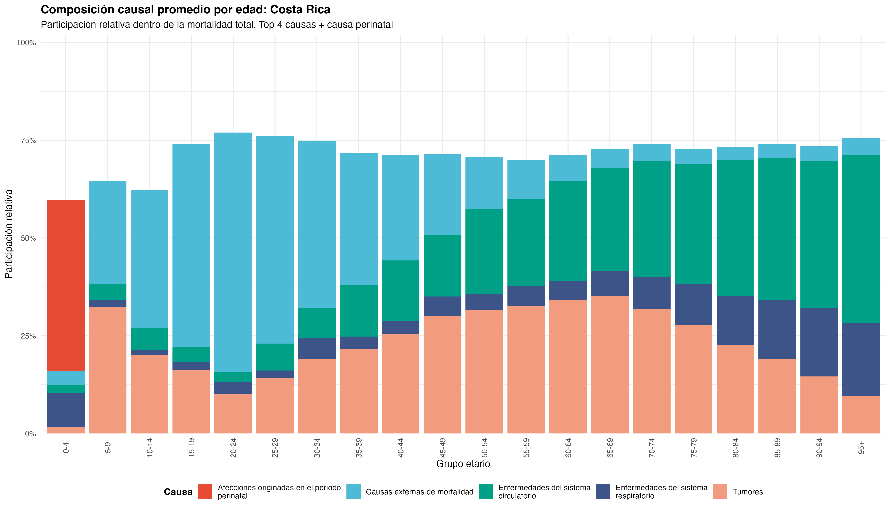

## Resumen

La mortalidad es un componente central para analizar la esperanza de vida; sin embargo, los análisis agregados pueden ocultar diferencias relevantes según causa de muerte, edad, sexo y territorio. En este contexto, el estudio analiza la mortalidad por causa en países de Centroamérica durante 2015–2018, un periodo y espacio con escasos antecedentes específicos desde el enfoque de decrementos múltiples. El objetivo es identificar patrones de variabilidad en la probabilidad de decremento por causa, $q_{x,t}^{(c)}$, según grupo etario, país, sexo, año calendario y categorías de la ICD-10. Para ello, se utilizaron defunciones de la WHO Mortality Database y exposiciones poblacionales de la WPP/Population Database, definiendo como unidad de análisis cada celda país-sexo-año-grupo etario-causa. La probabilidad de decremento por causa se estimó mediante un enfoque clásico, basado en conteos Poisson e intensidades estimadas por exposición, y un enfoque bayesiano Poisson–Gamma con estimación Empirical Bayes de hiperparámetros. Además, se calculó la composición causal condicionada al fallecimiento, $\pi_{x,t}^{(c)}$, para distinguir entre la magnitud absoluta del riesgo y el peso relativo de cada causa entre quienes fallecen, incorporando también el tratamiento de ceros observacionales y estructurales. Los resultados muestran una alta concordancia global entre las estimaciones clásica y bayesiana, aunque con diferencias más visibles en celdas con baja exposición o conteos escasos. También se identificó una mayor relevancia de las causas externas en hombres jóvenes, mientras que las enfermedades del sistema circulatorio adquirieron mayor peso en edades avanzadas, con variaciones específicas entre países. En conjunto, el trabajo muestra que el enfoque de decrementos múltiples permite interpretar la mortalidad centroamericana más allá del volumen total de defunciones, al revelar patrones diferenciados por edad, sexo, país y causa. Como extensión futura, se propone ampliar el periodo de estudio, incorporar más regiones y profundizar en la incertidumbre asociada a las estimaciones bayesianas.

## Palabras clave

Decrementos múltiples; mortalidad por causa; ICD-10; Centroamérica; estimación bayesiana.

## Introducción

Al mirar la mortalidad como una sola cifra, se pierde una parte decisiva del fenómeno. Dos poblaciones pueden tener niveles generales de mortalidad similares y, aun así, estructuras causales muy distintas. Por eso, este artículo parte de una idea central: en mortalidad no solo importa cuánto se muere, también debe preguntarse por qué causas ocurren los decrementos, en qué edades, en qué país y bajo qué estructura por sexo. Esta distinción es relevante porque las causas de muerte permiten leer desigualdades demográficas y sanitarias que una tasa agregada deja demasiado planas.

Para estudiar esa estructura se utiliza el marco actuarial de decrementos múltiples, donde una persona parte del estado vivo y puede salir de él por causas mutuamente excluyentes. La base del proyecto sigue esta lógica, pues para cada combinación de país, sexo, año y grupo etario se observan defunciones separadas por causa ICD-10 y una exposición común. A partir de esta información se estima la probabilidad anual de decremento por causa, denotada como $q_{x,t}^{(c)}$.

El estudio se delimita a Belice, Costa Rica, El Salvador, Guatemala, Nicaragua y Panamá durante 2015-2018. Se utilizan datos agregados de defunciones y exposición poblacional, organizados por grupo etario, país, sexo, año calendario y causa agrupada según capítulos de la ICD-10. Sobre esa base se comparan un enfoque clásico y uno bayesiano, no como fin principal, sino como herramienta para leer con más cuidado los patrones de variabilidad, especialmente en celdas con poca exposición o conteos pequeños.

El objetivo del artículo es identificar cómo varía la probabilidad actuarial de decremento por causa según edad, país, sexo y año, distinguiendo entre riesgo absoluto de morir por una causa y composición causal condicionada al fallecimiento. En el fondo, se busca pasar de leer cuántos mueren a entender de qué se muere una población.

## Metodología

Antes de presentar el modelo, se aclara una convención de notación. Aunque la probabilidad estimada depende del grupo etario $x$, año calendario $t$, país $p$, sexo $s$ y causa de muerte $c$, en general se escribirá solo $q_{x,t}^{(c)}$, entendiendo que cada cálculo se realiza dentro de una celda definida también por país y sexo.

La base final se construyó a partir de defunciones agregadas por causa de la *WHO Mortality Database* y exposición poblacional aproximada mediante población a mitad de año de la *World Population Prospects 2024*. El análisis se restringió a Belice, Costa Rica, El Salvador, Guatemala, Nicaragua y Panamá durante 2015-2018. La unidad de análisis es una celda agregada por país, sexo, año, grupo etario y causa ICD-10. Las causas se agruparon según capítulos generales de la ICD-10 para trabajar con categorías amplias y evitar conteos demasiado específicos.

El objeto actuarial de interés es la probabilidad anual de decremento por causa,

$$
q_{x,t}^{(c)} = P(T_{x,t}\leq 1, J=c),
$$

donde $T_{x,t}$ representa el tiempo futuro de vida de una persona perteneciente al grupo etario $x$ durante el año $t$, y $J$ indica la causa del decremento. Aquí $x$ no representa una edad exacta, sino el grupo etario completo. Además, como se trabaja en un marco de decrementos múltiples, la causa $c$ se interpreta en presencia de las demás causas competidoras.

Se asumió que la fuerza de mortalidad por causa permanece constante dentro de cada celda de observación. Así, $\mu_{x,t}^{(c)}$ representa la fuerza de mortalidad por la causa $c$ para la celda definida por grupo etario $x$ y año calendario $t$. Este supuesto permite pasar de conteos y exposición a intensidades de mortalidad, y luego transformar esas intensidades en probabilidades anuales de decremento.

En el enfoque clásico, las defunciones por causa se modelan como

$$D_{x,t}^{(c)}\mid \mu_{x,t}^{(c)}
\sim
\text{Poisson}(E_{x,t}\mu_{x,t}^{(c)}).$$

Bajo este modelo, la intensidad específica se estima mediante

$$
\widehat{\mu}_{x,t}^{(c)}=\frac{D_{x,t}^{(c)}}{E_{x,t}}
$$

y la intensidad total de salida del estado vivo como

$$
 \widehat{\mu}_{x,t}^{(\tau)}=\sum_{j=1}^{r}\widehat{\mu}_{x,t}^{(j)}
$$

Luego, la probabilidad anual de decremento por causa se estima como

$$
\widehat{q}_{x,t}^{(c)} = \frac{\widehat{\mu}_{x,t}^{(c)}}{\widehat{\mu}_{x,t}^{(\tau)}} \left(1-e^{-\widehat{\mu}_{x,t}^{(\tau)}}\right).
$$

En el enfoque bayesiano se mantiene el modelo Poisson, pero la intensidad se trata como una variable aleatoria positiva:

$$
D_{x,t}^{(c)}\mid \mu_{x,t}^{(c)}
\sim
\text{Poisson}(E_{x,t}\mu_{x,t}^{(c)}),
\qquad
\mu_{x,t,p,s}^{(c)}
\sim
\text{Gamma}(\alpha_p^{(c)},\beta_p^{(c)}).
$$

Los hiperparámetros $(\alpha_p^{(c)},\beta_p^{(c)})$ se estiman por país y causa mediante Empirical Bayes, usando la distribución marginal Poisson-Gamma, equivalente a una binomial negativa. Luego, por conjugación, la posterior de cada intensidad queda dada por

$$\mu_{x,t,p,s}^{(c)}
\mid D_{x,t,p,s}^{(c)},E_{x,t,p,s}
\sim
\text{Gamma}
\left(
\widehat{\alpha}_p^{(c)}+D_{x,t,p,s}^{(c)},
\widehat{\beta}_p^{(c)}+E_{x,t,p,s}
\right).$$

También se distinguieron ceros observacionales y celdas fuera del dominio de una causa. Los ceros observacionales se mantuvieron, mientras que las celdas fuera del dominio no se usaron para estimar hiperparámetros ni para simular intensidades. En particular, la causa XV se restringió a mujeres en edades reproductivas y la causa XVI al grupo 0-4.

Como $q_{x,t}^{(c)}$ es una función no lineal de las intensidades, en el enfoque bayesiano no se sustituyeron directamente las medias posteriores en la fórmula clásica. En su lugar, se simularon intensidades posteriores por causa y, en cada simulación $s=1,\dots,S$, se calculó

$$q_{x,t}^{(c,s)}
=
\frac{\mu_{x,t}^{(c,s)}}{\mu_{x,t}^{(\tau,s)}}
\left(1-e^{-\mu_{x,t}^{(\tau,s)}}\right),
\qquad
\mu_{x,t}^{(\tau,s)}
=
\sum_{j=1}^{r}\mu_{x,t}^{(j,s)}.$$

La estimación bayesiana final se obtuvo como

$$q_{x,t}^{(c),*}
=
\frac{1}{S}\sum_{s=1}^{S}q_{x,t}^{(c,s)}.$$

Los resultados se analizaron con dos medidas: $q_{x,t}^{(c)}$, que mide el riesgo absoluto estimado de morir por la causa $c$ (La definición tradicional), y la composición causal condicionada al fallecimiento,

$$
\pi_{x,t}^{(c)}
=
P(J=c \mid T_{x,t}\leq 1)
=
\frac{q_{x,t}^{(c)}}{\sum_{j=1}^{r} q_{x,t}^{(j)}}.
$$

Esta medida responde qué tan grande es el riesgo por causa, mientras que la segunda responde cómo se reparte causalmente el total de fallecimientos estimados.

Finalmente, para comparar las estimaciones obtenidas con el enfoque clásico y el enfoque bayesiano, se utilizó la Diferencia Relativa Absoluta Simétrica, denotada como $DRAS_{x,t}^{(c)}$. Esta medida resume qué tan alejadas se encuentran, para una misma celda, la estimación bayesiana $q_{B,x,t}^{(c)}$ y la estimación clásica $q_{F,x,t}^{(c)}$. En este caso, los subíndices completos de país, sexo, grupo etario, año y causa se omiten únicamente para no sobrecargar la notación.

$$
DRAS_{x,t}^{(c)}
=
\frac{
2\left|q_{B,x,t}^{(c)} - q_{F,x,t}^{(c)}\right|
}{
q_{B,x,t}^{(c)} + q_{F,x,t}^{(c)}
}.
$$

Valores cercanos a 0 indican alta coincidencia entre enfoques, mientras que valores cercanos a 2 reflejan una discrepancia relativa fuerte. Esta métrica permite identificar si las diferencias entre ambos enfoques aparecen de forma generalizada o si se concentran en causas específicas y celdas con mayor fragilidad estadística.

## Resultados

Tal como se ha venido desarrollando a partir de la estructura metodológica, los resultados se organizan en dos niveles. Primero, se analiza la dinámica demográfica de la mortalidad por causa en los países centroamericanos delimitados, con énfasis en edad, país, sexo y año calendario. Segundo, se comparan las estimaciones obtenidas mediante el enfoque clásico y el enfoque bayesiano, para así evaluar si los patrones de variabilidad encontrados se mantienen cuando cambia el marco de estimación.

### Dinámica demográfica de la mortalidad por causa

La dinámica demográfica de la mortalidad por causa muestra que los patrones varían según edad, país, sexo y causa. En general, las causas externas tienen mayor peso en hombres jóvenes y adultos jóvenes, mientras que las enfermedades del sistema circulatorio adquieren mayor relevancia en edades avanzadas. Por esta razón, el análisis no puede limitarse al volumen agregado de defunciones, ya que una causa puede ser dominante solo en ciertos grupos etarios o países.

Un caso claro de esta variabilidad localizada se observa en las enfermedades del sistema circulatorio para hombres de 65--69 años. Como se muestra en @fig-radar-circ-belice-h65-69, Belice presenta la mayor probabilidad local de decremento por esta causa dentro del conjunto de países comparados. Además, el valor estimado aumenta entre 2015 y 2018, de modo que la probabilidad de decremento por enfermedades circulatorias en esta celda es mayor en 2018 que en 2015. Este resultado no debe leerse como una tendencia regional de deterioro de la supervivencia, sino como una variación puntual dentro de una celda específica.

El gráfico también permite observar que el comportamiento no es uniforme entre países. Mientras Belice muestra el nivel más alto y un aumento visible, otros países presentan cambios más moderados o valores inferiores. Esto refuerza la idea de que la mortalidad por causa no evoluciona de manera homogénea en toda la región, sino que depende de combinaciones concretas de edad, sexo, país y año.

En síntesis, el caso de Belice muestra que las enfermedades circulatorias dominan con mayor fuerza en edades adultas mayores, pero también que la probabilidad local de decremento puede variar en el corto plazo. Por tanto, la lectura de la mortalidad por causa debe hacerse de forma estratificada, distinguiendo entre patrones generales y variaciones localizadas.

## Dinámica demográfica con respecto a la composición causal

Además del cambio localizado observado en Belice, la composición causal permite analizar cómo se reparte la mortalidad por causa dentro de un país. En el caso de Costa Rica, @fig-composicion-causal-cr muestra una transición etaria relativamente clara: las afecciones originadas en el periodo perinatal dominan en el grupo 0--4, las causas externas tienen mayor peso en edades jóvenes, los tumores adquieren presencia en edades adultas y las enfermedades del sistema circulatorio aumentan progresivamente en edades avanzadas.

Esta lectura confirma que la estructura causal de la mortalidad cambia con la edad. En edades tempranas predominan causas asociadas al inicio de la vida, mientras que en edades adultas y avanzadas ganan peso causas crónicas como tumores, enfermedades respiratorias y enfermedades del sistema circulatorio. Por tanto, la composición causal $\pi_{x,t}^{(c)}$ no mide el riesgo absoluto de morir por una causa, sino cómo se reparte el total de fallecimientos estimados entre causas competidoras dentro de cada grupo etario.

En conjunto, el radar de Belice y la composición causal de Costa Rica muestran dos formas complementarias de variabilidad. El primero ilustra una variación localizada en la probabilidad absoluta de decremento por enfermedades circulatorias; la segunda muestra cómo cambia la estructura proporcional de las causas de muerte a lo largo de la edad. Así, la dinámica poblacional no se resume únicamente en qué causa tiene más defunciones, sino en cómo cambia el riesgo y cómo se reparte causalmente la mortalidad según edad, país, sexo y año.

### Diferencias entre el enfoque clásico y el enfoque bayesiano

Como se observa en @tbl-discrepancia-enfoques, las causas con mayores medianas de DRAS corresponden principalmente a causas poco frecuentes o con alta presencia de estimaciones clásicas iguales a cero. Destacan la causa XV, embarazo, parto y puerperio, con una mediana de DRAS de 0.2972; la causa XIII, enfermedades del sistema osteomuscular y tejido conjuntivo, con 0.1622; la causa III, enfermedades de la sangre y trastornos de la inmunidad, con 0.1498; y la causa XII, enfermedades de la piel y tejido subcutáneo, con 0.1414. Además, en todas las causas listadas el percentil 95 de DRAS alcanza el valor 2, lo cual indica que existen celdas donde la discrepancia relativa entre enfoques es muy alta.

Sin embargo, esta diferencia relativa debe interpretarse con cuidado. Aunque el DRAS puede ser alto, la mediana de la diferencia absoluta en $q_{x,t}^{(c)}$ se mantiene en magnitudes muy pequeñas, entre aproximadamente $1.3\times 10^{-6}$ y $3.7\times 10^{-6}$. Esto significa que la discrepancia puede verse grande en términos relativos porque las probabilidades son cercanas a cero, pero no necesariamente representa una diferencia actuarial grande en escala absoluta.

La explicación principal está en el tratamiento de los conteos nulos. En el enfoque clásico, cuando no se observan defunciones por una causa en una celda, la intensidad estimada puede quedar exactamente en cero y, por tanto, también la probabilidad de decremento. En cambio, en el enfoque bayesiano, si la causa pertenece al dominio aplicable de la celda, un cero observado no se interpreta como riesgo imposible. La posterior Gamma conserva soporte positivo, por lo que la estimación puede ser muy pequeña, pero no necesariamente igual a cero. Esto se refleja en el porcentaje de $q$ clásico cero, especialmente en las causas XII, XV, XIII y III.

Por lo que, las mayores diferencias aparecen en causas con pocos eventos, dominios restringidos o alta frecuencia de ceros clásicos. Por tanto, el enfoque bayesiano no cambia la lectura general del fenómeno, pero sí suaviza las estimaciones en celdas sensibles y evita interpretar automáticamente la ausencia de defunciones observadas como ausencia total de riesgo.


## Conclusiones

La investigación respondió la pregunta sobre los patrones de variabilidad de la probabilidad de decremento por causa, $q_{x,t}^{(c)}$, en Centroamérica durante 2015-2018, excluyendo Honduras por falta de información compatible. Con datos de defunciones de la WHO Mortality Database y exposiciones de la WPP, se estimaron probabilidades de decremento múltiple por país, sexo, año, grupo etario y causa ICD-10. El enfoque clásico permitió estimar intensidades y probabilidades locales, mientras que el enfoque bayesiano incorporó información colectiva mediante una estructura Poisson-Gamma y Empirical Bayes. En general, ambos enfoques produjeron resultados cercanos en celdas con suficiente información, con diferencias más visibles en causas poco frecuentes, conteos bajos o combinaciones inestables.

Los hallazgos muestran que la mortalidad por causa varía de forma importante según edad, sexo, país y causa. Las causas externas tuvieron mayor participación en hombres jóvenes y adultos jóvenes, especialmente en El Salvador, donde se concentró el 92.6 % de las muertes por agresiones dentro del conjunto de países que superaban la mediana. En contraste, los mayores conteos absolutos se ubicaron en edades avanzadas y en enfermedades del sistema circulatorio, especialmente en Guatemala. También se observaron patrones particulares: Belice mostró incrementos locales en decrementos circulatorios, Nicaragua presentó una composición causal más dispersa que Costa Rica y Guatemala tuvo mayor presencia de síntomas y hallazgos no clasificados en edades avanzadas.

Finalmente, la comparación entre enfoques mostró que las mayores discrepancias aparecen en celdas frágiles, especialmente cuando el enfoque clásico asigna probabilidades iguales a cero y el bayesiano conserva estimaciones positivas pequeñas. Estas diferencias fueron más notorias en causas poco frecuentes o con dominios específicos, como enfermedades de la sangre, piel, osteomusculares, genitourinarias y embarazo, parto y puerperio. Las principales limitaciones provienen de la naturaleza agregada de los datos, la ausencia de trayectorias individuales, posibles diferencias en la calidad de registro entre países y el horizonte temporal reducido. Futuros trabajos podrían ampliar la serie de años, incorporar intervalos de incertidumbre y revisar con mayor detalle la calidad demográfica de las exposiciones.

## Agradecimientos

Se agradece en primer lugar a todos los profesores que han instruido a cada uno de los integrantes de esta investigación, y se agradece de manera especial al profesor Maikol Solís Chacón por la orientación brindada durante el desarrollo del proyecto y por las observaciones metodológicas realizadas a lo largo de las bitácoras. También se reconoce el apoyo de la Escuela de Matemática de la Universidad de Costa Rica por el marco académico en el que se desarrolló esta investigación. Finalmente se agradece a todas esas personas que de manera directa o indirecta han contribuido a la consolidación de esta investigación, entre estas, amistades, parejas, familia, conocidos y desconocidos. Sin el apoyo de estos y muchos más este trabajo no hubiese sido posible.


```{=latex}
\FloatBarrier
```

## Referencias

```{=latex}
\begingroup
\footnotesize
\setlength{\parskip}{0.15em}
\setlength{\baselineskip}{10pt}
```

Austin, P. C., Steyerberg, E. W., & Putter, H. (2021). Fine-Gray subdistribution hazard models to simultaneously estimate the absolute risk of different event types: Cumulative total failure probability may exceed 1. *Statistics in Medicine, 40*(19), 4200–4212. https://doi.org/10.1002/sim.9023

Bowers, N. L., Gerber, H. U., Hickman, J. C., Jones, D. A., & Nesbitt, C. J. (1997). *Actuarial mathematics* (2nd ed.). Society of Actuaries.

Calazans, J. A., & Queiroz, B. L. (2020). The adult mortality profile by cause of death in 10 Latin American countries (2000–2016). *Revista Panamericana de Salud Pública, 44*, e1. https://doi.org/10.26633/RPSP.2020.1

Deshmukh, S. (2012). *Multiple decrement models in insurance: An introduction using R*. Springer. https://doi.org/10.1007/978-81-322-0659-0

Fine, J. P., & Gray, R. J. (1999). A proportional hazards model for the subdistribution of a competing risk. *Journal of the American Statistical Association, 94*(446), 496–509. https://doi.org/10.1080/01621459.1999.10474144

Goerlich Gisbert, F. J. (2012). *Tablas de vida de decrementos múltiples: Mortalidad por causas en España (1975–2008)* (Documento de Trabajo No. 1/2012). Fundación BBVA.

Keyfitz, N., Preston, S. H., & Schoen, R. (1972). Inferring probabilities from rates: Extension to multiple decrement. *Scandinavian Actuarial Journal, 1972*(1), 1–13. https://doi.org/10.1080/03461238.1972.10404630

Lynch, S. M., & Brown, J. S. (2005). A new approach to estimating life tables with covariates and constructing interval estimates of life table quantities. *Sociological Methodology, 35*(1), 189–237. https://doi.org/10.1111/j.0081-1750.2006.00168.x

Macdonald, A. S. (1996). An actuarial survey of statistical models for decrement and transition data II: Competing risks, non-parametric and regression models. *British Actuarial Journal, 2*(2), 429–448. https://doi.org/10.1017/S1357321700003469

Macdonald, A. S., & Richards, S. J. (2025). On contemporary mortality models for actuarial use II: Principles. *British Actuarial Journal, 30*, e19. https://doi.org/10.1017/S1357321725000133

Manton, K. G., Woodbury, M. A., Stallard, E., Riggan, W. B., Creason, J. P., & Pellom, A. C. (1989). Empirical Bayes procedures for stabilizing maps of U.S. cancer mortality rates. *Journal of the American Statistical Association, 84*(407), 637–650. https://doi.org/10.1080/01621459.1989.10478816

Olivieri, A., & Pitacco, E. (2012). Life tables in actuarial models: From the deterministic setting to a Bayesian approach. *AStA Advances in Statistical Analysis, 96*, 127–153. https://doi.org/10.1007/s10182-011-0177-y

Pitacco, E., Denuit, M., Haberman, S., & Olivieri, A. (2009). *Modelling longevity dynamics for pensions and annuity business*. Oxford University Press. https://doi.org/10.1093/oso/9780199547272.001.0001

Román Sánchez, Y. G., Sánchez Pérez, A. L., & Mendieta Zacarias, I. (2018). Mortalidad por causas en el estado de México, 2000 y 2015. *Novedades en Población, 14*(28), 64–78.

Schmitt, F. O., Gilardoni, G. L., & Andrade, J. A. A. (2019). A class of flat prior distributions for the Poisson-gamma hierarchical model. *Statistica Neerlandica, 73*(3), 414–433. https://doi.org/10.1111/stan.12176

Schumacher, A. E., McCormick, T. H., Wakefield, J., Chu, Y., Perin, J., Villavicencio, F., Simon, N., & Liu, L. (2022). A flexible Bayesian framework to estimate age- and cause-specific child mortality over time from sample registration data. *The Annals of Applied Statistics, 16*(1), 124–143. https://doi.org/10.1214/21-AOAS1489

Society of Actuaries. (2016). *Experience study calculations*. Society of Actuaries.

United Nations, Department of Economic and Social Affairs, Population Division. (2024). *World Population Prospects 2024*. United Nations. https://population.un.org/wpp/

Wolbers, M., Koller, M. T., Stel, V. S., Schaer, B., Jager, K. J., Leffondré, K., & Heinze, G. (2014). Competing risks analyses: Objectives and approaches. *European Heart Journal, 35*(42), 2936–2941. https://doi.org/10.1093/eurheartj/ehu131

World Health Organization. (2026). WHO Mortality Database. World Health Organization. https://www.who.int/data/data-collection-tools/who-mortality-database

Zhang, Y.-Y., Wang, Z.-Y., Duan, Z.-M., & Mi, W. (2019). The empirical Bayes estimators of the parameter of the Poisson distribution with a conjugate gamma prior under Stein’s loss function. *Journal of Statistical Computation and Simulation, 89*(16), 3061–3074. https://doi.org/10.1080/00949655.2019.1652606

```{=latex}
\endgroup
```

## Anexos

### 1. Tabla de causas ICD-10 con mayor discrepancia entre enfoques

```{r}
#| label: tbl-discrepancia-enfoques
#| echo: false
#| warning: false
#| message: false

library(tibble)
library(knitr)
library(kableExtra)

tabla_discrepancia <- tribble(
  ~Causa, ~Grupo, ~Celdas, ~Mediana_DRAS, ~P95_DRAS, ~Mediana_dif_abs_q, ~Pct_q_clasico_cero,
  "III", "Enfermedades de la sangre, órganos hematopoyéticos y trastornos de la inmunidad", 960, 0.1498, 2, "2.6e-06", 18.3,
  "IV", "Enfermedades endocrinas, nutricionales y metabólicas", 960, 0.0130, 2, "1.8e-06", 5.6,
  "V-VIII", "Trastornos mentales, sistema nervioso y órganos de los sentidos", 960, 0.0297, 2, "2.2e-06", 6.0,
  "XI", "Enfermedades del sistema digestivo", 960, 0.0153, 2, "1.8e-06", 5.1,
  "XII", "Enfermedades de la piel y del tejido subcutáneo", 960, 0.1414, 2, "1.3e-06", 36.4,
  "XIII", "Enfermedades del sistema osteomuscular y tejido conjuntivo", 960, 0.1622, 2, "1.9e-06", 27.1,
  "XIV", "Enfermedades del sistema genitourinario", 960, 0.0166, 2, "1.6e-06", 10.8,
  "XV", "Embarazo, parto y puerperio", 216, 0.2972, 2, "3.7e-06", 32.4
)

tabla_discrepancia |>
  kable(
    format = "latex",
    booktabs = TRUE,
    longtable = TRUE,
    caption = "Causas ICD-10 con mayor discrepancia entre enfoque clásico y bayesiano. Elaboración propia.",
    col.names = c(
      "Causa",
      "Grupo ICD-10",
      "Celdas",
      "Mediana DRAS",
      "P95 DRAS",
      "Mediana |dif. q|",
      "% q clásico cero"
    ),
    align = c("l", "l", "r", "r", "r", "r", "r"),
    escape = TRUE
  ) |>
  kable_styling(
    font_size = 6.5,
    full_width = FALSE
  ) |>
  column_spec(1, width = "1.0cm") |>
  column_spec(2, width = "5.4cm") |>
  column_spec(3, width = "1.1cm") |>
  column_spec(4, width = "1.4cm") |>
  column_spec(5, width = "1.1cm") |>
  column_spec(6, width = "1.5cm") |>
  column_spec(7, width = "1.5cm")
```


### 2. Radar de probabilidad local de decremento por sistema circulatorio

{#fig-radar-circ-belice-h65-69 width="71%" fig-pos="H"}

### 3. Composición causal promedio por edad en Costa Rica

{#fig-composicion-causal-cr width="71%" fig-pos="H"}

